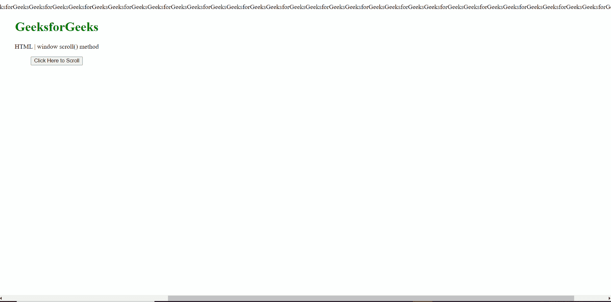
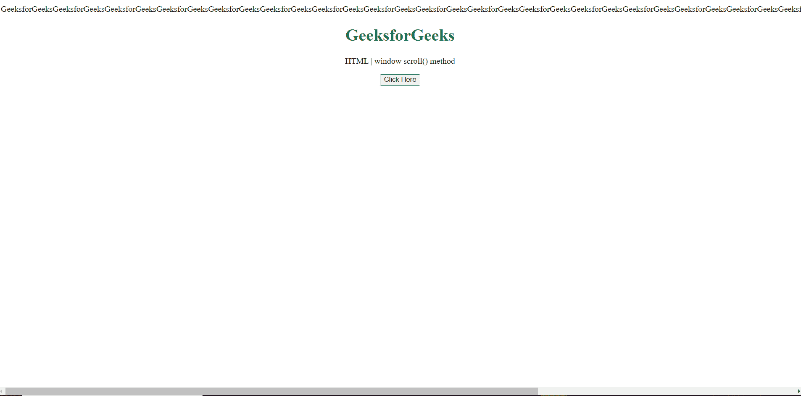

# HTML DOM 窗口滚动()方法

> 原文:[https://www . geesforgeks . org/html-DOM-window-scroll-method/](https://www.geeksforgeeks.org/html-dom-window-scroll-method/)

**窗口滚动()**方法将窗口滚动到文档中的特定位置。这个方法不同于 scrollTo()方法，因为它使用 ScrolltoOptions 字典获取不同的参数，如滚动行为等。

**语法:**

```html
window.scroll(*x-coord*, *y-coord*)
```

或者

```html
window.scroll(*options*)
```

**参数:**

*   **x 坐标:**沿您想要滚动到的文档水平轴的像素。
*   **y 坐标:**沿您想要滚动到的文档纵轴的像素。

*   **选项:**一个滚动选项字典。

**示例 1:** 在本例中，我们将使用 ScrolltoOptions 字典滚动。

```html
<!DOCTYPE HTML> 
<html>  
<head>
    <meta charset="UTF-8">
    <title>window scroll() method</title>
</head>   

<body style="text-align:center;">
    GeeksforGeeksGeeksforGeeksGeeksforGeeksGeeks
forGeeksGeeksforGeeksGeeksforGeeksGeeksforGeeks
GeeksforGeeksGeeksforGeeksGeeksforGeeksGeeksfor
GeeksGeeksforGeeksGeeksforGeeksGeeksforGeeksGeeks
forGeeksGeeksforGeeksGeeksforGeeksGeeksforGeeks
GeeksforGeeksGeeksforGeeksGeeksforGeeksGeeksfor
GeeksGeeksforGeeks

    <h1 style="color:green;">  
     GeeksforGeeks
    </h1> 
    <p id="a"> 
    HTML | window scroll() method
    </p>

    <button onclick = "Geeks()">
    Click Here to Scroll
    </button>
    <script> 
        var a = document.getElementById("a");
        function Geeks(){
            window.scroll({
                top: 100,
                left: 100,
                behavior: 'smooth'
});
        }
  </script> 
</body>   
</html>
```

**输出:**



**示例 2:** 在本例中，我们将使用坐标滚动。

```html
<!DOCTYPE HTML> 
<html>  
<head>
    <meta charset="UTF-8">
    <title>window scroll() method</title>
</head>   

<body style="text-align:center;">
    GeeksforGeeksGeeksforGeeksGeeksforGeeksGeeks
forGeeksGeeksforGeeksGeeksforGeeksGeeksforGeeks
GeeksforGeeksGeeksforGeeksGeeksforGeeksGeeksfor
GeeksGeeksforGeeksGeeksforGeeksGeeksforGeeksGeeks
forGeeksGeeksforGeeksGeeksforGeeksGeeksforGeeks
GeeksforGeeksGeeksforGeeksGeeksforGeeksGeeksfor
GeeksGeeksforGeeks

    <h1 style="color:green;">  
     GeeksforGeeks
    </h1> 
    <p id="a"> 
    HTML | window scroll() method
    </p>

    <button onclick = "Geeks()">
    Click Here
    </button>
    <script> 
        var a = document.getElementById("a");
        function Geeks(){
            window.scroll(500, 0);
        }
  </script> 
</body>   
</html>
```

**输出:**



**支持的浏览器:**

*   谷歌 Chrome
*   边缘
*   火狐浏览器
*   旅行队
*   歌剧