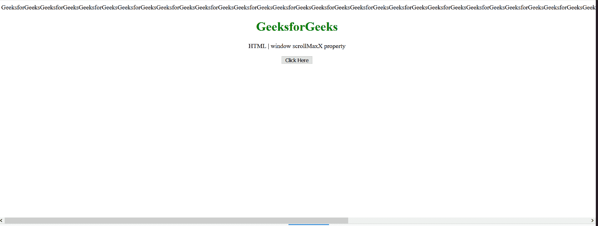
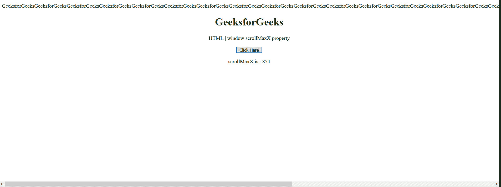

# HTML DOM 窗口 scrollMaxX 属性

> 原文:[https://www . geesforgeks . org/html-DOM-window-scrollmaxx-property/](https://www.geeksforgeeks.org/html-dom-window-scrollmaxx-property/)

**窗口滚动最大值** 属性返回文档在当前窗口中可以水平滚动的最大像素数。Window scrolmaxx为只读属性。

**语法:**

```html
var Scrx = window.scrollMaxX

```

**返回值:**该属性返回文档可以水平滚动的最大像素数。

**示例:**本示例展示了如何使用该属性获取文档的最大水平像素数。

在这里，我附加了一个超过框架的长文本来实现水平滚动。

## 超文本标记语言

```html
<!DOCTYPE HTML>
<html>

<body style="text-align:center;">
    GeeksforGeeksGeeksforGeeksGeeksforGeeksGeeksforGeeksGeeksforGeeksGeeksforGeeksGeeksforGeeksGeeksforGeeksGeeksforGeeksGeeksforGeeksGeeksforGeeksGeeksforGeeksGeeksforGeeksGeeksforGeeksGeeks
    <h1 style="color:green;">
        GeeksforGeeks
    </h1>

    <p>
        HTML | window scrollMaxX property
    </p>

    <button onclick="Geeks()">
        Click Here
    </button>
    <p id="a"></p>

    <script>
        var a = document.getElementById("a");
        function Geeks() {
            a.innerHTML = "scrollMaxX is : " + window.scrollMaxX;
        }
    </script>
</body>

</html>
```

**输出:**

*   **点击按钮前:**

    

*   **点击按钮后:**

    

**支持的浏览器:**

*   火狐浏览器
*   歌剧
*   微软公司出品的 web 浏览器