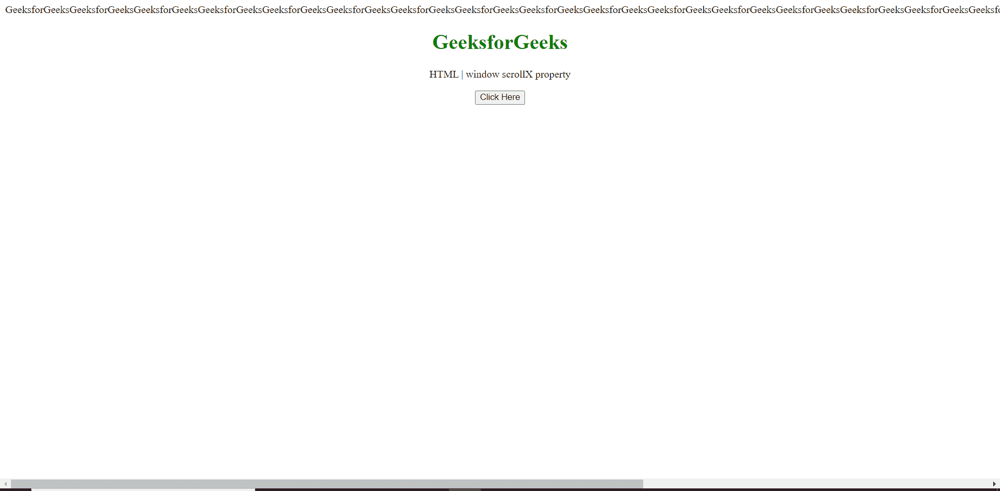
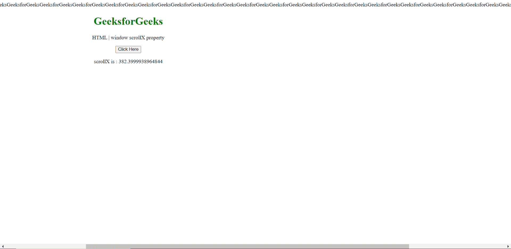

# HTML DOM 窗口滚动属性

> 原文:[https://www . geesforgeks . org/html-DOM-window-scrollx-property/](https://www.geeksforgeeks.org/html-dom-window-scrollx-property/)

窗口界面的**滚动**属性返回当前窗口中文档当前水平滚动的像素数。这个值在现代浏览器中是亚像素精度的，这意味着它不一定是一个整数。这是只读属性。

**语法:**

```html
var Scrx = window.scrollX
```

**返回值:**返回值为双精度浮点值，表示文档当前从原点水平滚动的像素数。

**示例:**该示例显示了如何使用该属性获得文档水平滚动的精确像素数
。

在这里，我们附加了一个长的水平文本来超过框架，以实现水平滚动。

```html
<!DOCTYPE HTML> 
<html>  
<head>
    <meta charset="UTF-8">
    <title>window scrollX property</title>
</head>   
<body style="text-align:center;">
    GeeksforGeeksGeeksforGeeksGeeksforG
eeksGeeksforGeeksGeeksforGeeksGeeksforGeeks
GeeksforGeeksGeeksforGeeksGeeksforGeeksGeeks
forGeeksGeeksforGeeksGeeksforGeeksGeeksfor
GeeksGeeksforGeeksGeeksforGeeksGeeksforGeeks
GeeksforGeeksGeeksforGeeksGeeksforGeeksGeeks
forGeeksGeeksforGeeksGeeksforGeeksGeeksforGeeks
GeeksforGeeks
    <h1 style="color:green;">  
     GeeksforGeeks
    </h1> 
    <p> 
    HTML | window scrollX property
    </p>

    <button onclick = "Geeks()">
    Click Here
    </button>
    <p id="a"></p>
    <script> 
        var a = document.getElementById("a");
        function Geeks(){
            a.innerHTML =
 "scrollX is : " + window.scrollX;
}
  </script> 
</body>   
</html>
```

**输出:**

**点击按钮前:**



**点击按钮后:**因此，可以看到水平滚动。



**支持的浏览器:**

*   谷歌 Chrome
*   旅行队
*   火狐浏览器
*   歌剧
*   边缘