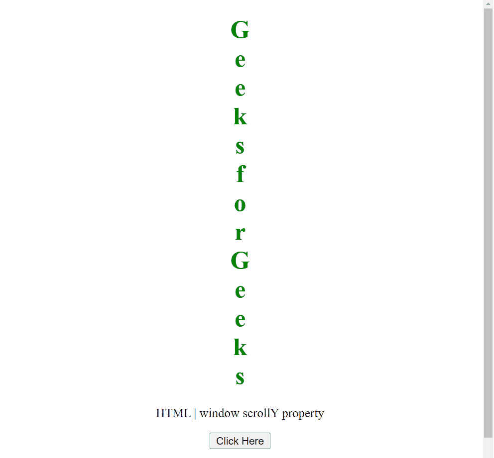
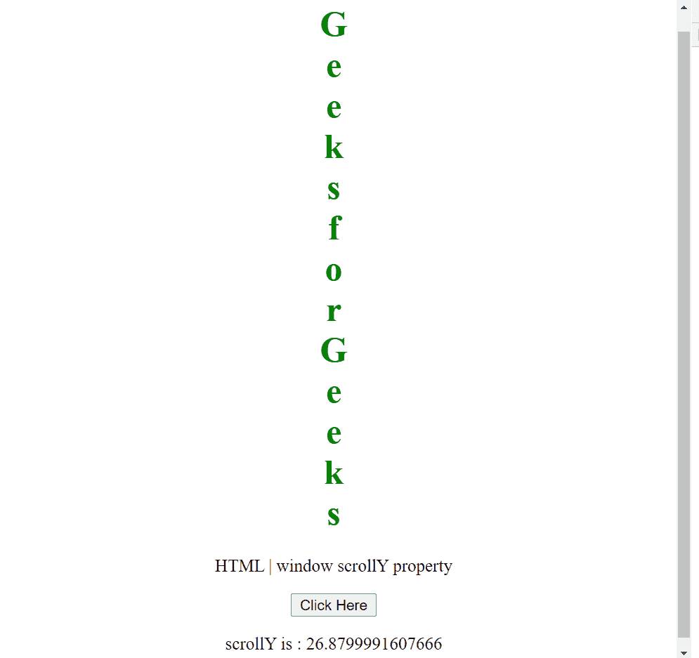

# HTML DOM 窗口滚动属性

> 原文:[https://www . geesforgeks . org/html-DOM-window-scrolly-property/](https://www.geeksforgeeks.org/html-dom-window-scrolly-property/)

窗口 界面 [的**滚动**属性返回当前窗口中文档当前垂直滚动的像素数。这个值在现代浏览器中是亚像素精度的，这意味着它不一定是一个整数。这是只读属性。](https://developer.mozilla.org/en-US/docs/Web/API/Window)

**语法:**

```html
var Scry = window.scrollY

```

**返回值:** T 返回值是一个双精度浮点值，表示文档当前从原点垂直滚动的像素数。

**示例:**该示例显示了如何使用该属性获取文档垂直滚动的精确像素数。

在这里，我们附加了一个长的垂直标题来超过框架，以允许垂直滚动。

## 超文本标记语言

```html
<!DOCTYPE HTML>
<html>

<body style="text-align:center;">
    <h1 style="color:green;">
        G<br>
        e<br>
        e<br>
        k<br>
        s<br>
        f<br>
        o<br>
        r<br>
        G<br>
        e<br>
        e<br>
        k<br>
        s<br>
    </h1>

    <p>
        HTML | window scrollY property
    </p>

    <button onclick="Geeks()">
        Click Here
    </button>
    <p id="a"></p>

    <script>
        var a = document.getElementById("a");
        function Geeks() {
            a.innerHTML = "scrollY is : " 
                    + window.scrollY;
        }
    </script>
</body>

</html>
```

**输出:**

*   **点击按钮前:**

    

*   **点击按钮后:**

    

**支持的浏览器:**

*   谷歌 Chrome
*   旅行队
*   火狐浏览器
*   歌剧
*   边缘