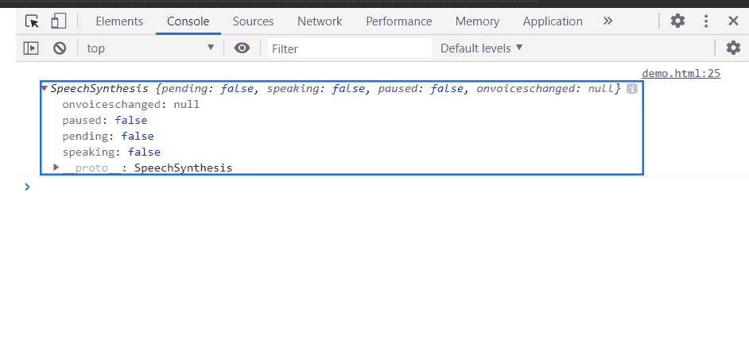

# HTML DOM 窗口语音合成属性

> 原文:[https://www . geesforgeks . org/html-DOM-window-speechsynthesis-property/](https://www.geeksforgeeks.org/html-dom-window-speechsynthesis-property/)

SpeechSynthesis 属性返回一个 speechSynthesis 对象，它是使用 Web 语音 API 语音合成功能的入口点，可以进一步使用。

**语法:**

```html
var speech = window.speechSynthesis;
```

**返回值:**一个语音合成对象。

**示例:**这个示例展示了如何使用这个对象获取 SpeechSynthesis 对象。

```html
<!DOCTYPE HTML> 
<html>  
<head>
    <meta charset="UTF-8">
    <title>window speechSynthesis property</title>
</head>   
<body style="text-align:center;">
    <h1 style="color:green;">  
     GeeksforGeeks
    </h1> 
    <p> 
    HTML | window speechSynthesis property
    </p>

    <button onclick = "Geeks()">
    Click Here
    </button>
    <p id="a"></p>
    <script> 
        var a = document.getElementById("a");
        function Geeks(){
            a.innerHTML += "paused : " +
 window.speechSynthesis.paused + `<br>`;
            a.innerHTML += "pending : " +
 window.speechSynthesis.pending + `<br>`;
            a.innerHTML += "paused : " +
 window.speechSynthesis.speaking + `<br>`;
            console.log(window.speechSynthesis)
}
  </script> 
</body>   
</html>
```

**输出:**

**点击按钮前:**


**点击按钮后:**


**控制台中:**



**支持的浏览器:**

*   谷歌 Chrome
*   旅行队
*   火狐浏览器
*   歌剧
*   边缘