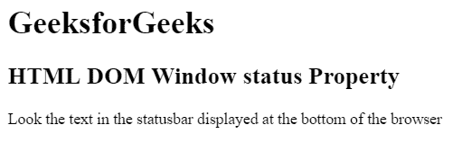
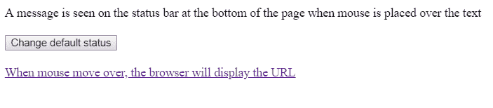

# HTML | DOM 窗口状态属性

> 原文:[https://www . geesforgeks . org/html-DOM-window-status-property/](https://www.geeksforgeeks.org/html-dom-window-status-property/)

HTML DOM 中的**窗口状态属性**用于设置或返回浏览器底部状态栏中的文本。

**语法:**

```html
window.status
```

**返回值:**返回一个字符串，代表状态栏中显示的文本。

**示例 1:** 本示例使用窗口状态属性。

```html
<!DOCTYPE html>
<html>

<head>
    <title>
        HTML DOM Window status Property
    </title>
</head>

<body>
    <h1>GeeksforGeeks</h1>

    <h2>
        HTML DOM Window status Property
    </h2>
    <p>
        Look the text in the statusbar displayed
        at the bottom of the browser
    </p>

    <!-- Script to use window status property -->
    <script>
        window.status = "GeeksforGeeks";
    </script>
</body>

</html>                                
```

**输出:**


**示例 2:** 本示例使用窗口状态属性设置状态栏的文本。

```html
<!DOCTYPE html>
<html>

<head>
    <title>
        HTML DOM Window status Property
    </title>

    <!-- Script to use window status property -->
    <script type="text/javascript">
        function UpdateStatusBar (over) {
            if (over)
                window.status = "The mouse is over the text.";
            else
                window.status = window.defaultStatus;
        }

        function ChangeDefStatus () {
            window.defaultStatus = "Default Status.";
        }
    </script>
</head>

<body>
    <div onmousemove="UpdateStatusBar(true);" 
        onmouseout="UpdateStatusBar(false);">
        A message is seen on the status bar at the bottom
        of the page when mouse is placed over the text
    </div><br>

    <button onclick="ChangeDefStatus();">
        Change default status
    </button>

    <br><br>

    <a href="#">
        When mouse move over, the browser
        will display the URL
    </a>
</body>

</html>                    
```

**输出:**


**支持的浏览器:***DOM Window 状态属性*不支持任何浏览器。