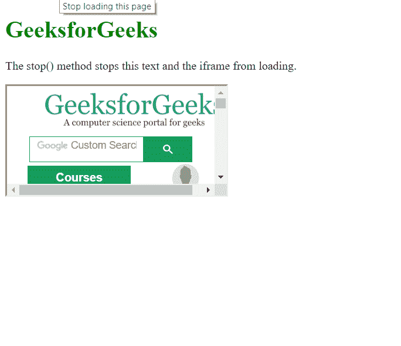

# HTML | DOM Window stop()方法

> 原文:[https://www.geeksforgeeks.org/html-dom-window-stop-method/](https://www.geeksforgeeks.org/html-dom-window-stop-method/)

DOM 中的 **stop()方法**用于停止窗口加载当前浏览上下文中的资源，类似于浏览器的 stop 按钮。

**语法:**

```html
window.stop()
```

**示例:**停止窗口加载。

```html
<!DOCTYPE html>

<html>

<head>
    <title>
        HTML | DOM Window stop() Method
    </title>

</head>
<style>
    h1 {
        color: green;
    }
</style>

<head>
    <script>
        // Stop window loading.
        window.stop();
    </script>
</head>

<body>
    <h1>GeeksforGeeks</h1>
    <p>
      The stop() method stops this
      text and the iframe from loading.
    </p>

    <iframe src=
     "https://ide.geeksforgeeks.org/">
    </iframe>

</body>

</html>
```

**输出:**
**无窗.停()方法:**


**同 window.stop()方法:**


**支持的浏览器:***DOM Window stop()方法*支持的浏览器如下:

*   谷歌 Chrome
*   火狐浏览器
*   歌剧
*   旅行队