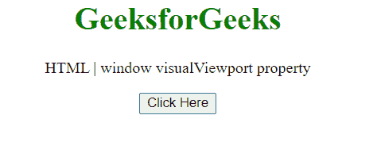
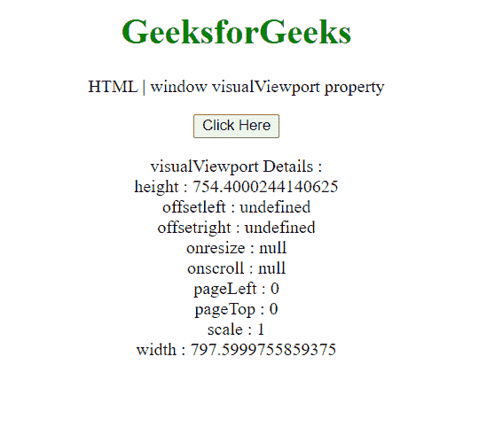
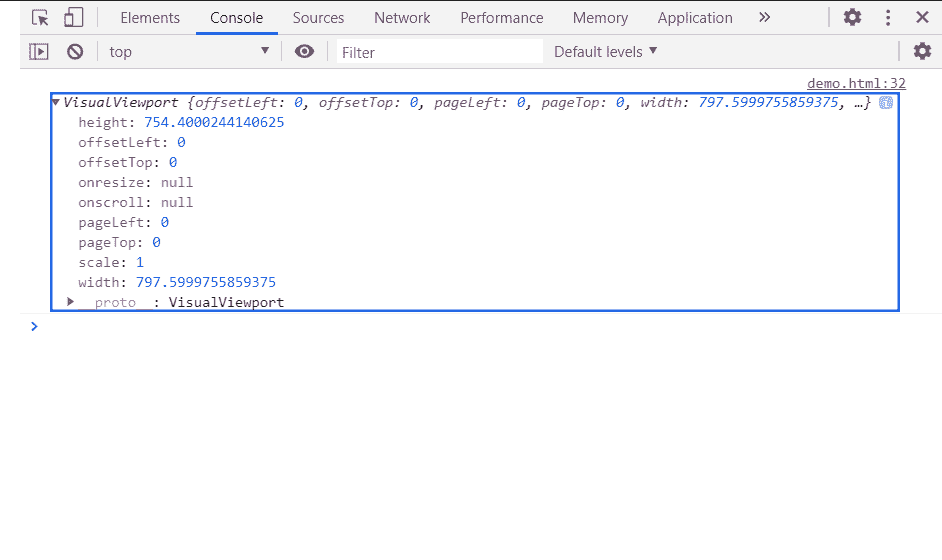

# HTML DOM 窗口可视化视口属性

> 原文:[https://www . geesforgeks . org/html-DOM-window-visualviewport-property/](https://www.geeksforgeeks.org/html-dom-window-visualviewport-property/)

窗口界面的**视口**属性返回一个表示当前窗口视口的视口对象。这是只读属性。

**语法:**

```html
var visualViewport = Window.visualViewport;
```

**返回值:**可视化视口对象。

**示例:**这个示例展示了如何使用这个对象获取可视化视口对象。

此外，我们已经展示了使用该对象的可视化视口的一些细节。

```html
<!DOCTYPE HTML> 
<html>  
<head>
    <meta charset="UTF-8">
    <title>window visualViewport property</title>
</head>   
<body style="text-align:center;">
    <h1 style="color:green;">  
     GeeksforGeeks
    </h1> 
    <p> 
    HTML | window visualViewport property
    </p>

    <button onclick = "Geeks()">
    Click Here
    </button>
    <p id="a"></p>
    <script> 
        var a = document.getElementById("a");
        function Geeks(){
            a.innerHTML +="visualViewport Details : " + `<br>`;
            a.innerHTML += "height : " 
+ window.visualViewport.height + `<br>`;
            a.innerHTML += "offsetleft : " 
+ window.visualViewport.offsetleft + `<br>`;
            a.innerHTML += "offsetright : " 
+ window.visualViewport.offsetright + `<br>`;
            a.innerHTML += "onresize : " 
+ window.visualViewport.onresize + `<br>`;
            a.innerHTML += "onscroll : " 
+ window.visualViewport.onscroll + `<br>`;
            a.innerHTML += "pageLeft : " 
+ window.visualViewport.pageLeft + `<br>`;
            a.innerHTML += "pageTop : " 
+ window.visualViewport.pageTop + `<br>`;
            a.innerHTML += "scale : " 
+ window.visualViewport.scale + `<br>`;
            a.innerHTML += "width : " 
+ window.visualViewport.width + `<br>`;
            console.log(window.visualViewport)
        }
  </script> 
</body>   
</html>
```

**输出:**

**点击按钮前:**



**点击按钮后:**



**控制台中:**



**支持的浏览器:**

*   谷歌 Chrome
*   旅行队
*   火狐浏览器
*   歌剧
*   边缘