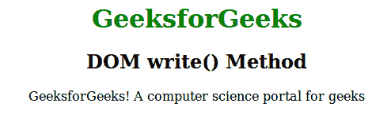
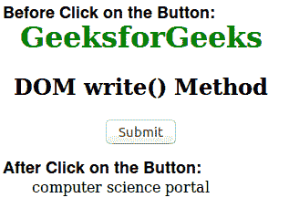

# HTML | DOM write()方法

> 原文:[https://www.geeksforgeeks.org/html-dom-write-method/](https://www.geeksforgeeks.org/html-dom-write-method/)

HTML 中的 **write()方法**用于在一个文档中编写一些内容或者 JavaScript 代码。这种方法主要用于测试目的。它用于从 HTML 文档中删除所有内容，并插入新内容。它还用于向 document.open()方法打开的输出提供附加文本。这个方法与 writeln()方法非常相似。

**语法:**

```html
document.write( exp1, exp2, exp3, ... )
```

**参数:**该方法包含许多可选参数。所有表达式参数(exp1、exp2、…)都可以按出现的顺序列出和显示。

**例 1:**

```html
<!DOCTYPE html>
<html>
    <head>
        <title>DOM write() Method</title>
        <style>
            body {
                text-align:center;
            }
            h1 {
                color:green;
            }
        </style>
    </head>
    <body>
        <h1>GeeksforGeeks</h1>
        <h2>DOM write() Method</h2>
        <script>
            document.write("GeeksforGeeks! ");
            document.write
                ("A computer science portal for geeks")
        </script>
    </body>
</html>                    
```

**输出:**


**例 2:**

```html
<!DOCTYPE html>
<html>
    <head>
        <title>DOM write() Method</title>
        <style>
            body {
                text-align:center;
            }
            h1 {
                color:green;
            }
        </style>
    </head>
    <body>
        <h1>GeeksforGeeks</h1>
        <h2>DOM write() Method</h2>
        <button type="button" onclick="Geeks()">
            Submit
        </button>
        <script>
        function Geeks() {
            document.write
                ('<center>computer science portal</center>');
        }
        </script>
    </body>
</html>                            
```

**输出:**

**支持的浏览器:**DOM write()方法支持的浏览器如下:

*   铬
*   微软公司出品的 web 浏览器
*   火狐浏览器
*   歌剧
*   旅行队