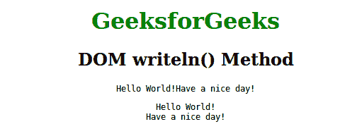

# HTML | DOM writeln()方法

> 原文:[https://www.geeksforgeeks.org/html-dom-writeln-method/](https://www.geeksforgeeks.org/html-dom-writeln-method/)

**writeln()方法**用于在每个语句后编写一个带有换行符附加属性的文档。此方法类似于 document.write()方法。

**语法:**

```html
document.writeln( exp1, exp2, exp3, ... )
```

**参数:**该方法包含许多可选参数。所有表达式参数(exp1、exp2、…)都可以按出现的顺序列出和显示。

**示例:**

```html
<!DOCTYPE html>
<html>
    <head>
        <title>DOM writeln() Method</title>
        <style>
            h1 {
                color:green;
            }
            body {
                text-align:center;
            }
        </style>
    </head>
    <body>
        <h1>GeeksforGeeks</h1>
        <h2>DOM writeln() Method</h2>
        <pre>
        <script>
            document.write("Hello World!");
            document.write("Have a nice day!");
        </script>
        </pre>
        <pre>
        <script>
            document.writeln("Hello World!");
            document.writeln("Have a nice day!");
        </script>
        </pre>
    </body>
</html>
```

**输出:**


**支持的浏览器:**下面列出了 *writeln()方法*支持的浏览器:

*   铬
*   微软公司出品的 web 浏览器
*   火狐浏览器
*   歌剧
*   旅行队