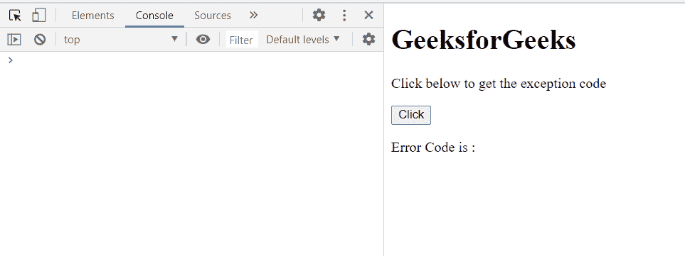
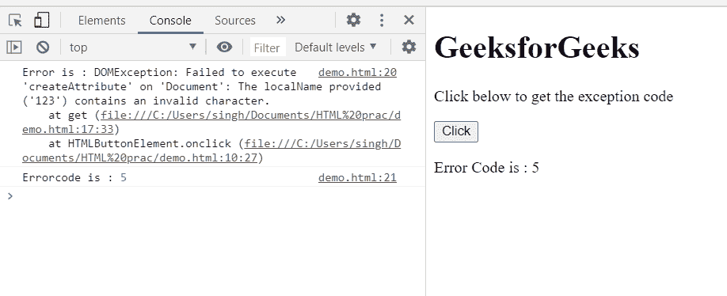

# HTML DOMException 代码属性

> 原文:[https://www . geesforgeks . org/html-DOM exception-code-property/](https://www.geeksforgeeks.org/html-domexception-code-property/)

DOMException 接口的**代码属性**返回一个包含异常错误的错误代码的短数字，如果不匹配则返回 0。这是只读属性。

**语法:**

```html
var codeNumber = domException.code;
```

**返回值:**该属性返回一个短数字。

**示例:**在本例中，我们将创建一个 INVALID_CHARACTER_ERR，然后显示其代码。

```html
<!DOCTYPE html>
<html>
<head>
  <meta charset="utf-8">
  <title>DOMException code example</title>
</head>
<body>
  <h1>GeeksforGeeks</h1>
  <p>Click below to get the exception code</p>
  <button onclick="get()">Click</button>
  <p class="p">Error Code is : </p>
</body>
<script>
    function get(){
        try {
                // INVALID_CHARACTER_ERR
            var elem = document.createAttribute ("123");
        }
        catch (e) {
            console.log("Error is :", e);
            console.log("Errorcode is :", e.code);
            document.querySelector(
      ".p").textContent+=e.code;
        }   
        } 
</script>
</html>
```

**输出:**

**按钮点击前:**



**按钮点击后:**



**支持的浏览器:**

*   谷歌 Chrome
*   边缘
*   火狐浏览器
*   旅行队
*   歌剧