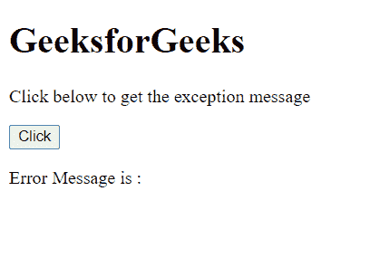
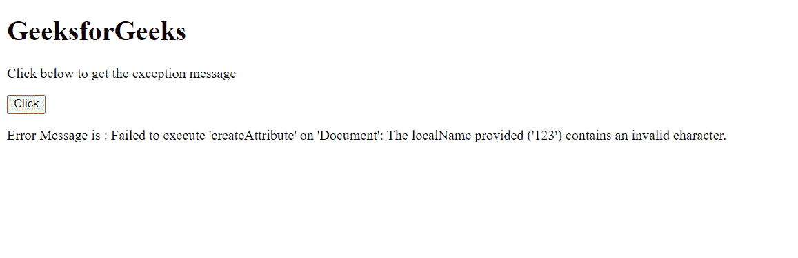

# 超文本标记语言异常消息属性

> 原文:[https://www . geesforgeks . org/html-DOM exception-message-property/](https://www.geeksforgeeks.org/html-domexception-message-property/)

属性返回表示与给定错误相关的消息或描述的。这是只读属性。

**语法:**

```html
domException.message
```

**返回值:**该属性返回一个与错误相关的多字符串。

**示例:** 本示例说明了多异常消息属性的使用。

## 超文本标记语言

```html
<!DOCTYPE html>
<html>

<body>
    <h1>GeeksforGeeks</h1>

    <p>
        Click below to get
        the exception message
    </p>

    <button onclick="get()">Click</button>

    <p class="p">Error Message is : </p>

    <script>
        function get() {
            try {
                // INVALID_CHARACTER_ERR
                var elem = document
                    .createAttribute("123");
            }
            catch (e) {
                document.querySelector(".p")
                    .textContent += e.message;
            }
        } 
    </script>
</body>

</html>
```

**输出:**

**点击按钮前:**



**点击按钮后:**



**支持的浏览器:**

*   谷歌 Chrome
*   边缘
*   火狐浏览器
*   旅行队
*   歌剧