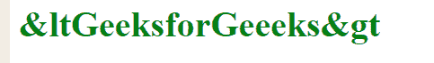
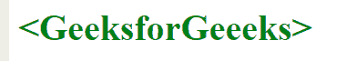

# 使用 CSS 内容添加 HTML 实体

> 原文:[https://www . geesforgeks . org/add-html-entities-use-CSS-content/](https://www.geeksforgeeks.org/adding-html-entities-using-css-content/)

HTML 提供了一些显示保留字符的方法。保留字符是为 HTML 保留的字符或基本键盘中不存在的字符。例如:‘HTML 实体。

**示例:**本示例使用使用 CSS 的 HTML 实体在文档中添加一些内容。

```html
<!DOCTYPE HTML>
<html>

<head>

    <!--If you write HTML entities directly, then 
    it will not provide the desired result-->

    <!--If you add < symbol before the content,
    then it will not produce the desired result-->

    <!-- If you add > symbol after the content, 
    then it will not produce the desired result-->

    <style>
        h1:before {
            content:'<';
            color:'green';
        }
        h1:after {
            content:'>';
            color:'green';
        }
        h1 {
            color:green;
        }
    </style>
</head>

<body>
    <h1>GeeksforGeeeks</h1>
</body>

</html>                    
```

**输出:**


**示例 2:** 本示例使用 CSS 添加大于号和小于号，然后使用其对应的转义 Unicode 添加大于号和小于号。

**示例:**

```html
<!DOCTYPE HTML>
<html>

<head>
    <!--If you want to add < symbol before the content,
    then use its "Unicode<div id="practice"></div>" which is "003C"-->

    <!--If you want to add > symbol after the content,
    then use its "Unicode" which is "003E"-->

    <style>
        h1:before {
            content:'\003C';
            color:'green';
        }
        h1:after {
            content:'\003E';
            color:'green';
        }
        h1 {
            color:green;
        }
    </style>
</head>

<body>
    <h1>GeeksforGeeeks</h1>
</body>

</html>                    
```

**输出:**
