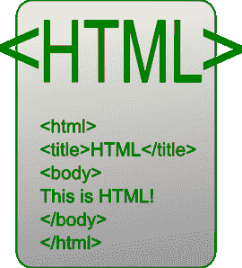

# HTML 的优缺点

> 原文:[https://www . geesforgeks . org/advantage-and-disadvantage-of-html/](https://www.geeksforgeeks.org/advantages-and-disadvanatges-of-html/)

**超文本标记语言(HTML)** 是一种超文本标记语言，用于文档的标准标记语言，设计为在浏览器期间在线显示和查看，也有助于创建网页的结构。因为它是一种标记语言，所以它由许多标签组成。有显示文本、表格、有序列表和无序列表等的标签。HTML 页面上有两个主要部分:头部和主体部分。描述页面的数据(也称为元数据)位于头部，而主体部分包括表示网页可见内容所需的所有标签。HTML 是一种独立于平台的语言，因此可以在任何平台上使用，如 Windows、Linux、Macintosh 等。

有各种各样的 HTML 版本。最新版本是 HTML 5。它的更高级的功能，如地理位置，本地音频和视频支持，画布，网络插座等。通常，HTML 是一种易于发现和使用的语言。程序员可以使用简单的文本编辑器创建一个 HTML 文件，并使用浏览器执行它。

**优势:**T2】

*   HTML 被广泛使用。
*   每个浏览器都支持超文本标记语言。
*   易于学习和使用。
*   HTML 重量轻，加载速度快。
*   不要购买任何额外的软件，因为默认情况下每个窗口都有。
*   使用方便
*   松散的语法(尽管过于灵活不符合标准)。
*   HTML 很容易写
*   HTML 的特点是，即使对于新手程序员来说，也很容易编写代码。
*   HTML 还允许使用模板，这使得设计网页变得容易。
*   对网页设计领域的初学者非常有用。
*   如果不是所有浏览器都支持 HTML，那么每个浏览器都可以支持它。
*   HTML 几乎建立在每个网站上，如果不是所有网站的话。
*   HTML 越来越多地像 XML 语法一样用于数据存储。
*   免费–您无需购买任何软件。
*   默认情况下，HTML 存在于每个窗口中，因此您不需要购买太贵的软件。
*   HTML 有许多标签和属性，可以缩短你的代码行。

**劣势:**T2】

*   它不能单独产生动态输出，因为它是一种静态语言。
*   使 HTML 文档的结构变得难以理解。
*   错误可能代价高昂。
*   维护页面的配色方案以及制作列表、表格和表单所花费的时间是一样耗时的。
*   它只能创建静态和普通页面，所以如果我们想要动态页面，那么 HTML 就没有用了。
*   需要写很多代码来创建一个简单的网页。
*   我们必须检查不推荐使用的标签，并确认不使用它们来显示，因为另一种使用 HTML 的语言已经取代了标签的第一个工作，因此需要理解和学习相反的语言。
*   HTML 提供的安全功能是有限的。
*   如果我们需要写下创建网页的长代码，那么就会产生一些复杂性。
*   HTML 只能创建静态页面和普通页面，所以如果我们想要动态页面，那么 HTML 就没有用了。
*   我需要写下大量的代码来创建一个简单的网页。
*   安全功能不擅长 HTML。
*   如果我们想写下创建网页的长代码，那么它会产生一些复杂性。