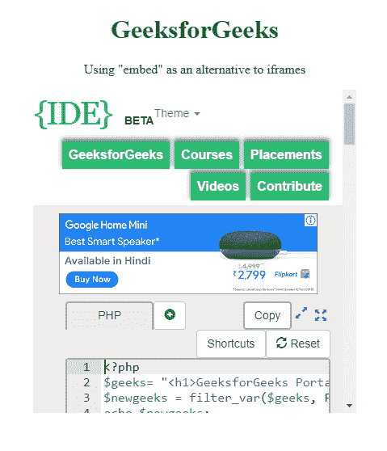
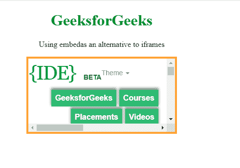

# html 5 中 iFrames 的替代

> 原文:[https://www . geesforgeks . org/alternative-to-iframes-in-html 5/](https://www.geeksforgeeks.org/alternative-to-iframes-in-html5/)

与之前的 iframe 不同，它是一个非标准标签，在 HTML 5 中是标准化的。诚然，所有主要浏览器都实现了这一点。嵌入元素为外部(通常是非 HTML)应用程序或交互式内容提供了集成目的。HTML 标记用于将外部应用程序或交互式内容嵌入到 HTML 文档中。

基本标签是这样写的，嵌入资源的 URL 被添加到 src 属性中(即双引号之间)。
类型属性接受嵌入资源的 MIME 类型。

**调整高度和宽度**

```html
<!DOCTYPE html>
<html>

<body>
    <center>
        <h1 style="color:green">GeeksforGeeks</h1>

        <p>Using "embed" as an alternative to iframes</p>
        <embed src="https://ide.geeksforgeeks.org"
               width="400" 
               height="400" />
    </center>
</body>

</html>
```

**输出:**使用嵌入的高度和宽度


**使用无边框嵌入。**
默认情况下，内嵌周围没有边框。但是我们也可以通过使用 style 属性和 CSS 边框属性来移除边框。

```html
<!DOCTYPE html>
<html>

<body>
    <center>
        <h1 style="color:green">
          GeeksforGeeks
      </h1>
        <p>Using "embed" as an alternative to iframes</p>
        <embed src="https://ide.geeksforgeeks.org/" 
               width="400" 
               height="400"
               style="border:none;" />
    </center>
</body>

</html>
```

**输出:**使用**无边框嵌入**
T5】

**在嵌入标签中，我们还可以应用不同颜色的边框。**

```html
<!DOCTYPE html>
<html>

<body>
    <center>
        <h1 style="color:green">GeeksforGeeks</h1>
        <p>Using embedas an alternative to iframes</p>
        <embed src="https://ide.geeksforgeeks.org" 
               style="border:4px solid orange;" />
    </center>
</body>

</html>
```

**输出:**使用**嵌入**带有纯橙色边框


**支持的浏览器:****嵌入式**支持的浏览器如下:

*   谷歌 Chrome
*   微软公司出品的 web 浏览器
*   火狐浏览器
*   苹果 Safari
*   歌剧