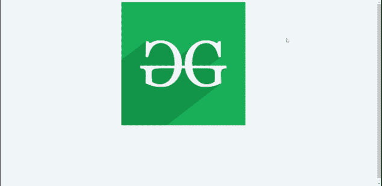
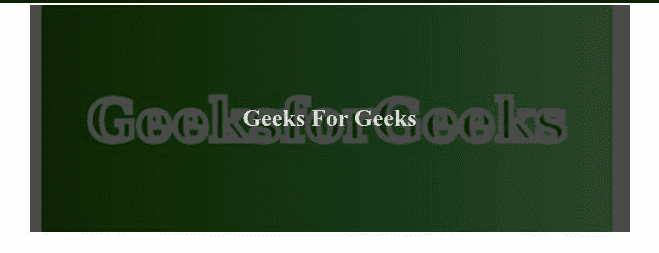
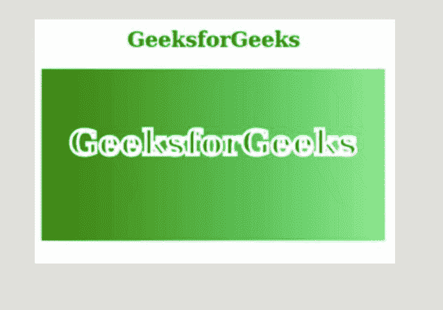

# 使用 HTML & CSS

的网页动画创意

> 原文:[https://www . geesforgeks . org/animation-ideas-for-web-page-use-html-CSS/](https://www.geeksforgeeks.org/animation-ideas-for-web-pages-using-html-css/)

直截了当和简单的网页很好，但不是最好的。动画是给静态页面带来活力的东西，让它更吸引眼球。

这里有一些使用 HTML 和 CSS 等前端语言制作网页动画的想法。

**1。旋转卡片:**第一个是旋转卡片。该卡有两个东西正面和背面当我们将鼠标悬停在卡上时，它将旋转 180 度，并且仅显示背面。

**说明:**这里第一个全身是造型形象。这个按钮是根据你的需要和创造力设计的。这里最主要的是旋转，首先背面隐藏或旋转 180 度，当我们悬停在卡片上时，正面旋转-180 度，背面在前面。

下面是说明*旋转卡*动画的例子。

**示例:**

## 超文本标记语言

```html
<!DOCTYPE html>
<html lang="en">

<head>
    <style>
        body {
            color: hsl(209, 61%, 16%);
            background: #fff;
            ;
        }

        img {
            width: 100%;
            display: block;
        }

        .btn {
            background: white;
            color: rgb(64, 119, 64);
            padding: 0.375rem 0.75rem;
            letter-spacing: 3px;
            display: inline-block;
            border: 2px solid transparent;
            border-radius: .5rem;
            cursor: pointer;
        }

        .blog {
            background: hsl(210, 36%, 96%);
        }

        .card {
            height: 500px;
            position: relative;
            width: 500px;
            margin-left: 30rem;
        }

        .card-side {
            -webkit-transition: all 2s linear;
            transition: all 2s linear;
            -webkit-backface-visibility: hidden;
            backface-visibility: hidden;
            position: absolute;
            top: 0;
            left: 0;
            width: 100%;
            height: 100%;
            border-radius: 0.5rem;
            visibility: visible;
        }

        .card-back {
            background: rgb(55, 116, 75);
            -webkit-transform: rotateY(180deg);
            transform: rotateY(180deg);
            display: grid;
            place-items: center;
        }

        .card:hover .card-front {
            -webkit-transform: rotateY(-180deg);
            transform: rotateY(-180deg);
        }

        .card:hover .card-back {
            -webkit-transform: rotateY(0);
            transform: rotateY(0);
        }

        .card-info {
            padding: 1rem 1.5rem;
        }

        .card-front img {
            height: 13rem;
            -o-object-fit: cover;
            object-fit: cover;
            height: 500px;
        }
    </style>
</head>

<body>
    <div class="section blog">
        <div class="card">

            <!-- front of the card -->
            <div class="card-side card-front">
                
            </div>

            <!-- card back  -->
            <div class="card-side card-back">
                <button class="btn">
                    Read More
                </button>
            </div>
        </div>
    </div>
</body>

</html>
```

**输出:**



旋转卡

**2。文字上移&下移:**在这个动画中，鼠标悬停在文字上，文字会上移，在点击移动的情况下，文字会上移。

**说明:**首先，使用溢出被隐藏和底部负值来覆盖下行文本。当我们将鼠标悬停在卡片上时，前面的文本使用 translateY 负值向上显示，下面的文本通过将底部的值设为 0 来显示。线性渐变用于清晰地阅读文本。过渡发挥了很大的作用，因为它使事情进展顺利。剩下的代码只是为了造型和让事情变好。

以下是说明*文本上移&下移*动画的示例。

**示例:**

## 超文本标记语言

```html
<!DOCTYPE html>
<html lang="en">

<head>
    <style>
        .services-container {
            max-width: 600px;
            margin: 0 auto;
            color: #e0e2db;
            background: url(
https://media.geeksforgeeks.org/wp-content/uploads/20201113113041/paintorder1.png);
            background-position: center;
            background-size: cover;
            background-repeat: no-repeat;
        }

        .service-item {
            overflow: hidden;
            position: relative;
            padding: 80px;
        }

        .service-item-black {
            background: linear-gradient(
                rgba(0, 0, 0, 0.7), 
                rgba(0, 0, 0, 0.7)
            );
        }

        .front-text {
            text-align: center;
            transition: transform 2s;
        }

        .back-text {
            position: absolute;
            bottom: -15em;
            width: 75%;
            margin: 0 auto;
            height: 100%;
            transition: bottom 2s;
            padding: 15px 0;
        }

        .back-text h1 {
            margin-bottom: 20px;
        }

        .back-text button {
            margin-top: 20px;
            padding: 10px 20px;
            background: transparent;
            border: 2px solid #30804b;
            font-size: 20px;
            color: #30804b;
        }

        .back-text button:hover {
            background-color: #30804b;
            color: #191716;
        }

        .service-item:hover .front-text {
            transform: translateY(-200px);
        }

        .service-item:hover .back-text {
            bottom: 0;
        }
    </style>
</head>

<body>
    <div class="services-container">
        <article class="service-item 
       service-item-black">
            <div class="front-text">
                <h1>Geeks For Geeks</h1>
            </div>

            <div class="back-text">
                <h1>Geeks For Geeks</h1>

                <p>
                    A Computer Science portal for geeks.
                    A Computer Science portal for geeks.
                    A Computer Science portal for geeks.
                </p>

                <button type="button">Read More</button>
            </div>
        </article>
    </div>
</body>

</html>
```

**输出:**



**3。悬停时出现的文本:**在此动画中，悬停时出现的文本会出现在图像上，并且图像会被缩放。

**说明:**首先是让文字消失，这是通过让不透明度为零来完成的。现在，在悬停图像时，图像将被缩放，溢出隐藏属性确保图像的外部在缩放时不会超出特定的高度和宽度。悬停使图像文本的不透明度可见。过渡属性只是让事情变得更顺利。

下面是说明悬停动画上出现*文本的示例。*

**示例:**

## 超文本标记语言

```html
<!DOCTYPE html>
<html lang="en">

<head>
    <style>
        #projects {
            padding: 20px 0 80px 0;
            background-color: #e0e2db;
        }

        .projects-container {
            max-width: 40vw;
            margin: 0 auto;
        }

        .projects-item {
            position: relative;
            background: linear-gradient(
                rgba(0, 0, 0, 0.9), 
                rgba(0, 0, 0, 0.9)
            );
            color: #e0e2db;
            overflow: hidden;
            margin: 10px 0;
        }

        #projects img {
            width: 100%;
            min-height: 100%;
            transition: transform 2s;
            display: block;
        }

        .img-text {
            position: absolute;
            top: 50%;
            left: 50%;
            transform: translate(-50%, -50%);
            text-align: center;
            opacity: 0;
            transition: opacity 4s;
        }

        .img-text h1 {
            font-size: 40px;
            margin-bottom: 10px;
        }

        .img-text h6 {
            font-size: 20px;
        }

        .projects-item:hover img {
            opacity: 0.4;
            transform: scale(1.3);
        }

        .projects-item:hover .img-text {
            opacity: 1;
        }
    </style>
</head>

<body>

    <div id="projects">
        <div class="projects-container">
            <article class="projects-item">
                
                <div class="img-text">
                    <h1>GeeksforGeeks</h1>

                    <h6>
                        It is a computer Science
                        portal for geeks.
                    </h6>
                </div>
            </article>
        </div>
    </div>

</body>

</html>
```

**输出:**

