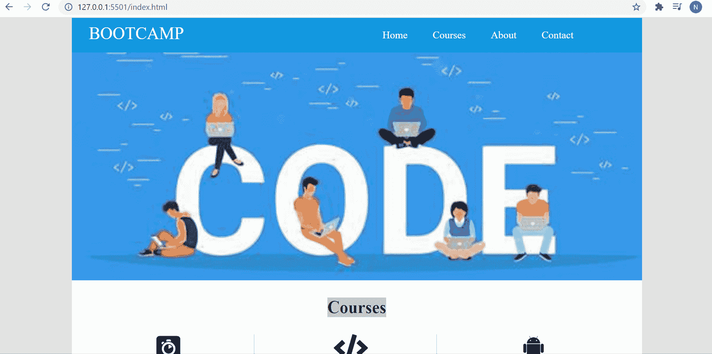

# 使用 HTML 和 CSS 的训练营网站模板

> 原文:[https://www . geesforgeks . org/boot camp-网站-模板-使用-html-and-css/](https://www.geeksforgeeks.org/bootcamp-website-template-using-html-and-css/)

在本文中，我们将看到如何使用 [HTML](https://www.geeksforgeeks.org/html-tutorials/) 和 [CSS](https://www.geeksforgeeks.org/css-tutorials/) 设计一个简单的**训练营网站模板**。

对于那些不是 CSS 专家的人来说，创建一个有吸引力的模板会很困难。不使用 CSS，就无法让网页更有吸引力。所以为了制作一个网页，我们需要有 HTML 和 CSS 的知识。在本文中，我们将使用 HTML 和 CSS 来制作网站模板。为了设计一个模板，我们需要首先创建一个 HTML 网页结构。

**第一步:使用 HTML–**创建网页结构在本节中，我们将使用[<div>](https://www.geeksforgeeks.org/div-tag-html/)[<Li>](https://www.geeksforgeeks.org/html-li-tag/)和 [<节>](https://www.geeksforgeeks.org/html-section-tag/) 标签以及[类](https://www.geeksforgeeks.org/html-class-attribute/#:~:text=The%20class%20is%20an%20attribute,with%20the%20specified%20class%20name.)和 [id](https://www.geeksforgeeks.org/html-id-attributes/) 属性来创建网页的简单结构。我们将有以下部分:导航栏，横幅，课程，关于，最后，我们将有联系我们部分。因此，这将创建一个简单的接口，您可以通过运行以下代码来进行检查。

**HTML 代码:**

## index.html

```html
<!DOCTYPE html>
<html lang="en">

<head>
    <meta charset="UTF-8" />
    <meta name="viewport" content=
        "width=device-width, initial-scale=1.0" />
    <meta http-equiv="X-UA-Compatible" 
        content="ie=edge" />
    <title>BOOTCAMP</title>
    <link rel="stylesheet" href="style.css" />
    <link rel="stylesheet" href=
"https://use.fontawesome.com/releases/v5.8.1/css/all.css"
        integrity=
"sha384-50oBUHEmvpQ+1lW4y57PTFmhCaXp0ML5d60M1M7uH2+nqUivzIebhndOJK28anvf"
        crossorigin="anonymous" />
</head>

<body>
    <div class="container">

        <!-------- Creating Navbar --------->
        <nav>
            <a href="#">BOOTCAMP</a>
            <div class="navbar">
                <ul>
                    <li><a href="index.html">Home</a></li>
                    <li><a href="#">Courses</a></li>
                    <li><a href="#">About</a></li>
                    <li><a href="#">Contact</a></li>
                </ul>
            </div>
        </nav>

        <!--------- Creating Banner -------->
        <div class="main-banner">
            
        </div>

        <!-------- Courses or services ------->
        <section class="service">
            <h1>Courses</h1>
            <div class="col">
                <i class="fab fa-algolia fa-3x ip"></i>
                <h3>Web Designing</h3>
                <p>
                    If you are looking for a way to 
                    use your artistic side, web design 
                    is a great way to do it.In today's 
                    world, learning how to design 
                    websites can be an incredibly useful 
                    skill.
                </p>

                <a href="#">Know More</a>
            </div>

            <div class="col">
                <i class="fas fa-code fa-3x ip"></i>
                <h3>Web Development</h3>
                <p>
                    Web development gives you the 
                    opportunity to express yourself 
                    creatively on the internet.
                    Fortunately, the high demand, 
                    easy-to-learn, fun-to-experience
                    life.
                </p>

                <a href="#">Know More</a>
            </div>

            <div class="col">
                <i class="fab fa-android fa-3x ip"></i>
                <h3>Android</h3>
                <p>
                    By learning Android Development, 
                    you give yourself the best possible 
                    chance to reach any career goals you 
                    set. Once you get started, within no 
                    time, you'll land in your dream job.
                </p>

                <a href="#">Know More</a>
            </div>
        </section>

        <section class="about">
            <h1>Why choose us?</h1>
            
            <p>
                In today’s digital world, when there 
                are thousands of online platforms 
                (maybe more than that!) available over 
                the web, it becomes quite difficult for 
                students to opt for a quality, relevant 
                and reliable platform for themselves.
                BOOTCAMP will help you excel in your 
                choice of domain by giving industry 
                equivalent experience.
            </p>

            <a href="#">More</a>
        </section>

        <section id="contact">
            <div class="services-info">
                <h1>Get in<span id="blue">Touch</span></h1>
                <p> We are Available</p>
            </div>

            <div class="contact-row">
                <div class="contact-left-col">
                    <div class="form">
                        <input type="text" name="" 
                            placeholder="E-mail">
                        <input type="text" name="" 
                            placeholder="Subject"><br>
                        <textarea rows="10" cols="40" 
                            placeholder="Message">
                        </textarea>
                        <br> 
                        <button class="c_btn">
                            Send
                        </button>
                    </div>
                </div>

                <div class="contact-right-col">
                    <h1>
                        <i class="fa fa-envelope" 
                            aria-hidden="true"></i> E-mail
                    </h1>
                    <p>geek@gmail.com</p><br>
                    <h1>
                        <i class="fa fa-phone" 
                            aria-hidden="true"></i> Mobile
                    </h1>
                    <p>8212341487, 9080140989</p>
                    <br>
                    <h1>
                        <i class="fa fa-location-arrow" 
                            aria-hidden="true"></i> Address
                    </h1>
                    <p> Noida Sector 136<br>
                        Metro Pillar- 237
                    </p>
                </div>
            </div>
        </section>

        <footer>
            <small>Copyright © 2021 || Designed by Geeks
            </small>
        </footer>
    </div>
</body>

</html>
```

**第二步:使用 CSS 设计网页结构–**我们将使用 CSS 为我们在 HTML 代码中创建的 HTML 网页结构赋予适当的设计效果。我们将为我们在上面的代码中使用的类和 id 提供样式。我们将使用 [flex](https://www.geeksforgeeks.org/css-flex-property/) 属性，以便于定位子元素和主容器。页边距不会随着内容页边距而折叠。无需编辑 HTML 部分，任何元素的顺序都可以轻松更改。

**CSS 代码:**

## style.css

```html
/* Write CSS Here */* {
  margin: 0px;
  padding: 0px;
  box-sizing: border-box;
}

body {
  background-color: #e3e3e3;
}
.container {
  width: 1000px;
  margin-left: auto;
  margin-right: auto;
  margin-bottom: 10px;
}

nav {
  background-color: #089de3;
}

nav > a {
  color: #fff;
  font-size: 30px;
  text-decoration: none;
  /* top right bottom left*/
  padding: 10px 10px 10px 30px;
  float: left;
}

.navbar > ul {
  list-style: none;
  float: right;
}

.navbar > ul > li {
  display: inline-block;
  line-height: 60px;
  /*top-bottom right-left*/
  padding: 0px 20px;
}

.navbar > ul:last-child {
  padding-right: 100px;
}

.navbar > ul > li > a {
  text-decoration: none;
  font-size: 18px;
  color: #fff;
}

.navbar > ul > li:hover {
  background-color: #111111;
}

nav::after {
  content: " ";
  display: block;
  clear: both;
  *zoom: 1;
}

/* Navbar End */

/* Banner Start */
.main-banner {
  height: 400px;
}
.main-banner > img {
  width: 100%;
  height: 400px;
  object-fit: cover;
}
/* Banner End */

/* Service Start */
.service {
  background-color: #fff;
}

.service > h1 {
  font-size: 30px;
  text-align: center;
  padding: 30px;
}

.col {
  width: 300px;
  text-align: center;
  margin-left: 20px;
  border-right: solid #bebebe 1px;
  padding-bottom: 30px;
  float: left;
}

.col:last-child {
  border-right: none;
}

.col > h3 {
  /* top-bottom right-left */
  padding: 10px 0px;
  color: grey;
}

.col > p {
  padding-bottom: 20px;
}

.col > a {
  background-color: #089de3;
  color: #fff;
  font-size: 17px;
  text-decoration: none;
  border: solid white 2px;
  padding: 5px 10px;
  border-radius: 20px;
}

.col > a:hover {
  background-color: #111111;
  border: solid #111111 2px;
}
.service::after {
  content: " ";
  display: block;
  clear: both;
  *zoom: 1;
}
/* Service End */

/* about Start */
.about {
  background-color: #089de3;
  min-height: 300px;
  text-align: center;
  padding: 20px;
  color: #fff;
}

.about > h1 {
  font-size: 30px;
  padding-bottom: 20px;
}

.about > img {
  border: solid 2px;
  width: 100px;
  height: 100px;
  border-radius: 50px;
  object-fit: cover;
}

.about > p {
  font-size: 18px;
  margin: 10px 200px;
  padding-bottom: 10px;
  line-height: 25px;
}

.about > a {
  color: #fff;
  font-size: 17px;
  text-decoration: none;
  border: solid white 1px;
  padding: 5px 20px;
}

.about > a:hover {
  background-color: #111111;
  border: solid #111111 1px;
}
/* about End */

#contact{
    padding: 30px 0px;
}

.contact-row{
    display: flex;
    justify-content: center;
    align-items: center;
}
.contact-left-col{
    flex-basis: 50%;
    padding-top: 50px;
}
.contact-right-col{
    flex-basis: 50%;
    max-width: 450px;
    margin: auto;
}
.contact-right-col i{
    font-size: 20px;
    padding: 10px;
    background:#089de3;
    color: white; 
}
.contact-right-col p{
    margin-top: 10px;
    margin-bottom: 20px;
}

.form{

    width: 70%;
    margin:auto;
    text-align: center;
}
.form input[type="text"]{
    width: 70%;
    padding: 10px;
    margin-bottom: 10px;
}
textarea{
    width: 70%;
    padding: 10px;
    margin-bottom: 10px;
}

.c_btn{
    background: black;
    color: white;
    padding: 10px;
    width: 50%;
    border:none;
}

/* Footer Start */
footer {
  background-color: #089de3;
  text-align: center;
  padding: 10px;
}

footer > small {
  color: #fff;
}

footer > small > a {
  color: #fff;
  text-decoration: none;
}
/* Footer End */
```

**输出:**用 Visual Studio Code 中的 live 服务器打开，或者如果您正在使用任何其他代码编辑器，只需在浏览器中打开 index.html 文件。

