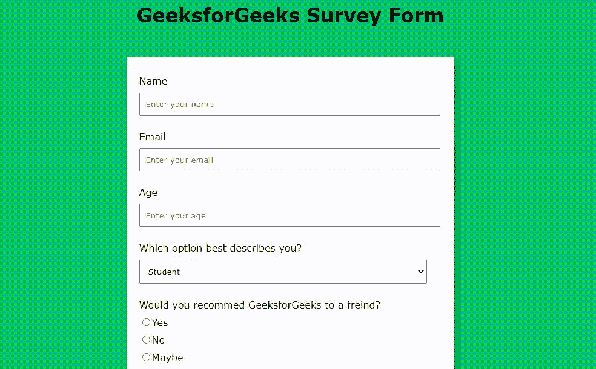

# 使用 HTML 和 CSS 构建调查表单

> 原文:[https://www . geesforgeks . org/build-a-survey-form-use-html-and-CSS/](https://www.geeksforgeeks.org/build-a-survey-form-using-html-and-css/)

表单始终是用于收集用户输入信息的任何项目的重要组成部分。在本文中，我们使用 HTML 和 CSS 为极客们创建了一个调查表单。在这个表单中，有几个问题是由用户提出的。在这里，我们将使用 HTML 来设计表单的基本布局，CSS 将为我们的布局提供漂亮的设计，如文本装饰、文本颜色、背景颜色、文本对齐、边距、填充等。在…里

**先决条件:**HTML 和 CSS 的基本概念，如标签、ID、颜色、边距、填充、字体、文本字段、复选框、单选按钮等。

**进场:**

*   [<表单>](https://www.geeksforgeeks.org/html-form-tag/) 元素用于创建一个 HTML 表单供用户输入。
*   在表单元素中，为用户提供不同的选项，如[姓名](https://www.geeksforgeeks.org/html-input-name-attribute/)、[电子邮件](https://www.geeksforgeeks.org/html-input-typeemail/)、[年龄](https://www.geeksforgeeks.org/html-input-name-attribute/)等。在 HTML 中，我们对不同的任务有不同的输入元素。因此，我们根据问题提供了相应的输入类型(用于接收电子邮件输入的电子邮件、用于接收大消息的文本区域、用于接收姓名输入的姓名等。).
*   我们还使用了[单选按钮](https://www.geeksforgeeks.org/html-input-typeradio/)(让用户选择提供的选项。)、check-button(允许用户从提供的选项中选择零个或多个选项)和 submit-button(用于将表单数据提交给表单处理程序的按钮)。

**示例:**

## 超文本标记语言

```html
<!DOCTYPE html>
<html lang="en">

<head>
    <meta charset="UTF-8">
    <meta http-equiv="X-UA-Compatible" content="IE=edge">
    <meta name="viewport" content=
        "width=device-width, initial-scale=1.0">
    <title>
        Build a Survey Form using HTML and CSS
    </title>

    <style>

        /* Styling the Body element i.e. Color,
        Font, Alignment */
        body {
            background-color: #05c46b;
            font-family: Verdana;
            text-align: center;
        }

        /* Styling the Form (Color, Padding, Shadow) */
        form {
            background-color: #fff;
            max-width: 500px;
            margin: 50px auto;
            padding: 30px 20px;
            box-shadow: 2px 5px 10px rgba(0, 0, 0, 0.5);
        }

        /* Styling form-control Class */
        .form-control {
            text-align: left;
            margin-bottom: 25px;
        }

        /* Styling form-control Label */
        .form-control label {
            display: block;
            margin-bottom: 10px;
        }

        /* Styling form-control input,
        select, textarea */
        .form-control input,
        .form-control select,
        .form-control textarea {
            border: 1px solid #777;
            border-radius: 2px;
            font-family: inherit;
            padding: 10px;
            display: block;
            width: 95%;
        }

        /* Styling form-control Radio
        button and Checkbox */
        .form-control input[type="radio"],
        .form-control input[type="checkbox"] {
            display: inline-block;
            width: auto;
        }

        /* Styling Button */
        button {
            background-color: #05c46b;
            border: 1px solid #777;
            border-radius: 2px;
            font-family: inherit;
            font-size: 21px;
            display: block;
            width: 100%;
            margin-top: 50px;
            margin-bottom: 20px;
        }
    </style>
</head>

<body>
    <h1>GeeksforGeeks Survey Form</h1>

    <!-- Create Form -->
    <form id="form">

        <!-- Details -->
        <div class="form-control">
            <label for="name" id="label-name">
                Name
            </label>

            <!-- Input Type Text -->
            <input type="text"
                   id="name"
                   placeholder="Enter your name" />
        </div>

        <div class="form-control">
            <label for="email" id="label-email">
                Email
            </label>

            <!-- Input Type Email-->
            <input type="email"
                   id="email"
                   placeholder="Enter your email" />
        </div>

        <div class="form-control">
            <label for="age" id="label-age">
                Age
            </label>

            <!-- Input Type Text -->
            <input type="text"
                   id="age"
                   placeholder="Enter your age" />
        </div>

        <div class="form-control">
            <label for="role" id="label-role">
                Which option best describes you?
            </label>

            <!-- Dropdown options -->
            <select name="role" id="role">
                <option value="student">Student</option>
                <option value="intern">Intern</option>
                <option value="professional">
                    Professional
                </option>
                <option value="other">Other</option>
            </select>
        </div>

        <div class="form-control">
            <label>
                Would you recommed GeeksforGeeks
                to a friend?
            </label>

            <!-- Input Type Radio Button -->
            <label for="recommed-1">
                <input type="radio"
                       id="recommed-1"
                       name="recommed">Yes</input>
            </label>
            <label for="recommed-2">
                <input type="radio"
                       id="recommed-2"
                       name="recommed">No</input>
            </label>
            <label for="recommed-3">
                <input type="radio"
                       id="recommed-3"
                       name="recommed">Maybe</input>
            </label>
        </div>

        <div class="form-control">
            <label>Languages and Frameworks known
                <small>(Check all that apply)</small>
            </label>
            <!-- Input Type Checkbox -->
            <label for="inp-1">
                <input type="checkbox"
                       name="inp">C</input></label>
            <label for="inp-2">
                <input type="checkbox"
                       name="inp">C++</input></label>
            <label for="inp-3">
                <input type="checkbox"
                       name="inp">C#</input></label>
            <label for="inp-4">
                <input type="checkbox"
                       name="inp">Java</input></label>
            <label for="inp-5">
                <input type="checkbox"
                       name="inp">Python</input></label>
            <label for="inp-6">
                <input type="checkbox"
                       name="inp">JavaScript</input></label>
            <label for="inp-7">
                <input type="checkbox"
                       name="inp">React</input></label>
            <label for="inp-7">
                <input type="checkbox"
                       name="inp">Angular</input></label>
            <label for="inp-7">
                <input type="checkbox"
                       name="inp">Django</input></label>
            <label for="inp-7">
                <input type="checkbox"
                       name="inp">Spring</input></label>
        </div>

        <div class="form-control">
            <label for="comment">
                Any comments or suggestions
            </label>

            <!-- multi-line text input control -->
            <textarea name="comment" id="comment"
                placeholder="Enter your comment here">
            </textarea>
        </div>

        <!-- Multi-line Text Input Control -->
        <button type="submit" value="submit">
            Submit
        </button>
    </form>
</body>

</html>
```

**输出:**

