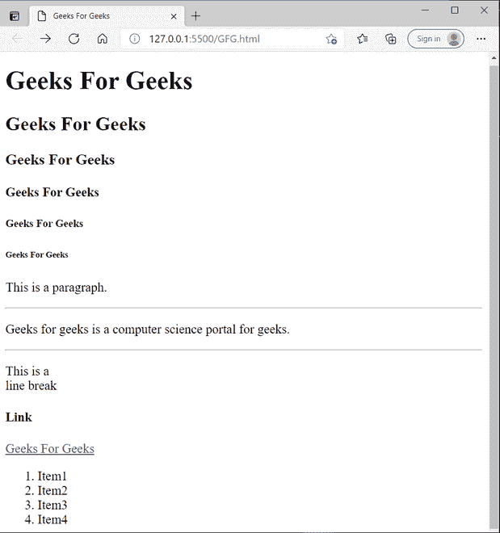

# HTML 中的容器和空标签

> 原文:[https://www . geesforgeks . org/container-and-empty-tags-in-html/](https://www.geeksforgeeks.org/container-and-empty-tags-in-html/)

HTML 使用预定义的标签告诉浏览器如何显示内容。标签只不过是用角括号括起来的一些说明(即<>)。标签被用在网页的很多地方，但是很多用户经常对一些标签感到困惑，不管它是一个容器还是一个空标签。他们之所以会有这种困惑，是因为他们不知道除了开始标记之外，还应该有一个结束标记。HTML 中有两种类型的标签:

*   空的
*   容器

现在，让我们看看最常用的 HTML 容器和空标签的定义和示例。

### 集装箱标签

容器标签通常分为三个部分，即开始标签、内容(将显示在浏览器上)和结束标签。在内容部分，它们还可以包含一些其他标签。这些开始标记和结束标记成对使用，它们是开始标记和结束标记，通常称为开和关标记。如果您忘记关闭容器标签，浏览器将应用开始标签的效果，直到页面结束。所以在使用容器标签时要小心。HTML 中的大多数标签都是容器标签。

**语法:**

> <tag_name>……</tag_name>

一些常用的容器标签有:

**1。基本标签:**以下标签用于创建网页的结构:

> *   **< html > …。 </html >** : This marks the beginning and end of the web page, and also shows that the document is an HTML document. This includes all other tags between these tags, which are considered for making web pages.
> *   **< Header > ... </Header >** : This tag is used to define the header of the document containing information related to the webpage.
> *   **< Title > ... </Title >** : This tag stores the description of the web page. No matter what is given in these tags, it will appear on the tag name when the browser is opened. It is described in the title tag.
> *   **< Body > ... </body >:** This tag is used to display all information or data, i.e. text, images, hyperlink videos, etc. , and put it on the web page for users.

**2。标题:**以下标签用于标题:

> **< h1 > …。< /h1 >至<h6>……</h6>:**用于包含 1 至 6 个不同大小的标题。

**3。文本格式化程序:**以下标签用于文本格式化:

> *   **< p > …。 </P >** : When paragraphs need to be included, use
> *   **< b > …。 </b >** : Make the included text bold.
> *   **< I > … </I >** : Turn the included text into italics.

**4。超链接:**以下标签用于定义网页中的超链接:

> **<a href = " link . com ">……</a>:**当我们链接一些其他网页时，我们使用这个<a……>……</a>标签将超链接添加到其他网页。

**5。按钮标签:**以下标签用于创建点击按钮:

> **<按钮>…</按钮> :** 这有很多用法，但主要用于通过添加事件等来操纵 dom。

**6。分部标签:**以下标签用于创建分部:

> **<分区> …。< /div > :** 这定义了文档中的一个部分。使用< div >可以将网页分成不同的部分。< /div >标签。

**7。Iframe 标签:**以下标签用于内嵌框架:

> **<iframe src = " link . com></iframe>**:当一些其他文档要像一些视频或图像一样嵌入到 HTML 中时，我们使用这个标签。

**8。导航标签:**以下标签用于设置导航链接:

> **<导航>…</导航> :** 定义包含一组菜单或超链接菜单的导航栏。

**9。脚本标签:**以下标签用于向网页添加 JavaScript 代码:

> **<脚本>……</脚本>** :这包含了给网页增加交互性的 javascript 代码。

**10。列表:**跟随标签用于以有序和无序列表的形式写入数据:

> *   **< ol > ... </ol >:** This tab is used to create an ordered list.
> *   **< UL > … </UL >:** This tab is used to create an unordered list.
> *   **< Li > ... </Li >:** This tab is used to add list items.

### 空标签

不包含任何结束标记的标记称为空标记。空标签仅包含开始标签，但它们在网页中执行一些操作。

**语法:**

> <tag_name></tag_name>

一些常用的空标签有:

1.  **< br > :** 在网页中任何需要的地方使用换行符。
2.  **< hr > :** 在网页中任何需要的地方插入一条水平线。
3.  **< img > :** 该标签用于显示网页上在标签的 src 属性中给出的图像。
4.  **<输入>** :这主要是和表单一起使用，从用户那里获取输入，我们也可以定义输入的类型。
5.  **<链接> :** 当我们将我们的 CSS 存储在一个外部文件中时，这可以用来将外部文件和文档链接到网页，它主要用于链接 CSS 文件。
6.  **<元> :** 包含网页的所有元数据。元数据是关于数据的数据，在头标签中描述。
7.  **<来源> :** 当网页需要包含外部媒体源时。source 标签用于在我们的网页中插入任何媒体源，如音频、视频等。

**示例:**

这个例子演示了容器和空标签的使用:

## 超文本标记语言

```html
<!DOCTYPE html>
<html lang="en">
<head>
    <!--Meta data-->
    <meta charset="UTF-8">
    <meta http-equiv="X-UA-Compatible" content="IE=edge">
    <meta name="viewport" content="width=device-width, initial-scale=1.0">

    <!--The description written on title tag get appeared as browser tab name-->
    <title>Geeks For Geeks </title>

</head>
<!-- Whatever content in body tag appears on the webpage-->
<body>
    <!--Headings-->
    <h1> Geeks For Geeks </h1>
    <h2> Geeks For Geeks </h2>
    <h3> Geeks For Geeks </h3>
    <h4>Geeks For Geeks </h4>
    <h5> Geeks For Geeks</h5>
    <h6> Geeks For Geeks </h6>

<p> This is a paragraph.</p>

     <!--For horizontal line -->
     <hr> 
    <!--For paragraphs -->

<p> Geeks for geeks is a computer science portal for geeks. </p>

   <hr> 

<p> This is a <br> line break </p>

    <h4> Link </h4>
    <a href="https://www.geeksforgeeks.org/"> Geeks For Geeks</a>
    <!--For ordered lists-->
    <ol>
        <li> Item1</li>
        <li> Item2 </li>
        <li> Item3 </li>
        <li> Item4</li>
    </ol>

</body>
</html>
```

**输出:**

