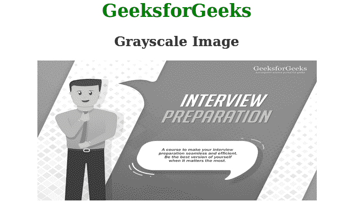

# 使用 HTML/CSS 将图像转换为灰度图像

> 原文:[https://www . geesforgeks . org/convert-a-image-to-grade-image-use-html-CSS/](https://www.geeksforgeeks.org/convert-an-image-into-grayscale-image-using-html-css/)

给定一个彩色图像，任务是使用 CSS 属性将图像转换为灰度图像。在 CSS 中，滤镜属性用于将图像转换为灰度图像。Filter 属性主要用于设置图像的视觉效果。

**语法:**

```html
filter: grayscale()
```

**示例 1:** 在本例中，使用滤镜:灰度(100%)将图像转换为灰度。

```html
<!DOCTYPE html>
<html>
    <head>
        <title>Convert into grayscale image</title>
        <style>
            img {
                -webkit-filter: grayscale(100%);
                filter: grayscale(100%);
            }
            h1 {
                color:green;
            }
        </style>
    </head>
    <body>
        <center>
        <h1>GeeksforGeeks</h1>
        <h2>Grayscale Image</h2>
          
        </center>
    </body>
</html>
```

**输出:**


**例 2:**

```html
<!DOCTYPE html>
<html>
    <head>
        <title>Convert into grayscale image</title>
        <style>
            img {
                -webkit-filter: grayscale(1);
                filter: grayscale(1);
            }
            img:hover {
              -webkit-filter: grayscale(0);
              filter: none;
            }
            h1 {
                color:green;
            }
        </style>
    </head>
    <body>
        <center>
        <h1>GeeksforGeeks</h1>
        <h2>Grayscale Image</h2>
          
        </center>
    </body>
</html>
```

**输出:**
