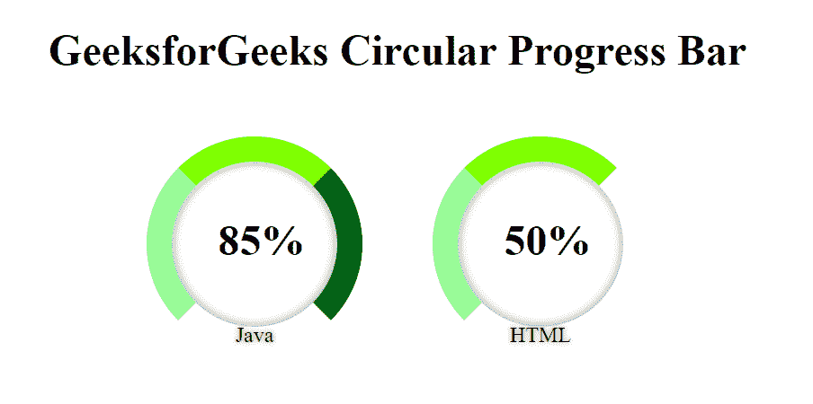

# 使用 HTML 和 CSS 创建圆形进度条

> 原文:[https://www . geesforgeks . org/create-a-circular-进度条-使用-html-and-css/](https://www.geeksforgeeks.org/create-a-circular-progress-bar-using-html-and-css/)

进度条用于显示计算机上进程的进度。进度条显示流程完成了多少，还剩下多少。所以，今天我们将使用 HTML 和 CSS 设计一个圆形进度条。通过使用 HTML，我们将为进度条设计不同的组件，然后通过使用 CSS 的属性，我们可以设置进度条的样式。

为了更清楚地理解今天的任务，我们提供了一张示例图片。



**分步实施:**

**第一步:**首先，我们将使用 HTML 设计一个基本的进度条结构。首先，我们将创建一个包含两个进度条的容器 div。之后，我们将在容器 div 中创建另一个 div，创建循环 div 元素。这里我们增加了一些评论，有助于读者轻松理解。

## 超文本标记语言

```html
<!DOCTYPE html>
<html lang="en">

<head>
    <meta charset="UTF-8">
    <meta http-equiv="X-UA-Compatible" content="IE=edge">
    <meta name="viewport" content=
        "width=device-width, initial-scale=1.0">

    <!-- Set title of web page -->
    <title>GFG Circular progress Bar</title>
</head>

<body>

    <!-- Added heading of the page -->
    <h1>GeeksForGeeks Circular Progress Bars</h1>

    <!-- Creating a container class that 
        hold other useful classes -->
    <div class="container">

        <!-- Creating a ui-widgets classes that 
            store other useful classes like 
            ui-values and ui-labels -->
        <div class="ui-widgets">
            <div class="ui-values">85%</div>
            <div class="ui-labels">Java</div>
        </div>

        <div class="ui-widgets">
            <div class="ui-values">50%</div>
            <div class="ui-labels">HTML</div>
        </div>
    </div>
</body>

</html>
```

**第二步:**接下来，我们将使用一些 CSS 属性来设计进度条。容器类设置 div 元素的位置。其他 CSS 类用于创建圆形进度条和添加 CSS 样式。

## 半铸钢ˌ钢性铸铁(Cast Semi-Steel)

```html
/* Apply css properties to h1 element */
h1{
    text-align: center;
}

/* Create a container using css properties */
.container {
    top: 30%;
    left:50%;
    position: absolute;
    text-align: center;
    transform: translate(-50%, -50%);
}

/* Apply css properties to ui-widgets class */
.ui-widgets {
    position: relative;
    display: inline-block;
    width: 10rem;
    height: 10rem;
    border-radius: 9rem;
    margin:1.5rem;
    border: 1.2rem solid palegreen;
    box-shadow: inset 0 0 7px grey;
    border-left-color: palegreen;
    border-top-color:chartreuse ;
    border-right-color: darkgreen;
    border-bottom-color: white ;
    text-align: center;
    box-sizing: border-box;
}

/* Apply css properties to the second
    child of ui-widgets class */
.ui-widgets:nth-child(2) {
    border-top-color:chartreuse ;
    border-right-color: white;
    border-left-color: palegreen;
    border-bottom-color: white;
}

/* Apply css properties to ui-widgets
   class and ui-values class */
.ui-widgets .ui-values {
    top: 40px;
    position: absolute;
    left: 10px;
    right: 0;
    font-weight: 700;
    font-size: 2.0rem;
}

/*  Apply css properties to ui-widgets 
class and ui-labels class */
.ui-widgets .ui-labels {
    left: 0;
    bottom: -16px;
    text-shadow: 0 0 4px grey;
    color:black;
    position: absolute;
    width: 100%;
    font-size: 16px;
}
```

**完成代码:**在本节中，我们将结合以上两个部分，使用 HTML 和 CSS 创建一个圆形进度条。

## 超文本标记语言

```html
<!DOCTYPE html>
<html lang="en">

<head>
    <meta charset="UTF-8">
    <meta http-equiv="X-UA-Compatible" content="IE=edge">
    <meta name="viewport" content=
        "width=device-width, initial-scale=1.0">

    <!-- Set title of web page -->
    <title>GFG Circular progress Bar</title>

    <style>

        /* Apply css properties to h1 element */
        h1 {
            text-align: center;
        }

        /* Create a container using CSS properties */
        .container {
            top: 30%;
            left: 50%;
            position: absolute;
            text-align: center;
            transform: translate(-50%, -50%);
        }

        /* Apply CSS properties to ui-widgets class */
        .ui-widgets {
            position: relative;
            display: inline-block;
            width: 10rem;
            height: 10rem;
            border-radius: 9rem;
            margin: 1.5rem;
            border: 1.2rem solid palegreen;
            box-shadow: inset 0 0 7px grey;
            border-left-color: palegreen;
            border-top-color: chartreuse;
            border-right-color: darkgreen;
            border-bottom-color: white;
            text-align: center;
            box-sizing: border-box;
        }

        /*  Apply css properties to the second 
            child of ui-widgets class */
        .ui-widgets:nth-child(2) {
            border-top-color: chartreuse;
            border-right-color: white;
            border-left-color: palegreen;
            border-bottom-color: white;
        }

        /*  Apply css properties to ui-widgets class 
            and ui-values class*/
        .ui-widgets .ui-values {
            top: 40px;
            position: absolute;
            left: 10px;
            right: 0;
            font-weight: 700;
            font-size: 2.0rem;

        }

        /*  Apply css properties to ui-widgets 
            class and ui-labels class*/
        .ui-widgets .ui-labels {

            left: 0;
            bottom: -16px;
            text-shadow: 0 0 4px grey;
            color: black;
            position: absolute;
            width: 100%;
            font-size: 16px;
        }
    </style>
</head>

<body>

    <!-- Add heading of the page -->
    <h1>GeeksforGeeks Circular Progress Bar</h1>

    <!-- Creating of a container class that 
        store other useful classes -->
    <div class="container">

        <!-- Creating a ui-widgets classes that 
            store other useful classes like 
            ui-values and ui-labels -->
        <div class="ui-widgets">
            <div class="ui-values">85%</div>
            <div class="ui-labels">Java</div>
        </div>

        <div class="ui-widgets">
            <div class="ui-values">50%</div>
            <div class="ui-labels">HTML</div>
        </div>
    </div>
</body>

</html>
```

**输出:**

