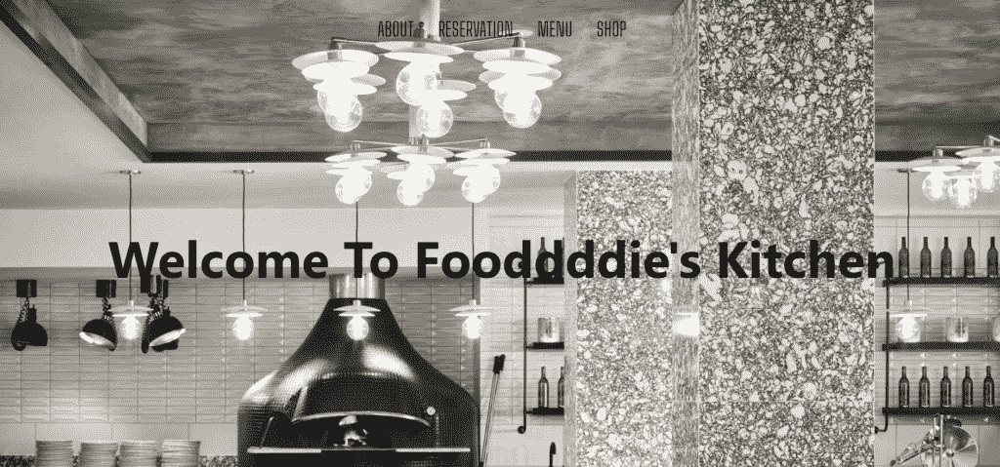

# 使用 HTML、CSS 和 Bootstrap 创建餐厅主页

> 原文:[https://www . geeksforgeeks . org/create-a-home page-for-restaurant-use-html-CSS-and-bootstrap/](https://www.geeksforgeeks.org/create-a-homepage-for-restaurant-using-html-css-and-bootstrap/)

**先决条件:** HTML 5、CSS 和 Bootstrap

[**HTML:**](https://www.geeksforgeeks.org/html-tutorials/)**HTML 代表超文本标记语言。它用于使用标记语言设计网页。HTML 是超文本和标记语言的结合。超文本定义了网页之间的链接。标记语言用于在定义网页结构的标签中定义文本文档。**

**[**CSS:**](https://www.geeksforgeeks.org/css-tutorials/) 层叠样式表，被亲切地称为 CSS，是一种简单设计的语言，旨在简化网页呈现的过程。CSS 允许您将样式应用于网页。更重要的是，CSS 使您能够独立于组成每个网页的 HTML 来完成这项工作。**

**[**BOOTSTRAP:**](https://www.geeksforgeeks.org/bootstrap-tutorials/)BOOTSTRAP 是一个免费的开源工具集合，用于创建响应性网站和 web 应用程序。它是最流行的 HTML、CSS 和 JavaScript 框架，用于开发响应迅速、移动优先的网站。如今，这些网站非常适合所有浏览器(IE、火狐和 Chrome)和所有大小的屏幕(台式机、平板电脑和手机)。这都要感谢 Bootstrap 的开发者——推特的马克·奥托和雅各布·桑顿，尽管后来它被宣布为开源项目。**

**以下是[餐厅主页建设源代码:](https://miniyadav1.github.io/restaurant/restaurant-website-master/)**

****HTML 版块:**文件名为 index.html**

## **超文本标记语言**

```html
<!DOCTYPE html>
<html lang="en">

<head>

    <!-- Required meta tags -->
    <meta charset="utf-8">
    <meta name="viewport" content="width=device-width,
            initial-scale=1, shrink-to-fit=no">

    <link rel="stylesheet" href="index.css">

    <!-- Bootstrap CSS -->
    <link rel="stylesheet" href=
"https://stackpath.bootstrapcdn.com/bootstrap/4.3.1/css/bootstrap.min.css"
        integrity=
"sha384-ggOyR0iXCbMQv3Xipma34MD+dH/1fQ784/j6cY/iJTQUOhcWr7x9JvoRxT2MZw1T"
        crossorigin="anonymous">

    <title>Restaurant Website</title>
</head>

<body>

    <!-- navbar  -->
    <nav>
        <ul class="nav-flex-row">
            <li class="nav-item">
                <a href="#about">About</a>
            </li>
            <li class="nav-item">
                <a href="#reservation">Reservation</a>
            </li>
            <li class="nav-item">
                <a href="#menu">Menu</a>
            </li>
            <li class="nav-item">
                <a href="#shop">Shop</a>
            </li>
        </ul>
    </nav>
    <section class="section-intro">
        <header>
            <h1> Welcome To Fooddddie's
                Kitchen</h1>
        </header>
        <div class="link-to-book-wrapper">
            <a class="link-to-book"
                href="#reservations">Book a table</a>
        </div>
    </section>

    <section class="about-section">
        <article>
            <h3>
                Section for the text why your
                restaurant is the best.
            </h3>

<p>
                Lorem ipsum dolor sit, amet consectetur
                adipisicing elit. A quos, voluptatum
                illum mollitia dolores libero placeat
                nesciunt quasi adipisci impedit!Lorem
                ipsum dolor sit, amet consectetur
                adipisicing elit. A quos, voluptatum
                illum mollitia dolores libero placeat
                nesciunt quasi adipisci impedit!
                Lorem ipsum dolor sit, amet consectetur
                adipisicing elit. A quos, voluptatum
                illum mollitia dolores libero placeat
                nesciunt quasi adipisci impedit!Lorem
                ipsum dolor sit.
            </p>

        </article>
    </section>

    <!-- carousel section -->
    <div id="carouselExampleControls"
        class="carousel slide" data-ride="carousel">
        <div class="carousel-inner">
            <div class="carousel-item active">
                
            </div>
            <div class="carousel-item">
                
            </div>
            <div class="carousel-item">
                
            </div>
        </div>
        <a class="carousel-control-prev"
            href="#carouselExampleControls"
            role="button" data-slide="prev">
            <span class="carousel-control-prev-icon"
                aria-hidden="true">
            </span>
            <span class="sr-only">Previous</span>
        </a>
        <a class="carousel-control-next"
            href="#carouselExampleControls"
            role="button" data-slide="next">
            <span class="carousel-control-next-icon"
                aria-hidden="true">
            </span>
            <span class="sr-only">Next</span>
        </a>
    </div>

    <div class="container">
        <div class="row-flex">
            <div class="flex-column-form">
                <h3>
                    Make a booking
                </h3>
                <form class="media-centered">
                    <div class="form-group">

<p>
                            Please leave your number we will
                            call to make a reservation
                        </p>

                        <input type="name" class="form-control"
                            id="exampleInputName1"
                            aria-describedby="nameHelp"
                            placeholder="Enter your name">
                    </div>
                    <div class="form-group">
                        <input type="number" class="form-control"
                            id="exampleInputphoneNumber1"
                            placeholder="Enter your phone number">
                    </div>
                    <button type="submit" class="btn btn-primary">
                        Submit
                    </button>
                </form>
            </div>
            <div class="opening-time">
                <h3>
                    Opening times
                </h3>

<p>
                    <span>Monday—Thursday: 08:00 — 22:00</span>
                    <span>Friday—Saturday: 09:00 — 23:00 </span>
                    <span>Sunday: 10:00 — 17:00</span>
                </p>

            </div>
            <div class="contact-address">
                <h3>
                    Contact
                </h3>

<p>
                    <span>410-602-8008</span>
                    <span>15 Florida Ave</span>
                    <span>Palo-Alto, 1111 CA</span>
                </p>

            </div>
        </div>
    </div>

    <!-- Optional JavaScript -->
    <!-- jQuery first, then Popper.js, then Bootstrap JS -->

    <script src="https://code.jquery.com/jquery-3.3.1.slim.min.js"
        integrity=
"sha384-q8i/X+965DzO0rT7abK41JStQIAqVgRVzpbzo5smXKp4YfRvH+8abtTE1Pi6jizo"
        crossorigin="anonymous">
    </script>

    <script src=
"https://cdnjs.cloudflare.com/ajax/libs/popper.js/1.14.7/umd/popper.min.js"
        integrity=
"sha384-UO2eT0CpHqdSJQ6hJty5KVphtPhzWj9WO1clHTMGa3JDZwrnQq4sF86dIHNDz0W1"
        crossorigin="anonymous">
    </script>

    <script src=
"https://stackpath.bootstrapcdn.com/bootstrap/4.3.1/js/bootstrap.min.js"
        integrity=
"sha384-JjSmVgyd0p3pXB1rRibZUAYoIIy6OrQ6VrjIEaFf/nJGzIxFDsf4x0xIM+B07jRM"
        crossorigin="anonymous">
    </script>
</body>

</html>
```

****CSS 节:**文件名为 index.css**

## **半铸钢ˌ钢性铸铁(Cast Semi-Steel)**

```html
@import url('https://fonts.googleapis.com/css?family=Big+Shoulders+Text:100, 300, 400, 500, 600, 700, 800, 900&display=swap');

/* font-family: 'Big Shoulders Text', cursive; */

.nav-flex-row {
    display: flex;
    flex-direction: row;
    justify-content: center;
    position: absolute;
    z-index: 100;
    left: 0;
    width: 100%;
    padding: 0;
}

.nav-flex-row li {
    text-decoration: none;
    list-style-type: none;
    padding: 20px 15px;
}

.nav-flex-row li a {
    font-family: 'Big Shoulders Text', cursive;
    color: #000;
    font-size: 1.5em;
    text-transform: uppercase;
    font-weight: 300;
}
.nav-flex-row li a:hover{
    background: #E7E7E7;
}

.section-intro {
    height: 820px;
    background-image: url(img/foddiee.png);
    background-size: cover;
    display: flex;
    flex-direction: column;
    justify-content: center;
    align-items: center;
}

.section-intro h1 {
    text-align: center;
    color: #000;
    font-size: 4em;
    font-weight: 700;
}

.section-intro header {
    display: flex;
    flex: 4;
    flex-direction: row;
    justify-content: center;
    align-items: center;
}

.link-to-book-wrapper {
    flex: 1;
}

.about-section {
    display: flex;
    align-items: center;
    background-color: #f3f3f3c0;
    padding: 50px 30px;
}

.link-to-book {
    color: #ffffff;
    display: block;
    border: 2px solid #ffffff;
    padding: 5px 10px;
}

a.link-to-book:hover {
    background-color: #ffffff;
    color: #95999e;
    text-decoration: none;
}

.about-section p,
.about-section h3 {
    text-align: center;
    width: 60%;
    margin: auto;
    font-family: 'Big Shoulders Text', cursive;
    font-size: 1.8em;
    text-transform: uppercase;
}

.carousel-inner {
    height: 700px;
}

.row-flex {
    display: flex;
    flex-direction: row;
}

.flex-column-form {
    display: flex;
    flex-direction: column;
    flex: 1;
    margin: 30px 20px;
}

.btn.btn-primary {
    font-family: 'Big Shoulders Text', cursive;
    color: #ffffff;
    background-color: #95999e;
    text-transform: uppercase;
    font-size: 16px;
    padding: 5px 10px;
    letter-spacing: 2px;
    border: 0;
}

.btn.btn-primary:hover {
    background-color: #747474;
}
.opening-time,
.contact-address {
    flex: 1;
    margin: 30px 20px;
    font-size: 1.2em;
}

.form-group p {
    font-size: 1.2em;
}

.opening-time p span,
.contact-address p span {
    display: block;
}

@media (min-width:577px) and (max-width: 800px) {

    .section-intro {
        height: 500px;
    }

    .about-section p,
    .about-section h3 {
        font-size: 20px;
    }

    .carousel-inner {
        height: auto;
    }

    .row-flex {
        display: flex;
        flex-direction: column;
    }
}

@media screen and (max-width: 576px) {
    .section-intro {
        height: 300px;
    }

    .about-section {
        padding: 30px;
    }

    .section-intro h1 {
        font-size: 2em;
    }

    .about-section p,
    .about-section h3 {
        font-size: 15px;
    }

    .carousel-inner {
        height: auto;
    }

    .row-flex {
        display: flex;
        flex-direction: column;
    }

    .row-flex h3 {
        font-size: 25px;
        text-align: center;
    }

    .form-group p {
        font-size: 15px;
    }

    .opening-time p span,
    .contact-address p span {
        font-size: 15px;
        text-align: center;
    }

}
```

****输出:****

****