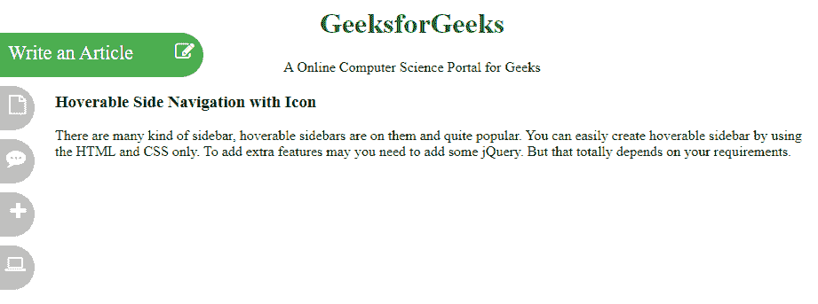
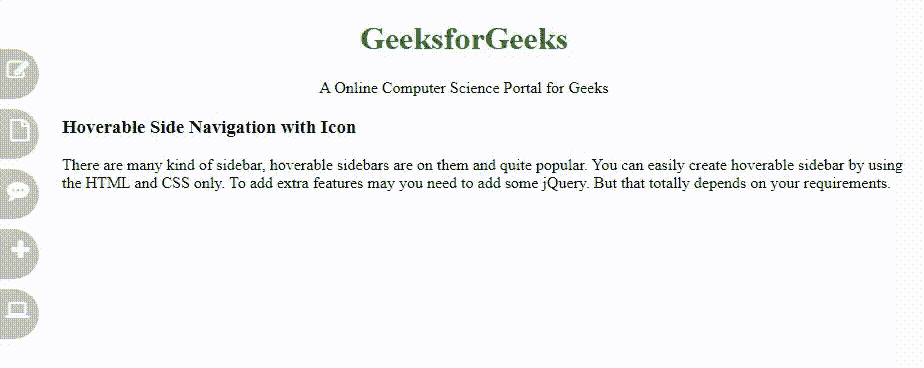

# 使用 HTML、CSS 和 JavaScript 创建一个可悬停的侧面导航

> 原文:[https://www . geesforgeks . org/create-a-可悬停侧边导航-带 html-CSS-和-javascript/](https://www.geeksforgeeks.org/create-a-hoverable-side-navigation-with-html-css-and-javascript/)



要在任何网站上创建带有图标的可悬停侧面导航，需要两种东西:HTML 和 CSS。如果你想在导航栏上附加图标，那么你需要一个字体棒极了的 CDN 链接。这些功能使网站看起来比普通网站更酷，在普通网站中，导航条是老式的设计。在本文中，我们将使用侧面导航栏创建侧面的结构，即**创建结构**部分和用于设计网站的另一部分，即**设计结构**。下面是完整代码的输出。
**创建结构:**在这一部分，我们正在创建基本的网站结构，并且还为将用作悬停导航条图标的图标附加了字体-Awesome 的 CDN 链接。

*   **字体超赞图标的 CDN 链接:**

> <link rel="”stylesheet”" href="”https://cdnjs.cloudflare.com/ajax/libs/font-awesome/4.7.0/css/font-awesome.min.css”">

*   **HTML 代码制作结构:**

## 超文本标记语言

```html
<!DOCTYPE html>
<html>

<head>
    <title>
        Hoverable Side Navigation with Icon
    </title>
</head>

<body>

    <!-- Geeksforgeeks and Slogan -->
    <div class="banner">
        <h1>GeeksforGeeks</h1>

<p>
            A Online Computer Science
            Portal for Geeks
        </p>

    </div>

    <!-- Body content topic -->
    <div class="hoverable-topic">
        <h3>Hoverable Side Navigation with Icon</h3>

<p>
            There are many kind of sidebar, hoverable
            sidebars are on them and quite popular.
            You can easily create hoverable sidebar
            by using the HTML and CSS only. To add
            extra features may you need to add some
            jQuery. But that totally depends on your
            requirements.
        </p>

    </div>

    <!-- Side navigation Bar -->
    <div class="sidehoverbar">
        <a href="#" class="article">
            Write an Article
            <i class="fa fa-edit"></i>
        </a>

        <a href="#" class="Interview">
            Interview Experience
            <i class="fa fa-file-o"></i>
        </a>

        <a href="#" class="Scripter">
            Technical Scripter
            <i class="fa fa-commenting"></i>
        </a>

        <a href="#" class="Suggested">
            Suggested Topic
            <i class="fa fa-plus"></i>
        </a>

        <a href="#" class="Practice">
            Coding Practice
            <i class="fa fa-laptop"></i>
        </a>
    </div>
</body>

</html>
```

**设计结构:**在上一节中，我们已经创建了基本网站的结构，我们将在其中使用带有图标的可悬停侧面导航。在这一节中，我们将设计结构并为每个导航栏添加图标。

*   **CSS 代码要好看的结构:**

## 超文本标记语言

```html
<style>

    /* Head banner team */
    .banner {
        text-align: center;
        width: ;
    }

    h1 {
        color: green;
    }

    /* styling sidebar */
    .sidehoverbar a {
        background-color: grey;
        position: absolute;
        font-size: 22px;
        text-decoration: none;
        Color: white;
        padding: 10px;
        border-radius: 0px 25px 25px 0px;
        left: -190px;
        transition: 0.5s;
        opacity: 0.5;
    }

    /* Hover effect on sidebar */
    .sidehoverbar a:hover {
        left: 0px;
        opacity: 1;
        background-color: #4CAF50;
    }

    /* float icons*/
    .sidehoverbar i {
        float: right;
    }

    /* defining position of each nav bar */
    .article {
        top: 50px;
        width: 210px;
        height: 30px;
    }

    .Interview {
        top: 110px;
        width: 210px;
        height: 30px;
    }

    .Scripter {
        top: 170px;
        width: 210px;
        height: 30px;
    }

    .Suggested {
        top: 230px;
        width: 210px;
        height: 30px;
    }

    .Practice {
        top: 290px;
        width: 210px;
        height: 30px;
    }

    /* content margin */
    .hoverable-topic {
        margin-left: 55px;
    }
</style>
```

**结合 HTML 和 CSS 的代码:**这是最后的代码，也就是上面两部分的结合。

## 超文本标记语言

```html
<!DOCTYPE html>
<html>

<head>
    <title>Hoverable Side Navigation with Icon</title>

    <link rel="stylesheet" href=
"https://cdnjs.cloudflare.com/ajax/libs/font-awesome/4.7.0/css/font-awesome.min.css">

    <style>

        /* Head banner team */
        .banner {
            text-align: center;
            width: ;
        }

        h1 {
            color: green;
        }

        /* styling sidebar */
        .sidehoverbar a {
            background-color: grey;
            position: absolute;
            font-size: 22px;
            text-decoration: none;
            Color: white;
            padding: 10px;
            border-radius: 0px 25px 25px 0px;
            left: -190px;
            transition: 0.5s;
            opacity: 0.5;
        }

        /* Hover effect on sidebar */
        .sidehoverbar a:hover {
            left: 0px;
            opacity: 1;
            background-color: #4CAF50;
        }

        /* float icons*/
        .sidehoverbar i {
            float: right;
        }

        /* defining position of each nav bar */
        .article {
            top: 50px;
            width: 210px;
            height: 30px;
        }

        .Interview {
            top: 110px;
            width: 210px;
            height: 30px;
        }

        .Scripter {
            top: 170px;
            width: 210px;
            height: 30px;
        }

        .Suggested {
            top: 230px;
            width: 210px;
            height: 30px;
        }

        .Practice {
            top: 290px;
            width: 210px;
            height: 30px;
        }

        /* content margin */
        .hoverable-topic {
            margin-left: 55px;
        }
    </style>
</head>

<body>

    <!-- Geeksforgeeks and Slogan -->
    <div class="banner">
        <h1>GeeksforGeeks</h1>

<p>
            A Online Computer Science
            Portal for Geeks
        </p>

    </div>

    <!-- Body content topic -->
    <div class="hoverable-topic">
        <h3>Hoverable Side Navigation with Icon</h3>

<p>
            There are many kind of sidebar, hoverable
            sidebars are on them and quite popular.
            You can easily create hoverable sidebar by
            using the HTML and CSS only. To add extra
            features may you need to add some jQuery.
            But that totally depends on your
            requirements.
        </p>

    </div>

    <!-- Side navigation Bar -->
    <div class="sidehoverbar">
        <a href="#" class="article">
            Write an Article
            <i class="fa fa-edit"></i>
        </a>

        <a href="#" class="Interview">
            Interview Experience
            <i class="fa fa-file-o"></i>
        </a>

        <a href="#" class="Scripter">
            Technical Scripter
            <i class="fa fa-commenting"></i>
        </a>

        <a href="#" class="Suggested">
            Suggested Topic
            <i class="fa fa-plus"></i>
        </a>

        <a href="#" class="Practice">
            Coding Practice
            <i class="fa fa-laptop"></i>
        </a>
    </div>
</body>

</html>
```

**输出:**

