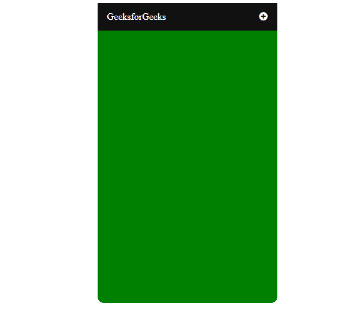
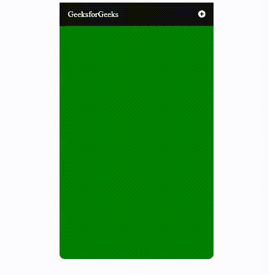

# 使用 HTML、CSS 和 JavaScript 创建移动切换导航菜单

> 原文:[https://www . geesforgeks . org/create-a-mobile-toggle-navigation-menu-use-html-CSS-and-JavaScript/](https://www.geeksforgeeks.org/create-a-mobile-toggle-navigation-menu-using-html-css-and-javascript/)

创建**移动切换导航菜单**需要 HTML、CSS 和 JavaScript。如果你想把图标和菜单连在一起，那么你需要一个字体棒极了的 CDN 链接。本文分为两个部分:创造结构和设计结构。

**完整导航一瞥:**



**创建结构:**在本节中，我们将创建一个基本的站点结构，并为将用作菜单图标的图标附加字体-Awesome 的 CDN 链接。

*   **字体超赞图标的 CDN 链接:**

> <link rel="”stylesheet”" href="”https://cdnjs.cloudflare.com/ajax/libs/font-awesome/4.7.0/css/font-awesome.min.css”">

*   **制作结构的 HTML 代码:**

## 超文本标记语言

```html
<!DOCTYPE html>
<html>

<head>
    <title>Mobile Navigation Bar</title>
    <meta name="viewport"
          content="width=device-width, initial-scale=1">
</head>

<body>

    <div class="menu-list">

        <!-- Logo and navigation menu -->
        <div class="geeks">
            <a href="#" class="">GeeksforGeeks</a>
            <div id="menus">
                <a href="#">Language</a>
                <a href="#">Practice</a>
                <a href="#">Interview</a>
                <a href="#">Puzzle</a>

            </div>

            <!-- Bar icon for navigation -->
            <a href="javascript:void(0);" class="icon"
               onclick="geeksforgeeks()">
               <i onclick="myFunction(this)"
                        class="fa fa-plus-circle">
               </i>
            </a>
        </div>
    </div>
</body>

</html>
```

**设计结构:**在上一节中，我们已经创建了基本网站的结构，我们将在其中使用菜单图标。在本节中，我们将设计导航栏的结构。

*   **结构 CSS 代码:**

## 超文本标记语言

```html
<style>

        /* Navigation bar styling */
        .menu-list {
            max-width: 300px;
            margin: auto;
            height: 500px;
            color: white;
            background-color: green;
            border-radius: 10px;
        }

        /* Logo, navigation menu styling */
        .geeks {
            overflow: hidden;
            background-color: #111;
            position: relative;
        }

        /* styling navigation menu */
        .geeks #menus {
            display: none;
        }

        /* Link specific styling */
        .geeks a {
            text-decoration: none;
            color: white;
            padding: 14px 16px;
            font-size: 16px;
            display: block;
        }

        /* Navigation toggle menu styling */
        .geeks a.icon {
            display: block;
            position: absolute;
            right: 0;
            top: 0;
        }

        /* hover effect on navigation logo and menu */
        .geeks a:hover {
            background-color: #ddd;
            color: black;
        } 
    </style>
```

*   **动画菜单的 JavaScript 代码:**

## java 描述语言

```html
<script>

    // Function to toggle the bar
    function geeksforgeeks() {
        var x = document.getElementById("menus");
        if (x.style.display === "block") {
            x.style.display = "none";
        } else {
            x.style.display = "block";
        }
    }
</script>

<script>

    // Function to toggle the plus menu into minus
    function myFunction(x) {
        x.classList.toggle("fa-minus-circle");
    }
</script>
```

**合并 HTML、CSS 和 JavaScript 代码:**这是合并上述部分后的最终代码。它将移动导航动画菜单。

**示例:**

## 超文本标记语言

```html
<!DOCTYPE html>
<html>

<head>
    <title>Mobile Navigation Bar</title>
    <meta name="viewport"
          content="width=device-width, initial-scale=1">
    <link rel="stylesheet" href=
"https://cdnjs.cloudflare.com/ajax/libs/font-awesome/4.7.0/css/font-awesome.min.css">

    <style>

        /* Navigation bar styling */
        .menu-list {
            max-width: 300px;
            margin: auto;
            height: 500px;
            color: white;
            background-color: green;
            border-radius: 10px;
        }

        /* logo, navigation menu styling */
        .geeks {
            overflow: hidden;
            background-color: #111;
            position: relative;
        }

        /* styling navigation menu */
        .geeks #menus {
            display: none;
        }

        /* link specific styling */
        .geeks a {
            text-decoration: none;
            color: white;
            padding: 14px 16px;
            font-size: 16px;
            display: block;
        }

        /* navigation toggle menu styling */
        .geeks a.icon {
            display: block;
            position: absolute;
            right: 0;
            top: 0;
        }

        /* hover effect on navigation logo and menu */
        .geeks a:hover {
            background-color: #ddd;
            color: black;
        }
    </style>
</head>

<body>

    <div class="menu-list">

        <!-- Logo and navigation menu -->
        <div class="geeks">
            <a href="#" class="">GeeksforGeeks</a>
            <div id="menus">
                <a href="#">Language</a>
                <a href="#">Practice</a>
                <a href="#">Interview</a>
                <a href="#">Puzzle</a>

            </div>

            <!-- Bar icon for navigation -->
            <a href="javascript:void(0);" class="icon"
                    onclick="geeksforgeeks()">

                <i onclick="myFunction(this)"
                        class="fa fa-plus-circle">
                </i>
            </a>
        </div>
    </div>

    <script>

        // Function to toggle the bar
        function geeksforgeeks() {
            var x = document.getElementById("menus");
            if (x.style.display === "block") {
                x.style.display = "none";
            } else {
                x.style.display = "block";
            }
        }
    </script>

    <script>

        // Function to toggle the plus menu into minus
        function myFunction(x) {
            x.classList.toggle("fa-minus-circle");
        }
    </script>
</body>

</html>
```

**输出:**

