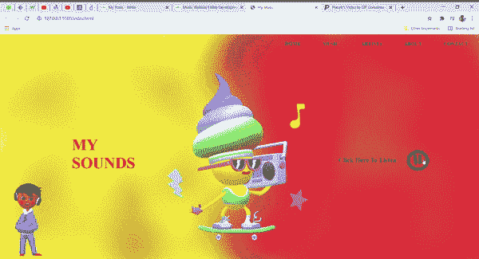

# 使用 HTML、CSS & JavaScript

创建音乐网站模板

> 原文:[https://www . geesforgeks . org/create-a-music-网站-模板-使用-html-css-javascript/](https://www.geeksforgeeks.org/create-a-music-website-template-using-html-css-javascript/)

音乐网站基本上是一个可以播放/暂停音乐的网页。它还有其他选项，如主页部分、音乐部分、关于部分、联系部分等。在这个项目中，我们将制作一个网站，使用 HTML、CSS 和 JavaScript 播放/暂停音乐。我们将使用 HTML 给出一个基本的布局，用 CSS，我们将通过给出搁浅和播放暂停按钮图像来美化我们的设计。我们将使用像 **if-else** 和 **document.getElementById** 这样的基本 JavaScript 功能来播放和暂停我们的音乐。

**进场:**

*   我们将创建基本布局，即一个 div 标签内的两个 **div** s(左和右)。在左边的区域我们会写一些文字，在右边的区域我们会放置播放或暂停的图像。我们还将创建一个基本的**导航条**并在右侧浮动。
*   在 CSS 的帮助下，我们将通过给背景图像、填充、边距等来美化我们的整体结构。
*   我们将使用像 onclick()、play()、pause()和 getElementById()这样的基本 JavaScript 函数来获取音乐的当前状态并做出相应的更改。
*   当用户播放音乐时，我们将显示播放图像或图标，当用户按下暂停时，将显示暂停图像或图标。这是使用简单的 if-else 语句完成的。

**示例:**

## 超文本标记语言

```html
<!DOCTYPE html>
<html lang="en">

<head>
    <style>

        /* Styling the body */
        * {
            padding: 0;
            margin: 0;
        }

        /* Styling the background image by
        giving its url and position */
        .container {
            height: 100vh;
            width: 100%;
            background-image: url(
'https://media.geeksforgeeks.org/wp-content/uploads/20210402235143/background.jpg');

            /* Image used: */
            background-size: cover;
            background-position: center;
            position: relative;
        }

        /* Styling the list tags to the
        right of the navigation bar */
        .nav li {
            float: right;
            list-style: none;
        }

        /* Styling the anchor tags of
        the navigation bar */
        .nav a {
            list-style: none;
            height: 50px;
            line-height: 50px;
            font-size: 1rem;
            font-weight: 550;
            display: block;
            padding: 5px 35px;
            color: black;
            text-decoration: none;
        }

        /* Giving position and margin
        to the content-div */
        .content {
            width: 100%;
            position: absolute;
            top: 45%;
        }

        /* Styling the left-col by
        giving margin */
        .left-col {
            margin-left: 11%;
        }

        /* Styling the my sound placed
        in the left-col */
        .left-col h1 {
            font-size: 50px;
            color: crimson;
        }

        /* Styling the right-col */
        .right-col {
            float: right;
            margin-right: 10%;
            margin-top: -5%;
            display: flex;
            align-items: center;
        }

        /* Styling the text in the right-col */
        .right-col p {
            font-size: 21px;
            color: black;
            font-weight: 650;
            margin-right: 20px;
        }

        /* Styling the cursor type
        of the icon to pointer */
        #icon {
            cursor: pointer;
        }
    </style>
</head>

<body>
    <div class="container">
        <ul class="nav">
            <li><a href="#">CONTACT</a></li>
            <li><a href="#">ABOUT</a></li>
            <li><a href="#">ARTISTS</a></li>
            <li><a href="#">MUSIC</a></li>
            <li><a href="#">HOME</a></li>
        </ul>
    </div>

    <div class="content">
        <div class="left-col">
            <h1>MY <br> SOUNDS</h1>
        </div>

        <div class="right-col">

<p>Click Here To Listen</p>

            
        </div>
    </div>

    <audio id="mysound">
        <source src="media/music.mp3" type="audio/mp3">
    </audio>

    <script>
        var mysound = document.getElementById("mysound");
        var icon = document.getElementById("icon");

        // Creating a function that will change
        // pause to play and vice-versa
        icon.onclick = function() {
            if (mysound.paused) {

                // If paused then play the
                // music and change the image
                mysound.play();
                icon.src =
"https://media.geeksforgeeks.org/wp-content/uploads/20210402235545/Pause.png";
            } else {

                // If playing then pause the
                // music and change the image
                mysound.pause();
                icon.src =
"https://media.geeksforgeeks.org/wp-content/uploads/20210402235520/play.png";
            }
        }
    </script>
</body>

</html>
```

**输出:**

