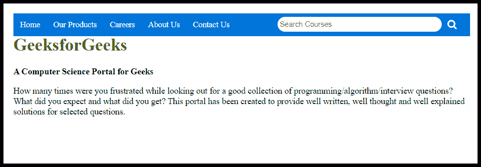

# 使用 HTML 和 CSS 创建一个搜索栏

> 原文:[https://www . geesforgeks . org/create-a-search-bar-using-html-and-CSS/](https://www.geeksforgeeks.org/create-a-search-bar-using-html-and-css/)



在导航栏中创建搜索栏很容易，就像在导航栏中创建另一个搜索数据库的选项一样。你需要小心放置搜索栏的时机。确保单独放置在吧台中。要创建一个包含搜索栏的导航栏，你需要 HTML 和 CSS。下面的解释将逐步指导您如何创建搜索栏。本文包含 2 个部分，在第一部分中，我们将附上图标的 CDN 链接，并建立一个基本结构。第二部分将设计导航栏和其中的搜索栏。
**创建结构:**在这一部分，我们将只创建基本的网站结构，并为图标附加字体的 CDN 链接，这些图标将用作栏中的搜索图标。

*   **字体超赞图标的 CDN 链接:**

> <link rel="”stylesheet”" href="”https://cdnjs.cloudflare.com/ajax/libs/font-awesome/4.7.0/css/font-awesome.min.css”">

*   **HTML 代码:**HTML 代码用于创建包含搜索栏的导航栏结构。因为它不包含 CSS，所以它只是一个简单的结构。我们将使用一些 CSS 属性使其具有吸引力。

## 超文本标记语言

```html
<!DOCTYPE html>
<html>

<head>
    <title>
        Create a Search Bar using HTML and CSS
    </title>
    <meta name="viewport"
        content="width=device-width, initial-scale=1">
</head>

<body>

    <!-- Navbar items -->
    <div id="navlist">
        <a href="#">Home</a>
        <a href="#">Our Products</a>
        <a href="#">Careers</a>
        <a href="#">About Us</a>
        <a href="#">Contact Us</a>

        <!-- search bar right align -->
        <div class="search">
            <form action="#">
                <input type="text"
                    placeholder=" Search Courses"
                    name="search">
                <button>
                    <i class="fa fa-search"
                        style="font-size: 18px;">
                    </i>
                </button>
            </form>
        </div>
    </div>

    <!-- logo with tag -->
    <div class="content">
        <h1 style="color:green; padding-top:40px;">
            GeeksforGeeks
        </h1>

        <b>
            A Computer Science
            Portal for Geeks
        </b>

<p>
            How many times were you frustrated while
            looking out for a good collection of
            programming/algorithm/interview questions?
            What did you expect and what did you get?
            This portal has been created to provide
            well written, well thought and well
            explained solutions for selected questions.
        </p>

    </div>
</body>

</html>               
```