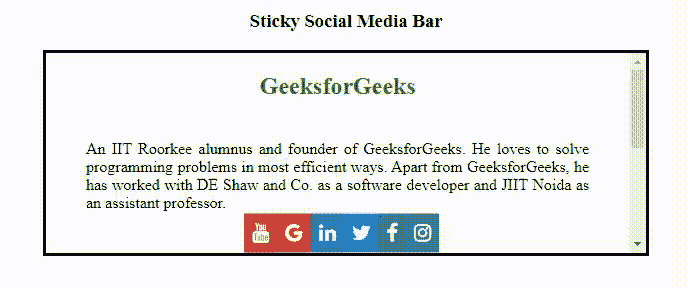

# 使用 HTML 和 CSS 创建一个粘性社交媒体栏

> 原文:[https://www . geeksforgeeks . org/create-a-sticky-social-media-bar-using-html-and-CSS/](https://www.geeksforgeeks.org/create-a-sticky-social-media-bar-using-html-and-css/)

在任何网站上创建一个粘性的社交媒体栏**使用 HTML** 和 **CSS** 。如果你想在粘性社交媒体上附上图标，那么你需要一个字体棒极了的 CDN 链接。如今，社交媒体是宣传你的东西的最佳平台。社交媒体，你可以很容易地向客户或用户介绍你的产品，如果用户喜欢你的产品，他们可以在他们的社交媒体账户上分享产品的细节。因此，创建一个粘性社交媒体栏有时会让你的网站变慢(如果你在粘性社交媒体栏中使用 jQuery 插件)。在本文中，您将了解如何在您的网站上附加一个粘性社交媒体栏。本文分为两节**创造结构**和**设计结构**。

**完整粘性社交媒体栏一瞥:**


**创建结构:**在这一部分，我们将创建一个基本的网站结构，并为将用作粘性社交媒体栏的图标附加字体-真棒的 CDN 链接。

*   **字体超赞图标的 CDN 链接:**

> <link rel="”stylesheet”" href="”https://cdnjs.cloudflare.com/ajax/libs/font-awesome/4.7.0/css/font-awesome.min.css”">

*   **制作结构的 HTML 代码:**

## 超文本标记语言

```html
<!DOCTYPE html>
<html>

<head>
    <title>Sticky Social Media Bar</title>
</head>

<body>
    <center>
        <h3>Sticky Social Media Bar</h3>

        <!-- Icons for the sticky Social Bar -->
        <div class="body-part">
            <div class="icon-list">
                <a href="#instagram" class="instagram">
                    <i class="fa fa-instagram"></i>
                </a>

                <a href="#facebook" class="facebook">
                    <i class="fa fa-facebook"></i>
                </a>

                <a href="#twitter" class="twitter">
                    <i class="fa fa-twitter"></i>
                </a>

                <a href="#linkedin" class="linkedin">
                    <i class="fa fa-linkedin"></i>
                </a>

                <a href="#google" class="google">
                    <i class="fa fa-google"></i>
                </a>

                <a href="#youtube" class="youtube">
                    <i class="fa fa-youtube"></i>
                </a>
            </div>

            <!-- Content of the Page -->
            <h2>GeeksforGeeks</h2>

<p>
                An IIT Roorkee alumnus and founder of GeeksforGeeks.
                He loves to solve programming problems in most
                efficient ways. Apart from GeeksforGeeks, he has
                worked with DE Shaw and Co. as a software developer
                and JIIT Noida as an assistant professor.
            </p>

<p>
                Only the zeal to learn and improve yourself is all
                we need. Anyone who has a passion for learning and
                writing is welcome to write for us. Contribution
                on GeeksforGeeks is not limited to writing articles
                only, below are the details about the ways in which
                you can help us and other fellow programmers:
            </p>

<p>
                If you like GeeksforGeeks and would like to
                contribute, you can also write an article using
                write.geeksforgeeks.org or mail your article
                to review-team@geeksforgeeks.org. See your article
                appearing on the GeeksforGeeks main page and help
                other Geeks.
            </p>

        </div>
    </center>
</body>

</html>
```

**设计结构:**在上一节中，我们已经创建了基本网站的结构，我们将在其中使用粘性社交媒体栏。在这一节中，我们将设计结构并附加社交媒体栏的粘性图标。

*   **CSS 代码要好看的结构:**

## 超文本标记语言

```html
<style>

    /* Styling Body-part */
    .body-part {
        width: 600px;
        height: 200px;
        border: 3px solid black;
        overflow: auto;
    }

    h2 {
        color: green;
    }

    /* Justifying Content text */
    p {
        text-align: justify;
        margin: 40px;
    }

    /* Styling icons */
    .icon-list {
        position: fixed;
        top: 242px;
        right:40%;
        transform: translateY(-50%);

    }

    .icon-list a {
        display: block;
        text-align: center;
        padding: 8px;
        transition: all 0.5s ease;
        color: white;
        font-size: 20px;
        float:right;
    }

     /* HOver affect on icons */
    .icon-list a:hover {
        color: #000;
        width:50px;
    }

    /* Designing each icons */
    .instagram {
        background: #3f729b;
        color: white;
    }

    .facebook {
        background: #3b5998;
        color: white;
    }

    .twitter {
        background: #00acee;
        color: white;
    }
    .linkedin {
        background: #0e76a8;
        color: white;
    }

    .google {
        background: #db4a39;
        color: white;
    }

    .youtube {
        background: #c4302b;
        color: white;
    }
</style>
```

**合并 HTML 和 CSS 代码:**这是合并以上两部分后的最终代码。它将创建一个网站的粘性社交媒体栏。

## 超文本标记语言

```html
<!DOCTYPE html>
<html>

<head>
    <title>Sticky Social Media Bar</title>

    <!-- Linking Font-Awesome For the Icons -->
    <link rel="stylesheet" href=
"https://cdnjs.cloudflare.com/ajax/libs/font-awesome/4.7.0/css/font-awesome.min.css">

    <style>

        /* Styling Body-part */
        .body-part {
            width: 600px;
            height: 200px;
            border: 3px solid black;
            overflow: auto;
        }

        h2 {
            color: green;
        }

        /* Justifying Content text */
        p {
            text-align: justify;
            margin: 40px;
        }

        /* Styling icons */
        .icon-list {
            position: fixed;
            top: 242px;
            right:40%;
            transform: translateY(-50%);

        }

        .icon-list a {
            display: block;
            text-align: center;
            padding: 8px;
            transition: all 0.5s ease;
            color: white;
            font-size: 20px;
            float:right;
        }

         /* HOver affect on icons */
        .icon-list a:hover {
            color: #000;
            width:50px;
        }

        /* Designing each icons */
        .instagram {
            background: #3f729b;
            color: white;
        }

        .facebook {
            background: #3b5998;
            color: white;
        }

        .twitter {
            background: #00acee;
            color: white;
        }
        .linkedin {
            background: #0e76a8;
            color: white;
        }

        .google {
            background: #db4a39;
            color: white;
        }

        .youtube {
            background: #c4302b;
            color: white;
        }
    </style>
</head>

<body>
    <center>
        <h3>Sticky Social Media Bar</h3>

        <!-- Icons for the sticky Social Bar -->
        <div class="body-part">
            <div class="icon-list">
                <a href="#instagram" class="instagram">
                    <i class="fa fa-instagram"></i>
                </a>

                <a href="#facebook" class="facebook">
                    <i class="fa fa-facebook"></i>
                </a>

                <a href="#twitter" class="twitter">
                    <i class="fa fa-twitter"></i>
                </a>

                <a href="#linkedin" class="linkedin">
                    <i class="fa fa-linkedin"></i>
                </a>

                <a href="#google" class="google">
                    <i class="fa fa-google"></i>
                </a>

                <a href="#youtube" class="youtube">
                    <i class="fa fa-youtube"></i>
                </a>
            </div>

            <!-- Content of the Page -->
            <h2>GeeksforGeeks</h2>

<p>
                An IIT Roorkee alumnus and founder of GeeksforGeeks.
                He loves to solve programming problems in most
                efficient ways. Apart from GeeksforGeeks, he has
                worked with DE Shaw and Co. as a software developer
                and JIIT Noida as an assistant professor.
            </p>

<p>
                Only the zeal to learn and improve yourself is all
                we need. Anyone who has a passion for learning and
                writing is welcome to write for us. Contribution
                on GeeksforGeeks is not limited to writing articles
                only, below are the details about the ways in which
                you can help us and other fellow programmers:
            </p>

<p>
                If you like GeeksforGeeks and would like to
                contribute, you can also write an article using
                write.geeksforgeeks.org or mail your article
                to review-team@geeksforgeeks.org. See your article
                appearing on the GeeksforGeeks main page and help
                other Geeks.
            </p>

        </div>
    </center>
</body>

</html>
```

**输出:**

