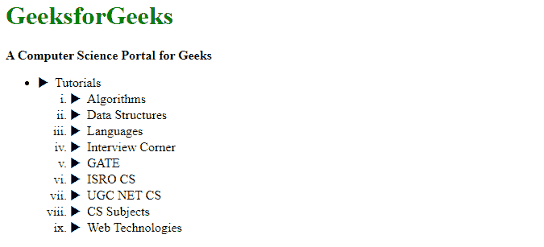
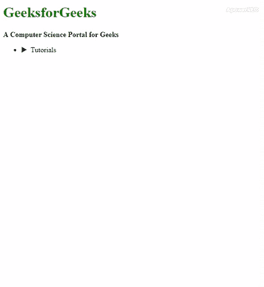

# 使用 HTML、CSS 和 JavaScript 在树形视图架构中创建内容表

> 原文:[https://www . geesforgeks . org/create-a-table-in-tree-view-architecture-use-html-CSS-and-JavaScript/](https://www.geeksforgeeks.org/create-a-table-of-content-in-tree-view-architecture-using-html-css-and-javascript/)



树形视图元素是一种下拉菜单，无论组织得多么好。这种视图给你的网站一个有组织的外观，为了创建一个下拉树视图架构，我们可以使用 HTML、CSS 和 JavaScript。我们将把整个过程分为两个部分:创建结构和设计结构。下面将详细介绍这两个部分。

**创建结构:**在本节中，我们将在元素的树形视图架构中创建内容表的基本结构。

*   **HTML 代码:**

    ```html
    <!DOCTYPE html>
    <html>

    <head>
        <title>
            Create a Table of Content in Tree
            View Architecture using HTML, CSS
            and JavaScript
        </title>
    </head>

    <body>
        <h1>GeeksforGeeks</h1>
        <b>A Computer Science Portal for Geeks</b>
        <br>

        <ul id="tuitorial">
            <li><span class="gfg">Tutorials</span>
                <ol class="cover" type="i">
                    <li><span class="gfg">Algorithms</span>
                        <ol class="cover" type="a">
                            <li>
                            <span class="gfg">
                                Analysis of Algorithms
                            </span>

                            <ol class="cover">
                                <li>Asymptotic Analysis</li>
                                <li>Worst, Average and Best Cases</li>
                                <li>Asymptotic Notations</li>
                                <li>Little o and little omega notations</li>
                                <li>Lower and Upper Bound Theory</li>
                                <li>Analysis of Loops</li>
                                <li>Solving Recurrences</li>
                                <li>Amortized Analysis</li>
                                <li>What does ‘Space Complexity’ mean?</li>
                                <li>Pseudo-polynomial Algorithms</li>
                                <li>Polynomial Time Approximation Scheme</li>
                                <li>A Time Complexity Question</li>
                            </ol>
                            </li>
                            <li>Searching Algorithms</li>
                            <li>Sorting Algorithms</li>
                            <li>Graph Algorithms</li>
                            <li>Pattern Searching</li>
                            <li>Geometric Algorithms</li>
                            <li>Mathematical</li>
                            <li>Randomized Algorithms</li>
                            <li>Greedy Algorithms</li>
                            <li>Dynamic Programming</li>
                            <li>Divide and Conquer</li>
                            <li>Backtracking</li>
                            <li>Branch and Bound</li>
                            <li>All Algorithms</li>
                        </ol>
                    </li>
                    <li>
                        <spna class="gfg">
                            Data Structures
                        </span>
                        <ol class="cover" type="a">
                            <li>Arrays</li>
                            <li>Linked List</li>
                            <li>Stack</li>
                            <li>Queue</li>
                            <li>Binary Tree</li>
                            <li>Binary Search Tree</li>
                            <li>Heap</li>
                            <li>Hashing</li>
                            <li>Graph</li>
                            <li>Advanced Data Structure</li>
                            <li>Matrix</li>
                            <li>Strings</li>
                            <li>All Data Structures</li>
                        </ol>
                    </li>
                    <li>
                        <spna class="gfg">Languages</span>
                        <ol class="cover" type="a">
                            <li>C</li>
                            <li>C++</li>
                            <li>Java</li>
                            <li>Python</li>
                            <li>C#</li>
                            <li>Javascript</li>
                            <li>JQuery</li>
                            <li>SQL</li>
                            <li>PHP</li>
                            <li>Scala</li>
                            <li>Perl</li>
                            <li>Go Language</li>
                            <li>HTML</li>
                            <li>CSS</li>
                            <li>Kotlin</li>
                        </ol>
                    </li>
                    <li>
                        <span class="gfg">Interview Corner</span>
                        <ol class="cover" type="a">
                            <li>Company Preparation</li>
                            <li>Top Topics</li>
                            <li>Practice Company Questions</li>
                            <li>Interview Experiences</li>
                            <li>Experienced Interviews</li>
                            <li>Internship Interviews</li>
                            <li>Competitive Programming</li>
                            <li>Design Patterns</li>
                            <li>Multiple Choice Quizzes</li>
                        </ol>
                        <li>
                            <spna class="gfg">GATE</span>
                        </li>
                        <li>
                            <spna class="gfg">ISRO CS</span>
                        </li>
                        <li>
                            <spna class="gfg">UGC NET CS</span>
                        </li>
                        <li>
                            <spna class="gfg">CS Subjects</span>
                        </li>
                        <li>
                            < class="gfg">Web Technologies</span>
                        </li>
                    </li>    
                </ol>
            </li>
        </ul>
    </body>

    </html>
    ```

**设计结构:**在上一节中，我们已经创建了基本树形视图元素的结构。在本节中，我们将设计树形视图的结构。

*   **CSS 代码:**

    ```html
    <style>
        h1 {
            color: green;
        }

        .gfg {
            cursor: pointer;
        }

        .gfg::before {
            content: "\25B6";
            color: black;
            display: inline-block;
            margin-right: 8px;
        }

        .cover {
            display: none;
        }

        .active {
            display: block;
        }

        ol [type=a] {
            background-color: yellow;
            color: purple;
        }
    </style>
    ```

*   **JavaScript 代码:**

    ```html
    <script>
        var toggler = document.getElementsByClassName("gfg");
        var i;

        for (i = 0; i < toggler.length; i++) {
            toggler[i].addEventListener("click",
                function() {
                    this.parentElement.querySelector(".cover")
                        .classList.toggle("active");
                    this.classList.toggle("gfg-down");
                }
            );
        }
    </script>
    ```

**合并 HTML、CSS 和 JavaScript 代码:**这是合并上述部分后的最终代码。它将在树形视图架构中显示内容表。

```html
<!DOCTYPE html>
<html>

<head>
    <title>
        Create a Table of Content in Tree
        View Architecture using HTML, CSS
        and JavaScript
    </title>

    <style>
        h1 {
            color: green;
        }

        .gfg {
            cursor: pointer;
        }

        .gfg::before {
            content: "\25B6";
            color: black;
            display: inline-block;
            margin-right: 8px;
        }

        .cover {
            display: none;
        }

        .active {
            display: block;
        }

        ol [type=a] {
            background-color: yellow;
            color: purple;
        }
    </style>
</head>

<body>
    <h1>GeeksforGeeks</h1>
    <b>A Computer Science Portal for Geeks</b>
    <br>
    <ul id="tuitorial">
        <li><span class="gfg">Tutorials</span>
            <ol class="cover" type="i">
                <li><span class="gfg">Algorithms</span>
                    <ol class="cover" type="a">
                        <li>
                            <span class="gfg">Analysis of Algorithms</span>
                            <ol class="cover">
                                <li>Asymptotic Analysis</li>
                                <li>Worst, Average and Best Cases</li>
                                <li>Asymptotic Notations</li>
                                <li>Little o and little omega notations</li>
                                <li>Lower and Upper Bound Theory</li>
                                <li>Analysis of Loops</li>
                                <li>Solving Recurrences</li>
                                <li>Amortized Analysis</li>
                                <li>What does ‘Space Complexity’ mean?</li>
                                <li>Pseudo-polynomial Algorithms</li>
                                <li>Polynomial Time Approximation Scheme</li>
                                <li>A Time Complexity Question</li>
                            </ol>
                        </li>
                        <li>Searching Algorithms</li>
                        <li>Sorting Algorithms</li>
                        <li>Graph Algorithms</li>
                        <li>Pattern Searching</li>
                        <li>Geometric Algorithms</li>
                        <li>Mathematical</li>
                        <li>Randomized Algorithms</li>
                        <li>Greedy Algorithms</li>
                        <li>Dynamic Programming</li>
                        <li>Divide and Conquer</li>
                        <li>Backtracking</li>
                        <li>Branch and Bound</li>
                        <li>All Algorithms</li>
                    </ol>
                </li>
                <li>
                    <spna class="gfg">Data Structures</span>
                    <ol class="cover" type="a">
                        <li>Arrays</li>
                        <li>Linked List</li>
                        <li>Stack</li>
                        <li>Queue</li>
                        <li>Binary Tree</li>
                        <li>Binary Search Tree</li>
                        <li>Heap</li>
                        <li>Hashing</li>
                        <li>Graph</li>
                        <li>Advanced Data Structure</li>
                        <li>Matrix</li>
                        <li>Strings</li>
                        <li>All Data Structures</li>
                    </ol>
                </li>
                <li>
                    <spna class="gfg">Languages</span>
                    <ol class="cover" type="a">
                        <li>C</li>
                        <li>C++</li>
                        <li>Java</li>
                        <li>Python</li>
                        <li>C#</li>
                        <li>Javascript</li>
                        <li>JQuery</li>
                        <li>SQL</li>
                        <li>PHP</li>
                        <li>Scala</li>
                        <li>Perl</li>
                        <li>Go Language</li>
                        <li>HTML</li>
                        <li>CSS</li>
                        <li>Kotlin</li>
                    </ol>
                </li>
                <li>
                    <span class="gfg">Interview Corner</span>
                    <ol class="cover" type="a">
                        <li>Company Preparation</li>
                        <li>Top Topics</li>
                        <li>Practice Company Questions</li>
                        <li>Interview Experiences</li>
                        <li>Experienced Interviews</li>
                        <li>Internship Interviews</li>
                        <li>Competitive Programming</li>
                        <li>Design Patterns</li>
                        <li>Multiple Choice Quizzes</li>
                    </ol>
                    <li><spna class="gfg">GATE</span></li>
                    <li><spna class="gfg">ISRO CS</span></li>
                    <li><spna class="gfg">UGC NET CS</span></li>
                    <li><spna class="gfg">CS Subjects</span></li>
                    <li><spna class="gfg">Web Technologies</span></li>
                </li>
            </ol>
        </li>
    </ul>

    <script>
        var toggler = document.getElementsByClassName("gfg");
        var i;

        for (i = 0; i < toggler.length; i++) {
            toggler[i].addEventListener("click",
                function() {
                    this.parentElement.querySelector(".cover")
                        .classList.toggle("active");
                    this.classList.toggle("gfg-down");
                }
            );
        }
    </script>
</body>

</html>
```

**输出:**
