# 使用 HTML CSS 和 JavaScript 创建一个网站，在 Firebase

中存储数据

> 原文:[https://www . geesforgeks . org/create-a-网站-使用-html-CSS-和-JavaScript-在 firebase 中存储数据/](https://www.geeksforgeeks.org/create-a-website-using-html-css-and-javascript-that-stores-data-in-firebase/)

以下是一些简单的步骤，以连接我们的静态网页与 **Firebase。**

### 逐步实施:

**第一步:**首先，我们要在 Firebase 上创建项目来连接我们的静态网页。访问 [Firebase](https://console.firebase.google.com/u/0/) 页面，了解如何配置**项目。访问网站，点击**添加项目**按钮，如下图。**

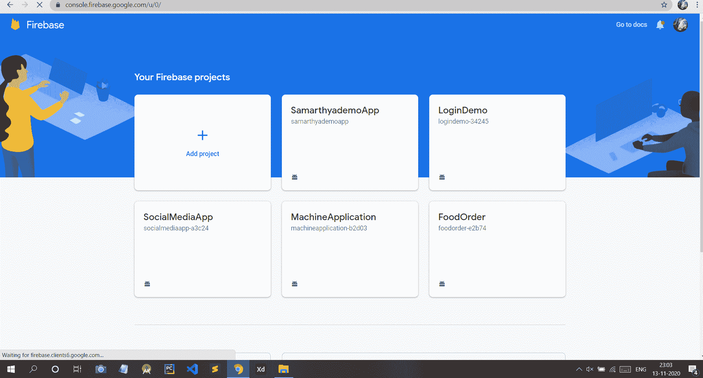

**第二步:**给你的项目起一个**名字**，点击**继续**按钮。

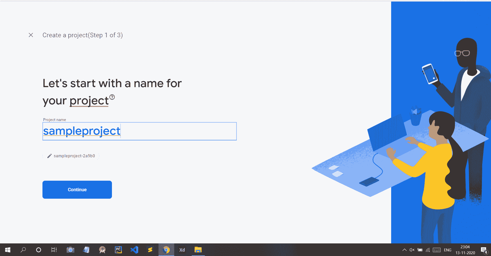

**第三步:**现在点击**继续**按钮。

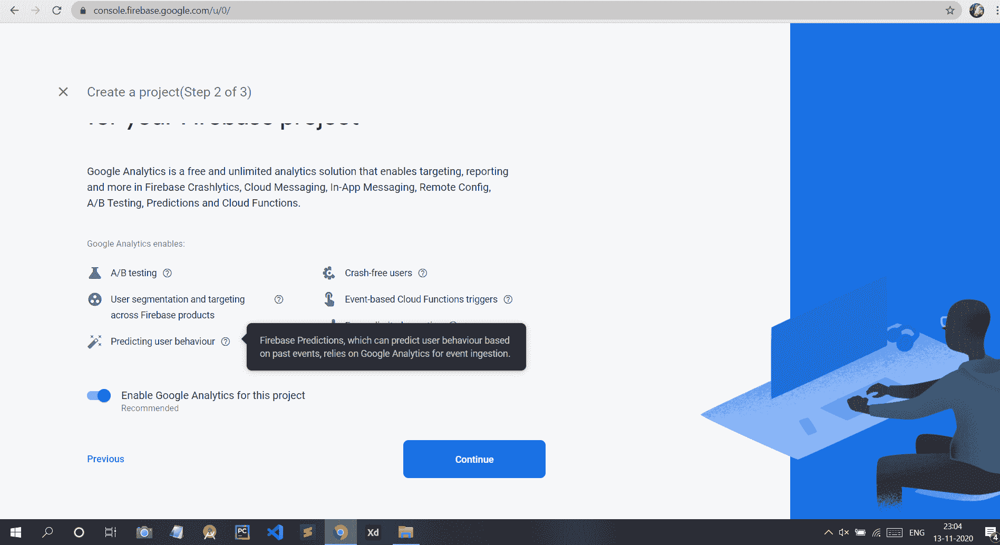

**第 4 步:**现在选择**火基地默认账号**，点击**创建项目**按钮。


**第五步:**现在你的项目是**创建的**，你现在可以开始了。

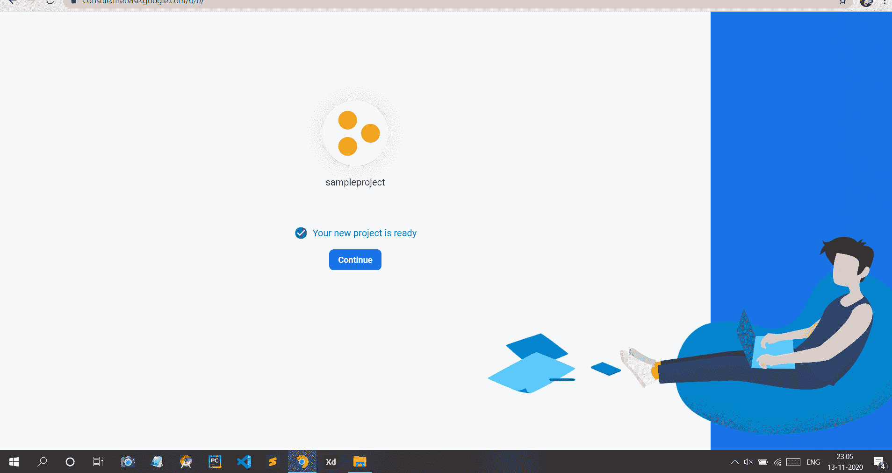

**第六步:**现在点击第三个图标，那就是**网页**按钮 **( < / > )** 。

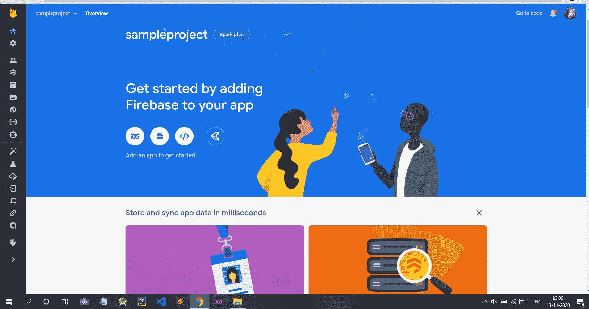

**第七步:**给你的网页项目取一个**昵称**，点击**注册 App** 按钮。

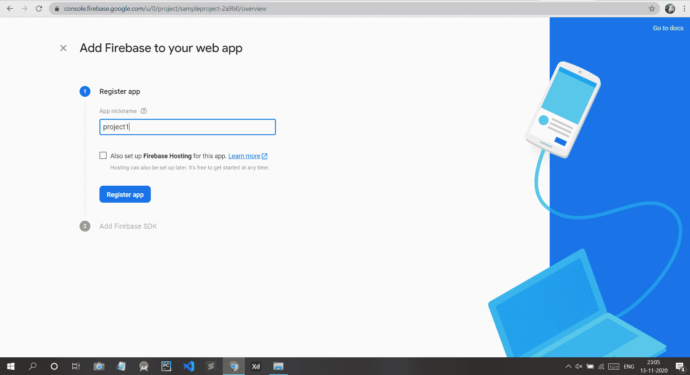

**第八步:**现在你会看到你的 App 的**配置**是这样的。把这段代码复制到某个地方，因为我们以后会用到它。

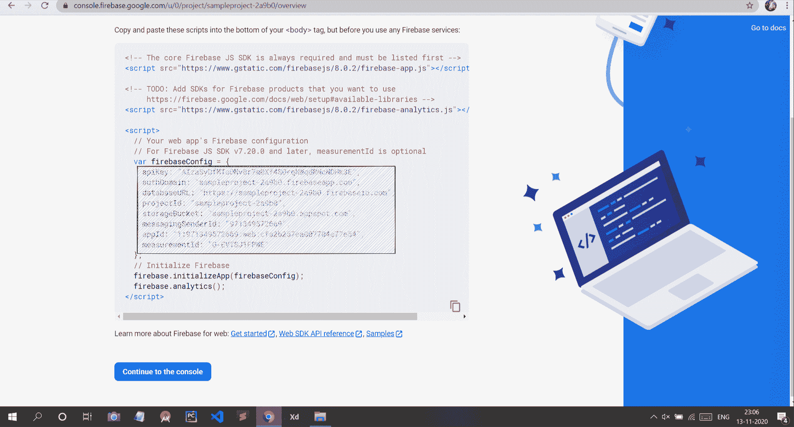

**第九步:**点击**实时数据库**，如下图。

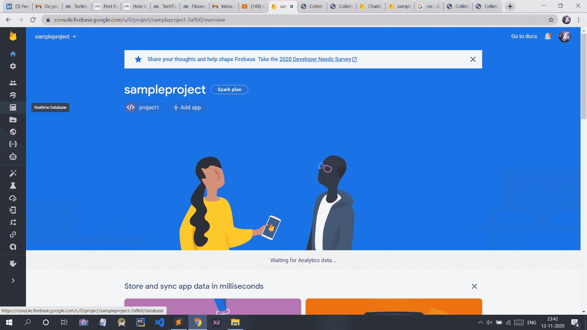

**第 10 步:**现在点击**创建数据库**按钮。

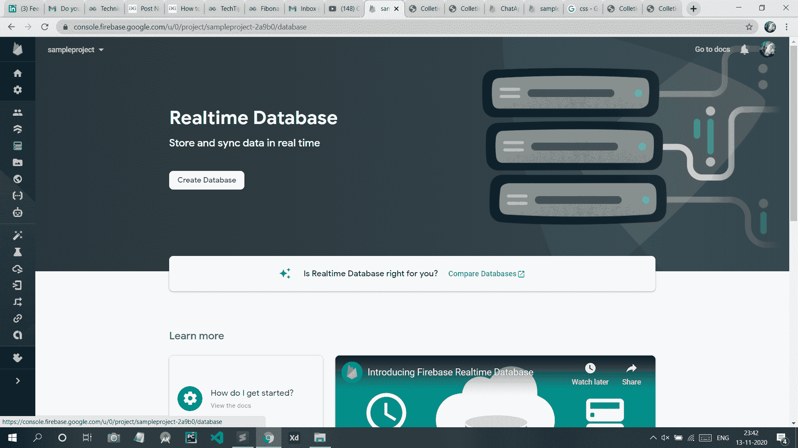

**第 11 步:**现在点击**测试模式**，然后点击**启用**按钮。

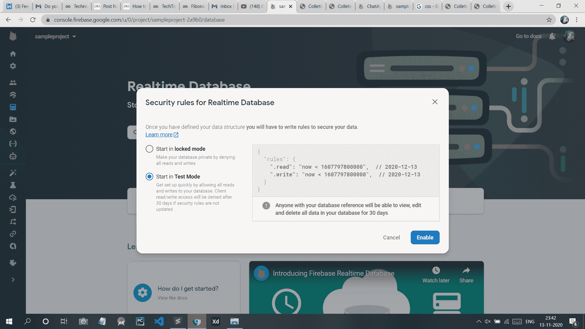

**第 12 步:**激活火基储存。单击左侧的存储按钮，然后单击开始。

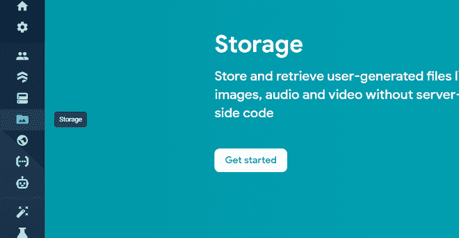

之后，这个盒子会弹出来。点击下一步。

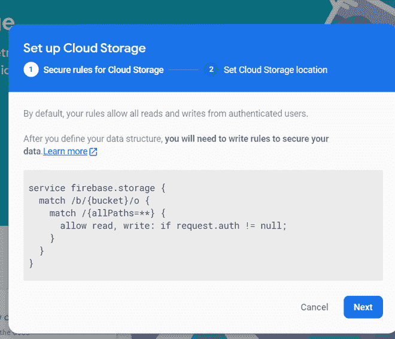

然后点击完成。

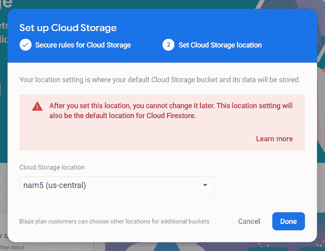

**项目设置:**

现在创建一个 **HTML** 文件，并复制您在**步骤 8** 中复制的**脚本**代码。下面的文件只是一个示例，让你了解如何**配置**你的项目。

## 超文本标记语言

```html
<!DOCTYPE html>
<html lang="en">

<head>
    <meta charset="UTF-8">
    <title>Collecting Data</title>
    <script src=
"https://ajax.googleapis.com/ajax/libs/jquery/3.5.1/jquery.min.js">
    </script>

    <link rel="stylesheet" href=
"https://cdn.jsdelivr.net/npm/bootstrap@4.5.3/dist/css/bootstrap.min.css"
        integrity=
"sha384-TX8t27EcRE3e/ihU7zmQxVncDAy5uIKz4rEkgIXeMed4M0jlfIDPvg6uqKI2xXr2"
        crossorigin="anonymous">
</head>

<body class="container" style="margin-top: 50px;
    width: 50%; height:auto;">

    <h2 class="text-primary" style=
        "margin-left: 15px; margin-bottom: 10px">
        Hey There,Help Us In Collecting Data
    </h2>

    <form class="container" id="contactForm">
        <div class="card">
            <div class="card-body">
                <div class="form-group">
                    <label for="exampleFormControlInput1">
                        Enter Your Name
                    </label>

                    <input type="text" class="form-control"
                    id="name" placeholder="Enter your name">
                </div>

                <div class="form-group">
                    <label for="exampleFormControlInput1">
                        Email address
                    </label>

                    <input type="email" class="form-control"
                    id="email" placeholder="name@example.com">
                </div>
            </div>
            <button type="submit" class="btn btn-primary"
                style="margin-left: 15px; margin-top: 10px">
                Submit
            </button>
        </div>
    </form>

    <script src=
"https://www.gstatic.com/firebasejs/3.7.4/firebase.js">
    </script>

    <script>
        var firebaseConfig = {
            apiKey: "Use Your Api Key Here",
            authDomain: "Use Your authDomain Here",
            databaseURL: "Use Your databaseURL Here",
            projectId: "Use Your projectId Here",
            storageBucket: "Use Your storageBucket Here",
            messagingSenderId: "Use Your messagingSenderId Here",
            appId: "Use Your appId Here"
        };

        firebase.initializeApp(firebaseConfig);

        var messagesRef = firebase.database()
            .ref('Collected Data');

        document.getElementById('contactForm')
            .addEventListener('submit', submitForm);

        function submitForm(e) {
            e.preventDefault();

            // Get values
            var name = getInputVal('name');
            var email = getInputVal('email');

            saveMessage(name, email);
            document.getElementById('contactForm').reset();
        }

        // Function to get get form values
        function getInputVal(id) {
            return document.getElementById(id).value;
        }

        // Save message to firebase
        function saveMessage(name, email) {
            var newMessageRef = messagesRef.push();
            newMessageRef.set({
                name: name,
                email: email,
            });
        }
    </script>
</body>

</html>
```

**输出:**

如下所示，在给定表格中输入**姓名**和**电子邮件地址**的一些样本值。

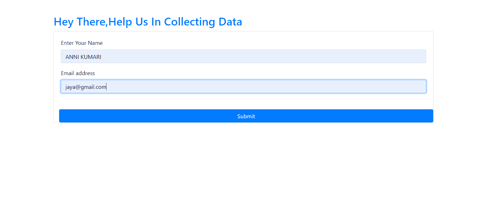

点击**提交**按钮后，数据被存储在实时数据库中，如下图所示。

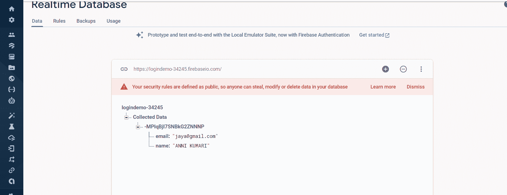