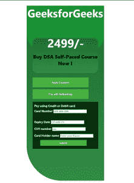

# 使用 HTML/CSS 创建在线支付用户界面设计

> 原文:[https://www . geesforgeks . org/create-an-online-payment-ui-design-use-html-CSS/](https://www.geeksforgeeks.org/create-an-online-payment-ui-design-using-html-css/)

对于任何经营在线业务的人来说，结账成为销售流程的重要组成部分，以保持在线销售和快速交易的便利性。一个吸引人的用户界面将帮助我们吸引潜在的访问者，并促进用户体验。

在本文中，我们将为交易目的创建一个支付页面。这个简单的项目是一个完美的例子，说明我们可以多么容易地使用 HTML 和 CSS 进行用户界面设计。

**为我们的网页创建结构:**我们将从使用简单的 HTML 创建网站的结构方面开始，稍后，我们将使用级联样式表(CSS)来设计它的样式，它将描述我们的 HTML 文档及其元素的样式。

**HTML 代码:**在这个 HTML 文件中，我们主要将我们的网页分成了几个**<div>**标签，我们还使用了几个类*如“主要内容”、“中心内容”、“最后内容”等。*这个 CSS 类是为了风格化我们的 HTML 元素。

## 超文本标记语言

```html
<!DOCTYPE html>
<html lang="en">
  <head>
    <meta charset="UTF-8" />
    <meta http-equiv="X-UA-Compatible" content="IE=edge" />
    <meta
      name="viewport"
      content="width=device-width,
               initial-scale=1.0"/>
    <link rel="stylesheet" href="style.css" 
          class="css" />
  </head>
  <body>
    <div class="container">
      <div class="main-content">
        <p class="text">GeeksforGeeks</p>
      </div>

      <div class="centre-content">
        <h1 class="price">2499<span>/-</span></h1>
        <p class="course">
           Buy DSA Self-Paced Course Now !
        </p>
      </div>

      <div class="last-content">
        <button type="button" class="pay-now-btn">
           Apply Coupons
        </button>
        <button type="button" class="pay-now-btn">
           Pay with Netbanking
        </button>

        <!-- <button type="button" class="pay-now-btn">
        Netbanking options
        </button> -->
      </div>

      <div class="card-details">
        <p>Pay using Credit or Debit card</p>

        <div class="card-number">
          <label> Card Number </label>
          <input
            type="text"
            class="card-number-field"
            placeholder="###-###-###"/>
        </div>
        <br />
        <div class="date-number">
          <label> Expiry Date </label>
          <input type="text" class="date-number-field" 
                 placeholder="DD-MM-YY" />
        </div>

        <div class="cvv-number">
          <label> CVV number </label>
          <input type="text" class="cvv-number-field" 
                 placeholder="xxx" />
        </div>
        <div class="nameholder-number">
          <label> Card Holder name </label>
          <input
            type="text"
            class="card-name-field"
            placeholder="Enter your Name"/>
        </div>
        <button type="submit" 
                class="submit-now-btn">
          submit
        </button>
      </div>
    </div>
  </body>
</html>
```

**设计我们的支付页面:**使用 CSS，我们可以存储我们的页面将共享的所有样式信息。每当用户访问网页时，浏览器将加载所有相关信息以及与页面内容相关的适当样式。在 CSS 中，类是相同或相似的元素组。你可以在一个类中拥有你想要的元素。每个元素可以是多个类的成员。每个类都有特定于该类的 CSS 属性(比如颜色和字体大小)。

**CSS 代码:** CSS 让我们可以创建独特的互动网站。

## style.css

```html
* {
  margin: 0;
  padding: 0;
}

body {
  font-family: "Segoe UI", Tahoma, Geneva, Verdana, sans-serif;
  font-weight: bold;
}

.container {
  height: 900px;
  width: 400px;
  background-image: linear-gradient(#1e6b30, #308d46);
  top: 50%;
  left: 50%;
  position: absolute;
  transform: translate(-50%, -50%);
  position: absolute;
  border-bottom-left-radius: 180px;
  border-top-right-radius: 150px;
}

.main-content {
  height: 235px;
  background-color: #1b9236;
  border-bottom-left-radius: 90px;
  border-bottom-right-radius: 80px;
  border-top: #1e6b30;
}

.text {
  text-align: center;
  font-size: 300%;
  text-decoration: aliceblue;
  color: aliceblue;
}

.course {
  color: black;
  font-size: 25px;
  font-weight: bolder;
}

.centre-content {
  height: 180px;
  margin: -70px 30px 20px;
  color: aliceblue;
  text-align: center;
  font-size: 20px;
  border-radius: 25px;
  padding-top: 0.5px;
  background-image: linear-gradient(#1e6b30, #308d46);
}

.centre-content-h1 {
  padding-top: 30px;
  padding-bottom: 30px;
  font-weight: normal;
}

.price {
  font-size: 60px;
  margin-left: 5px;
  bottom: 15px;
  position: relative;
}

.pay-now-btn {
  cursor: pointer;
  color: #fff;
  height: 50px;
  width: 290px;
  border: none;
  margin: 5px 30px;
  background-color: rgb(71, 177, 61);
  position: relative;
}

.card-details {
  background: rgb(8, 49, 14);
  color: rgb(225, 223, 233);
  margin: 10px 30px;
  padding: 10px;
  /* border-bottom-left-radius: 80px; */
}

.card-details p {
  font-size: 15px;
}

.card-details label {
  font-size: 15px;
  line-height: 35px;
}

.submit-now-btn {
  cursor: pointer;
  color: #fff;
  height: 30px;
  width: 240px;
  border: none;
  margin: 5px 30px;
  background-color: rgb(71, 177, 61);
}
```

**最终代码:**结合以上两个部分，将为您提供我们在线支付页面的最终表示。

**输出:**

