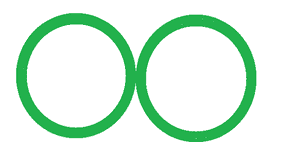
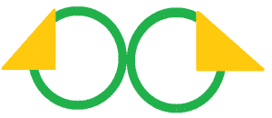
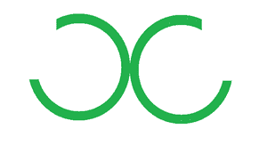
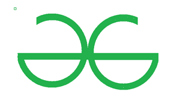
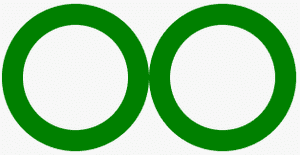
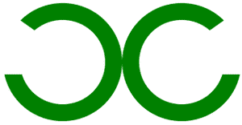
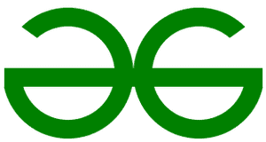

# 使用 HTML 和 CSS 创建 GeeksforGeeks 标志

> 原文:[https://www . geesforgeeks . org/create-geesforgeeks-logo-using-html-and-CSS/](https://www.geeksforgeeks.org/create-geeksforgeeks-logo-using-html-and-css/)

在本文中，我们将看到如何仅使用 HTML 和 CSS 来创建 GeeksforGeeks 徽标。

**第一步:**要创建 GFG 标志，首先我们取两个 div(内联)并用它们做圆。但是 div 元素是块级的，这就是为什么我们用包装 div 包装这两个 div，并使这个 div(包装)显示 **flex** 。用 10px 纯色绿色涂抹边框。你会得到这样的东西。



**步骤 2:** 现在使用伪元素**:****在“**和**绝对**位置属性**之后在两个圆上创建一个三角形。**应用三角形后，我们会得到这样的形状。



这里三角形的背景颜色是黄色，这只是为了解释。将三角形的背景色改为白色。

将白色背景颜色应用到三角形后，结果是:



**第三步:**现在使用伪元素**:在**之前并定位**绝对**属性，创建一个正方形。你可以把这个规则应用到任何一个圆上。生成的徽标如下所示:



**代码实现:**

**步骤 1:** 创建两个类名为**的 div，分别是**和**的 circle2，**并将它们包装到类名为**的父 div 中。**

## 超文本标记语言

```html
<div class="wrapper">
  <div class="circle1"></div>
  <div class="circle2"></div>
</div>
```

现在将 CSS 属性分配给**包装器**类。

```html
.wrapper{
   display: flex;
}
```

为两个圆圈设计风格

## 半铸钢ˌ钢性铸铁(Cast Semi-Steel)

```html
.circle1{
    height: 100px;
    width: 100px;
    border: 20px solid green;
    border-radius: 100px;
    position: relative;
}

.circle2{
    height: 100px;
    width: 100px;
    border: 20px solid green;
    border-radius: 200px;
    position: relative;
}
```

到目前为止，我们的标志是这样的



**步骤 2:** 使用伪元素将不可见的三角形添加到两个圆中:after

## 半铸钢ˌ钢性铸铁(Cast Semi-Steel)

```html
.circle1:after{
    content: "";
    position: absolute;
    border-top: 100px solid transparent;
    border-left: 140px solid white;
    left: -50px;
    top: -35px;
}

.circle2:after{
    content: "";
    position: absolute;
    border-top: 100px solid transparent;
    border-right: 140px solid white;
    right: -50px;
    top: -35px;
}
```

最终的徽标如下所示–



**第三步:**现在在伪元素之前使用**在徽标上添加正方形(我们没有使用 after(伪元素)，因为我们已经使用它来创建三角形)。**

## 半铸钢ˌ钢性铸铁(Cast Semi-Steel)

```html
.circle1:before{
    content: "";
    height: 20px;
    width: 276px;
    position: absolute;
    background: green;
    left: -18px;
    top: 45px;
    z-index: 1;
}
```

生成的徽标是:



#### 完整代码:

## 超文本标记语言

```html
<!DOCTYPE html>
<html>

<head>
    <style>
        .wrapper {
            display: flex
        }

        .circle1 {
            height: 100px;
            width: 100px;
            border: 20px solid green;
            border-radius: 100px;
            position: relative;
        }

        .circle2 {
            height: 100px;
            width: 100px;
            border: 20px solid green;
            border-radius: 200px;
            position: relative;
        }

        .circle1:after {
            content: "";
            position: absolute;
            border-top: 100px solid transparent;
            border-left: 140px solid white;
            left: -50px;
            top: -35px;
        }

        .circle2:after {
            content: "";
            position: absolute;
            border-top: 100px solid transparent;
            border-right: 140px solid white;
            right: -50px;
            top: -35px;
        }

        .circle1:before {
            content: "";
            height: 20px;
            width: 276px;
            position: absolute;
            background: green;
            left: -18px;
            top: 45px;
            z-index: 1;
        }
    </style>
</head>

<body>
    <div class="wrapper">
        <div class="circle1"></div>
        <div class="circle2"></div>
    </div>
</body>

</html>
```

#### 代码可以优化:

您可以看到，您使用的许多属性对两个圆都是相同的。如果我们对两个圆使用相同的 id，那么我们可以将公共属性写入该 id，并将不同的属性写入类。

以下是上述徽标的优化代码:

## 超文本标记语言

```html
<!DOCTYPE html>
<html>

<head>
    <style>
        .wrapper {
            display: flex
        }

        #circle {
            height: 100px;
            width: 100px;
            border: 20px solid green;
            border-radius: 100px;
            position: relative;
        }

        #circle:after {
            content: "";
            position: absolute;
            border-top: 100px solid transparent;
            top: -35px;
        }

        .circle1:after {
            border-left: 140px solid white;
            left: -50px;
            top: -35px;
        }

        .circle2:after {
            border-right: 140px solid white;
            right: -50px;
        }

        .circle1:before {
            content: "";
            height: 20px;
            width: 276px;
            position: absolute;
            background: green;
            left: -18px;
            top: 45px;
            z-index: 1;
        }
    </style>
</head>

<body>
    <div class="wrapper">
        <div id="circle" class="circle1"></div>
        <div id="circle" class="circle2"></div>
    </div>
</body>

</html>
```

**输出:**

