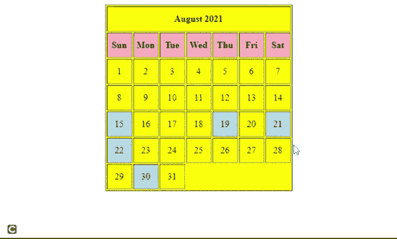

# 使用 HTML 和 PHP 创建假日日历

> 原文:[https://www . geesforgeks . org/create-holiday-calendar-using-html-and-PHP/](https://www.geeksforgeeks.org/create-holiday-calendar-using-html-and-php/)

在本文中，我们将使用 HTML 中的表格概念、用于设计日历样式的 CSS 和 PHP 来创建给定月份的假日日历。

我们还将显示给定月份中的所有假日，使用不同的颜色突出显示它们，并在鼠标悬停在突出显示的日期上时显示假日名称。我们将使用 PHP 来迭代日期，并检查它是否在假期列表中。如果鼠标悬停在假日单元格上，它将触发一个 JavaScript 函数，在日历下方显示假日名称。

**示例:**我们将显示 2021 年 8 月的日历作为示例。我们将创建一个 2021 年 8 月所有假期的列表，使用 CSS [*背景色*](https://www.geeksforgeeks.org/css-background-color-property/) 属性突出显示假期，鼠标悬停显示假期名称。

## 超文本标记语言

```html
<!DOCTYPE html>
<html>

<head>
    <title>August 2021</title>

    <style>
        table {
            background-color: yellow;
        }

        td {
            width: 40px;
            height: 40px;
            text-align: center;
        }

        .day {
            font-weight: bolder;
            background-color: lightpink;
        }

        .holiday {
            background-color: lightblue;
        }

        #field {
            font-weight: bolder;
            text-align: center;
        }
    </style>

    <script type="text/javascript">
        function show(a) {
            document.getElementById('field').innerHTML
                = document.getElementById(a.id)
                .attributes["name"].value;

            setTimeout(function () {
                document.getElementById('field').innerHTML = "";
            }, 5000);
        }
    </script>
</head>

<body>
    <table align="center" border="1">
        <tr>
            <td colspan="7"><b>August 2021</b></td>
        </tr>

        <tr class="day">
            <td>Sun</td>
            <td>Mon</td>
            <td>Tue</td>
            <td>Wed</td>
            <td>Thu</td>
            <td>Fri</td>
            <td>Sat</td>
        </tr>

        <?php
            $holidays = array(
                15 => "Independence Day", 
                19 => "Muharram", 
                21 => "Onam", 
                22 => "Raksha Bandhan", 
                30 => "Janmashtami"
            );

            for($i = 1; $i <= 31; $i++) {
                if (in_array($i, array_keys($holidays))) {
                    $x = $holidays[$i];
                echo "<td class = holiday id='$i'
                    name ='$x' onmouseover = show(this)>$i</td>";
                } else {
                    echo "<td id =$i>$i</td>";
                }

                if($i % 7 == 0) {
                    echo "</tr><tr>";
                }
            }
        ?>
    </table>
    <br><br>

    <div id="field"></div>
</body>

</html>
```

**输出:**在下面的输出中，当鼠标悬停在“8 月 30 日”单元格上时，会将节日名称显示为“Janmashtami”。



鼠标悬停的假日日历