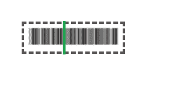

# 使用 HTML & CSS

创建扫描动画加载器

> 原文:[https://www . geesforgeks . org/create-scanning-animation-loader-using-html-CSS/](https://www.geeksforgeeks.org/create-scanning-animation-loader-using-html-css/)

在本文中，我们将学习如何创建扫描动画。这可以用来增加加载器页面的交互性。这是通过简单的 HTML & CSS 来实现的。

**项目一瞥:**



**进场:**

*   我们将首先创建一个 HTML 文件，在其中添加一个 div，用于在其中添加跨度。
*   然后我们将创建一个 CSS 样式来给扫描动画赋予动画效果。

我们将从定义页面的 HTML 和 CSS 部分开始，如下所示。
**HTML 部分:**在这个部分，定义了页面的结构。

*   我们将首先创建一个 HTML 文件。
*   然后，我们将写出 HTML 页面所需的样板代码。
*   我们接下来将链接 CSS 文件或直接添加提供所有动画效果的所需 CSS。
*   在正文部分，我们将添加一个跨度来添加我们的文本。

## index.html

```html
<!DOCTYPE html>
<html lang="en">
  <head>
    <link rel="stylesheet" href="style.css" />
  </head>

  <body>
    <div class="scan">
      
    </div>
  </body>
</html>
```

**CSS 部分:**在这一部分，我们将定义页面的 CSS。使用 CSS，我们将为我们的 HTML 页面提供不同类型的动画
和效果，这样它看起来对所有用户都是交互式的。

*   我们将首先重置所有浏览器效果，以便所有浏览器上的一切都是一致的。
*   然后我们将定义给元素的样式，包括大小和位置。
*   我们将使用@关键帧和伪类为特定的类添加动画效果。

## style.css

```html
.scan {
    width: 10em;
    text-align: center;
    padding: 6px 2px;
    position: absolute;
    left: 0;
    right: 0;
    top: 50%;
    margin: auto;
    border: dashed .25em rgb(90, 85, 85);
    transform: translate(-50%);
}

.scan::after {
    content: '';
    background: rgb(23, 162, 74);
    width: 0.25em;
    height: 3.5em;
    display: block;
    position: absolute;
    top: 0;
    right: 0;
    left: 0;
    bottom: 0;
    margin: auto;
    opacity: 7;
    z-index: 2;
    animation: 2s infinite ease-in-out roll;
}

.scan img {
    height: 30px;
    width: 98%;
}

@keyframes roll {
    0% {
        transform: translateX(-50px);
    }
    50% {
        transform: translateX(50px);
    }
    100% {
        transform: translateX(-50px);
    }
}
```

**输出:**

