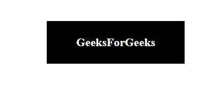

# 使用 HTML 和 CSS 创建三维翻转按钮

> 原文:[https://www . geesforgeks . org/creating-a-3d-flip-button-use-html-and-CSS/](https://www.geeksforgeeks.org/creating-a-3d-flip-button-using-html-and-css/)

创建三维效果是网页设计中最苛刻的需求之一。在本文中，我们将学习使用简单的 HTML 和 CSS 实现 3D 翻转按钮动画效果。在这种效果下，每当用户将鼠标悬停在按钮上时，它都会显示一个具有 3D 外观的翻转动画。

**HTML 代码:**在这一节中，我们将使用锚点标签，并使用 CSS 来设计按钮。

## 超文本标记语言

```html
<!DOCTYPE html>
<html>

<body>
    <a href="#">
        <span>GeeksForGeeks</span>
    </a>
</body>

</html>
```

**CSS 部分:**在这个部分，我们将使用一些 CSS 属性来创建 3D 效果。

*变换样式的*属性用于定义效果应该保留 3D 定位，以便效果看起来正确。 *:hove* r 选择器可用于选择超链接并使用*变换*属性。每当按钮悬停在上方时， *rotateX()* 值用于旋转按钮。

**CSS 代码:**

## 半铸钢ˌ钢性铸铁(Cast Semi-Steel)

```html
<style>
      body {
      display: flex;
      min-height: 100vh;
      align-items: center;
      justify-content: center;
      background: white;
    }

    a {
      position: relative;
      padding: 20px 40px;
      background: black;
      color: white;
      text-decoration: none;
      transform-style: preserve-3d;
      transition: ease-in-out 3s;
    }

    a:hover {
      transform: rotateX(360deg);
    }

    a span {
      display: block;
      font-weight: bold;
      transform-style: preserve-3d;
    }
</style>
```

**完整代码:**在本节中，我们将结合以上两个部分来创建一个完整的效果。

## 超文本标记语言

```html
<!DOCTYPE html>
<html>

<head>
    <style>
        body {
            display: flex;
            min-height: 100vh;
            align-items: center;
            justify-content: center;
            background: white;
        }

        a {
            position: relative;
            padding: 20px 40px;
            background: black;
            color: white;
            text-decoration: none;
            transform-style: preserve-3d;
            transition: ease-in-out 3s;
        }

        a:hover {
            transform: rotateX(360deg);
        }

        a span {
            display: block;
            font-weight: bold;
            transform-style: preserve-3d;
        }
    </style>
</head>

<body>
    <a href="#">
        <span>GeeksForGeeks</span>
    </a>
</body>

</html>
```

**输出:**

