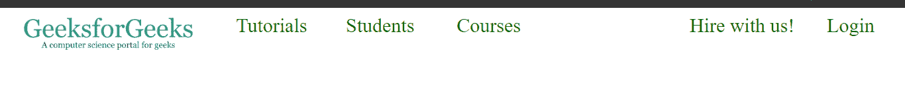

# 创建导航栏|普通 HTML CSS Vs Bootstrap

> 原文:[https://www . geesforgeks . org/creating-nav bar-vanilla-html-CSS-vs-bootstrap/](https://www.geeksforgeeks.org/creating-navbar-vanilla-html-css-vs-bootstrap/)

Navbar 代表导航栏，是网页不可分割的一部分。它列出了网站内外的许多链接，并使不同部分之间的导航变得容易。目录、菜单和索引是导航栏的一些常见示例。

建造酒吧很费时间，也很混乱。因此像 Bootstrap 这样的库有很多内置的类和选项可以派上用场。

**示例 1:** 不带 Bootstrap 的 Navbar(普通 HTML CSS)

```html
<!DOCTYPE html>
<html>
    <head>
        <title>Navbar Geeksforgeeks</title>
        <style>
            body {
                margin: 0;
            }
            nav {
                width: 100%;
            }
            ul {
                margin: 0;
                padding: 0;
            }
            li {
                float: left;
                margin: 0;
                padding-top: 10px;
                padding-bottom: 10px;
                font-size: 30px;
                width: 12%;
                list-style: none;
                text-align: center;
            }
            a {
                color: rgb(0, 102, 0);
                text-decoration: none;
            }
            img {
                width: 80%;
            }
            #image {
                width: 24%;
            }
            #blankSpace {
                width: 16%;
                height: 34px;
            }
        </style>
    </head>
    <body>
        <nav>
            <ul>
                <li id="image">
                  </li>
                <li><a href="">Tutorials</a></li>
                <li><a href="">Students</a></li>
                <li><a href="">Courses</a></li>
                <li id="blankSpace"><a href=""></a></li>
                <li><a href="">Hire with us!</a></li>
                <li><a href="">Login</a></li>
            </ul>
        </nav>
    </body>
</html>
```

**解释:**
**HTML:**

*   **<导航> :** 父元素，它包装了我们导航栏中的所有按钮和图标。
*   **< ul > :** (无序列表)将 navbar 中的所有链接存储为列表是一个很好的做法。
*   **< img > :** 用于图标。
*   **< a > :** 用作导航条的按钮。

CSS:

*   **浮动:**该属性改变元素从垂直到水平的对齐方式。
*   **列表样式:**设置为无时，将删除列表的项目符号。
*   **文字装饰:**负责链接的下划线。
*   **宽度:**指一个元素所占的水平空间。
*   **高度:**一个元素所占的垂直空间。

**输出:**


**示例 2:** 使用自举的导航条

```html
<!DOCTYPE html>
<html>
    <head>
        <title>bootstrapNavbar Geeksforgeeks</title>
        <link rel="stylesheet" 
              href=
"https://stackpath.bootstrapcdn.com/bootstrap/4.5.0/css/bootstrap.min.css"
              integrity=
"sha384-9aIt2nRpC12Uk9gS9baDl411NQApFmC26EwAOH8WgZl5MYYxFfc+NcPb1dKGj7Sk" 
              crossorigin="anonymous" />
        <style>
            div {
                text-align: center;
            }
            img {
                width: 80%;
            }
            .btn {
                font-size: 25px;
                color: rgb(0, 102, 0);
            }
        </style>
    </head>

    <body>
        <div class="row">
            <div class="col-3">
                
            </div>
            <div class="col-4 row">
                <div class="col-4">
                    <a href="#" class="btn">Tutorials</a>
                </div>
                <div class="col-4">
                    <a href="#" class="btn">Students</a>
                </div>
                <div class="col-4">
                    <a href="#" class="btn">Courses</a>
                </div>
            </div>
            <div class="col-2 row"></div>
            <div class="col-3 row">
                <div class="col-8">
                    <a href="#" class="btn">Hire with us!</a>
                </div>
                <div class="col-4">
                    <a href="#" class="btn">Login</a>
                </div>
            </div>
        </div>
    </body>
</html>
```

**说明:**由于我们的目标是一个没有任何 JavaScript 的静态 navbar，使用**网格代替 nav** 将是可行的。

1.  将 html 文档与官方引导 CDN(内容交付网络)链接起来。
2.  用 bootstrap 类行定义 div(这个类帮助我们将一行分成小列)。
3.  接下来分别用类 col-3、4、2 和 3 定义四个 div(整数对应于一列的宽度)(总宽度-12)。
4.  根据需要创建嵌套 div。
5.  给所有按钮一个 bootstrap 类 btn，为我们提供所需的填充、边距和悬停效果。

CSS:

1.  这一次我们的 CSS 代码要小得多，包括一些小的样式，比如字体大小和颜色。
2.  填充和边距由引导类负责。
3.  navbar 的整个布局是由引导行和引导列组成的，这进一步减少了我们的 CSS。

**输出:**


**两种方法的区别:**

1.  bootstrap 版本中的 CSS 非常少。
2.  与 bootstrap 相比，普通代码非常灵活。
3.  编写普通的代码非常乏味，而一旦理解了引导代码就变得非常容易。