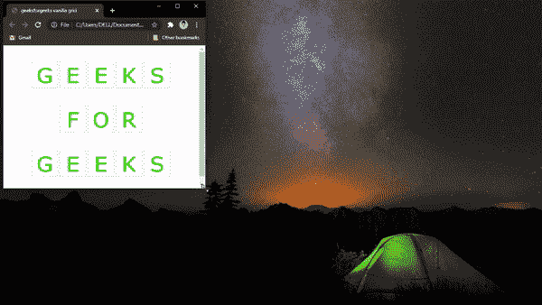
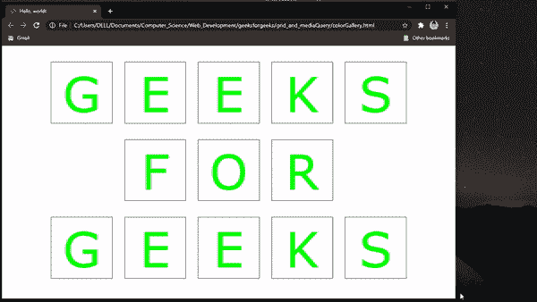

# 使用 HTML、CSS 和 Bootstrap 创建响应网格香草

> 原文:[https://www . geesforgeks . org/creating-responsive-grid-vanillar-use-html CSS-and-bootstrap/](https://www.geeksforgeeks.org/creating-responsive-grid-vanilla-using-htmlcss-and-bootstrap/)

许多现代网站使用网格系统在主页和其他页面上显示大量数据。网格在很大程度上类似于表格，但是，它在视觉上更有吸引力，并且通常显示兄弟元素。网格必须是响应性的，即它应该根据用户的屏幕大小进行调整。

[**Bootstrap**](https://www.geeksforgeeks.org/bootstrap-tutorials/) 是一个非常流行的开源[**HTML**](https://www.geeksforgeeks.org/html-tutorials/)[**CSS**](https://www.geeksforgeeks.org/css-tutorials/)和 [**JavaScript**](https://www.geeksforgeeks.org/javascript-tutorial/) 库，帮助设计网站的前端。一般来说，引导代码非常紧凑和健壮，但是每个开发人员都应该掌握普通的(可定制的)HTML 和 CSS 有几个原因:

*   大量的实用程序和组件从未使用过，因此成为网页的负担。
*   引导代码很难定制。
*   Bootstrap 会减慢网站的下载速度，因为它首先加载 jQuery，然后引导 CSS，然后引导 JS。

**创建网格的两种可能方法:**

**1。没有引导的网格(普通的 HTML CSS)**

**HTML 代码:**我们首先用类“ **customRow** 定义三个 div。然后在每个**自定义行**分区内创建一个 img 标签。

## 超文本标记语言

```html
<!DOCTYPE html>
<html>

<head>
  <title>geeksforgeeks vanilla grid</title>

  <!-- Custom CSS Link -->
  <link rel="stylesheet" 
        type="text/css" 
        href="gfgVanillaGrid.css">
</head>

<body>
  <!-- gfg(G),gfg(E) ... gfg(R) are images 
       for corresponding letters -->
  <div class="customRow">
      <!-- First Row  G E E K S-->
      
      
      
      
      
  </div>
  <div class="customRow">
      <!-- Second Row   F O R-->
      
      
      
  </div>
  <div class="customRow">
      <!-- Third Row  G E E K S-->
      
      
      
      
      
  </div>

</body>

</html>
```

**CSS 代码:**大部分样式都是预定义的。但是，我们必须将每个图像的**宽度**设置为“**自定义行**的百分比”，这样它们才会有响应，即它们的宽度会随着屏幕大小的变化而变化。我们为行设置一些非零的**边距**，这样它们就不会粘在一起。最后，我们使用**文本对齐**属性将所有图像对齐到屏幕中心。

## 半铸钢ˌ钢性铸铁(Cast Semi-Steel)

```html
img{
    width: 14%;
}

/* 40px margin on top and bottom, 
   zero margin on left and right*/
.customRow{
    margin: 40px 0; 
    text-align: center;
}
```

#### 

**输出:**



**2。使用自举的网格**

**HTML 代码:**首先，我们需要从其官方网站复制引导入门模板。该模板包含一个**引导** CDN、 **jQuery** CDN、 **popper.js** CDN 和**引导** JavaScript 文件。为了方便，我把它放在这里了。

然后我们通过创建一个带有****类容器的 **div** 来开始构建我们的网格。**这个 div 将包装我们所有的行，然后为每一行我们:**

1.  **用类行创建 div**
2.  **在这个“行 div”中，**创建尽可能多的 **div** 作为所需的列数，并给这些列 div 中的每一列赋予一个**类 col-*** 。这里星号(*)类似于列的宽度。任何屏幕的总宽度都设置为 12，这个总宽度在各列之间分配得太均匀或不均匀。在第一行中，定义了五列，每列宽度为 2，总共为 10 列，其余 2 列(12-10)用作空白。****
3.  **然后根据需要放置图像标签**
4.  **在每行图像的中心，向每个“**行 div** 添加一个引导类**调整内容中心**。**
5.  **在头部放一个自定义 CSS 文件(这里是 gfgBootstrapGrid.css)的链接。**

## **超文本标记语言**

```html
<!DOCTYPE html>
<html lang="en">
    <head>
        <!-- Required meta tags -->
        <meta charset="utf-8" />
        <meta name="viewport" 
              content="width=device-width, initial-scale=1, 
                       shrink-to-fit=no" />

        <!-- Bootstrap CSS CDN -->
        <link rel="stylesheet" href=
"https://stackpath.bootstrapcdn.com/bootstrap/4.5.1/css/bootstrap.min.css" 
              integrity=
"sha384-VCmXjywReHh4PwowAiWNagnWcLhlEJLA5buUprzK8rxFgeH0kww/aWY76TfkUoSX" 
              crossorigin="anonymous" />
        <!-- Custom CSS Link-->
        <link rel="stylesheet" 
              href="gfgBootstrapGrid.css" />
        <title>Geeksforgeeks grid with bootstrap</title>
    </head>
    <body>
        <!-- gfg(G),gfg(E) ... gfg(R) are images 
             for corresponding letters -->
        <div class="container-fluid">
            <!-- First Row  G E E K S-->
            <div class="row justify-content-center">
                <div class="col-2">
                    
                </div>
                <div class="col-2">
                    
                </div>
                <div class="col-2">
                    
                </div>
                <div class="col-2">
                    
                </div>
                <div class="col-2">
                    
                </div>
            </div>
            <!-- Second Row   F O R-->
            <div class="row justify-content-center">
                <div class="col-2">
                    
                </div>
                <div class="col-2">
                    
                </div>
                <div class="col-2">
                    
                </div>
            </div>
            <!-- Third Row  G E E K S-->
            <div class="row justify-content-center">
                <div class="col-2">
                    
                </div>
                <div class="col-2">
                    
                </div>
                <div class="col-2">
                    
                </div>
                <div class="col-2">
                    
                </div>
                <div class="col-2">
                    
                </div>
            </div>
        </div>

        <!-- jQuery first, then Popper.js, then Bootstrap JS -->
        <script src=
"https://code.jquery.com/jquery-3.5.1.slim.min.js" 
                integrity=
"sha384-DfXdz2htPH0lsSSs5nCTpuj/zy4C+OGpamoFVy38MVBnE+IbbVYUew+OrCXaRkfj" 
                crossorigin="anonymous">
        </script>
        <script src=
"https://cdn.jsdelivr.net/npm/popper.js@1.16.1/dist/umd/popper.min.js" 
                integrity=
"sha384-9/reFTGAW83EW2RDu2S0VKaIzap3H66lZH81PoYlFhbGU+6BZp6G7niu735Sk7lN" 
                crossorigin="anonymous">
        </script>
        <script src=
"https://stackpath.bootstrapcdn.com/bootstrap/4.5.1/js/bootstrap.min.js" 
                integrity=
"sha384-XEerZL0cuoUbHE4nZReLT7nx9gQrQreJekYhJD9WNWhH8nEW+0c5qq7aIo2Wl30J" 
                crossorigin="anonymous">
        </script>
    </body>
</html>
```

****CSS Code:** 首先我们需要给每一行留出余量，避免它们卡住。为此，我们追加了 bootstrap 的**行类，给它一个“上下 40px”和“左右 0”的边距。我们还调整每个图像标签的大小，以获取其 100%的父元素(此处为“列 div”)，这使得**图像具有响应性******

## **半铸钢ˌ钢性铸铁(Cast Semi-Steel)**

```html
.row{
    margin: 40px 0;
}
img{
    width: 100%;
}
```

****输出:****

****

****两种方法的区别:****

1.  **正如代码所反映的，对于小项目(比如这个)，自定义 CSS 是更好的选择。这是因为需要完成的类和泛化更少，并且代码是专门为特定用例编写的。**
2.  **然而，如果一个大型项目有很多元素(例如登录页面、注册页面、主页等)，一般的边距和填充总是相同的。因此，使用 bootstrap 将避免任何代码重复，因此是首选。**
3.  **由于 Bootstrap 是一个预定义的库，因此与自定义 CSS 相比，出现错误代码的可能性非常小。**