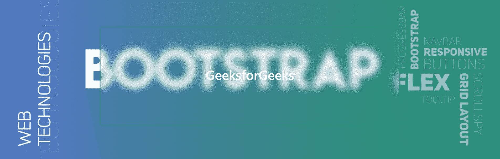

# 使用 HTML 和 CSS 设计磨砂玻璃效果

> 原文:[https://www . geesforgeks . org/design-a-磨砂玻璃-效果-使用-html-and-css/](https://www.geeksforgeeks.org/design-a-frosted-glass-effect-using-html-and-css/)

在本文中，我们将使用 bootstrap 4 card 类实现磨砂玻璃效果。下图是本文的最终结果。



**进场:**

**1。造型主体:**我们先来为你的网页设置背景。将下面的代码写在你的<风格>标签的头部标签下。如果您已经设置了背景属性(如果有的话)，请跳到下一部分。如果没有，给你。

## 半铸钢ˌ钢性铸铁(Cast Semi-Steel)

```html
body {
     background-image: url('background.jpg');
     background-repeat: no-repeat;
     background-size: 100%;
     background-attachment: fixed;
}
```

#### [您可以在这里阅读上述属性](https://www.geeksforgeeks.org/css-background/)

**2。冰霜玻璃卡:**在样式标签下，使用以下代码，

## 半铸钢ˌ钢性铸铁(Cast Semi-Steel)

```html
.card {
      box-shadow: 0 0 5px 0 ;
      background: inherit;
      backdrop-filter: blur(10px);
      <!--margin: 100px; according to your need-->
}
```

我们这里有什么，

*   [**框影**](https://www.geeksforgeeks.org/css-box-shadow-property/) **:** 此属性用于给元素的帧赋予类似阴影的效果。
*   [**【背景】**](https://www.geeksforgeeks.org/css-background/) **:** 用这个使元素透明，并有与你的网页相同的背景(在 body 类中其必须有“背景-附件:固定的，”)
*   [**背景色-滤镜**](https://www.geeksforgeeks.org/css-backdrop-filter-property/) **:** 用这个对元素后面的区域应用效果。([也看看这个](https://www.geeksforgeeks.org/workaround-to-backdrop-filter-in-css/))基本上，这就是在这里减少了很多 CSS 样式的属性。
*   [](https://www.geeksforgeeks.org/css-margins-padding/)****:**边距和填充都是根据你的需要。**

****注意:【Mozilla 的浏览器 Firefox 出现了问题，在某些情况下，背景滤镜无法正常工作，chrome 和 edge 工作正常。****

****3。<体内第>分区:****

## **超文本标记语言**

```html
<body>
    <div class="container">
        <div class="card card-body" style="justify-content: center;">
            <!--Contents <h1 >_______</h1> -->
        </div>
    </div>
</body>
```

****最终代码:****

## **超文本标记语言**

```html
<!DOCTYPE html>
<html lang="en">

<head>
    <link rel="stylesheet" href=
"https://stackpath.bootstrapcdn.com/bootstrap/4.5.2/css/bootstrap.min.css">

    <style>
        body {
            background-image: url(
"https://media.geeksforgeeks.org/wp-content/uploads/20200318142240/Bootstrap5.png");
            background-repeat: no-repeat;
            background-size: 100%;
            background-attachment: fixed;
        }

        h1 {
            color: white;
            height: 250px;
            display: flex;
            justify-content: center;
            align-items: center;
        }

        .card {
            top: 50%;
            box-shadow: 0 0 5px 0;
            background: inherit;
            backdrop-filter: blur(10px);
            margin: 100px;
            text-align: center;
        }
    </style>
</head>

<body>

    <div class="container">
        <div class="card card-body" 
            style="justify-content: center;">
            <h1>GeeksforGeeks</h1>
        </div>
    </div>
</body>

</html>
```

****输出:****

****