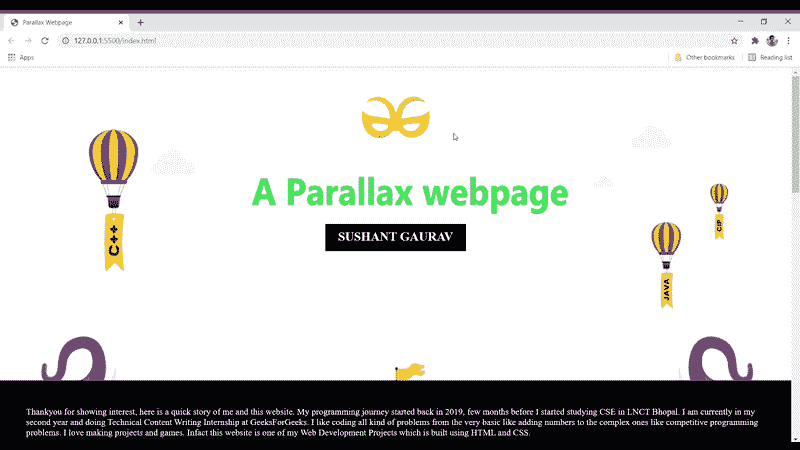

# 使用 HTML & CSS

设计一个视差网页

> 原文:[https://www . geesforgeks . org/design-a-parallax-网页-使用-html-css/](https://www.geeksforgeeks.org/design-a-parallax-webpage-using-html-css/)

视差网站在背景中包括固定的图像，这些图像保持在适当的位置，用户可以向下滚动页面来查看图像的不同部分。在本文中，我们使用 HTML 和 CSS 创建了一个视差网页。我们将使用像 div、段落和标题这样的 HTML 基本标签来编写我们的内容，并将使用 CSS 来对齐和美化我们的基本 HTML 设计。

**进场:**

*   我们使用了一个容器元素，并向容器中添加了一个背景图像。然后我们使用**背景-附件:固定**来创建实际的视差效果。
*   对于每个 HTML 部分，我们都给了一个类，这样它就可以成为 CSS 的目标。
*   在 HTML 页面中，我们有分区，在每个分区中，有一个标题和一个小段落。在 CSS 文件中，我们已经装饰了我们的文本，并将头部放置在固定的位置。

**示例:**

## 超文本标记语言

```html
<!DOCTYPE html>
<html lang="en">

<head>
    <style>

        /* Styling the body */
        * {
            margin: 0px;
            padding: 0px;
        }

        /* Styling the first parallax's 
        height, width and background color */
        .parallax-1 {
            width: 100%;
            height: 600px;
            background: url(
'https://media.geeksforgeeks.org/wp-content/uploads/20210402175040/back22.jpg');
            background-size: 100% 100%;
            background-attachment: fixed;
        }

        /* Styling the title of first parallax */
        .parallax-1 h2 {
            margin: auto;
            position: relative;
            left: 500x;
            top: 300px;
            width: 250px;
            height: 32px;
            padding: 10px;
            background-color: black;
            color: white;
            text-align: center;
        }

        /* Styling the second parallax's 
        height, width and background color */
        .parallax-2 {
            width: 100%;
            height: 600px;
            background: url(
'https://media.geeksforgeeks.org/wp-content/uploads/20210402175040/back22.jpg');
            background-size: 100% 100%;
            background-attachment: fixed;
        }

        /* Styling the title of second parallax */
        .parallax-2 h2 {
            margin: auto;
            position: relative;
            left: 500x;
            top: 300px;
            width: 250px;
            height: 37px;
            padding: 10px;
            background-color: white;
            color: black;
            text-align: center;
            font-size: 30px;
            font-family: Verdana;
        }

        /* Styling the content or paragraph */
        .para-1 {
            padding: 50px;
            background-color: black;
            color: white;
            font-size: 17px;
        }

        /* Styling the content or paragraph */
        .para-2 {
            text-align: center;
            padding: 25px;
            font-size: 17px;
            font-family: Verdana;
            background-color: black;
            color: white;
        }
    </style>
</head>

<body>

    <!-- Giving title of the first parallax -->
    <div class="parallax-1">
        <h2>SUSHANT GAURAV</h2>
    </div>

    <!--Content of first parallax -->
    <div class="para-1">
        <p>
            Thankyou for showing interest, 
            here is a quick story of me and
            this website. My programming 
            journey started back in 2019, 
            few months before I started 
            studying CSE in LNCT Bhopal. 
            I am currently in my second 
            year and doing Technical 
            Content Writing Internship
            at GeeksForGeeks. I like 
            coding all kind of problems 
            from the very basic like adding 
            numbers to the complex ones like
            competitive programming problems.
            I love making projects and games.
            Infact this website is one of my 
            Web Development Projects which 
            is built using HTML and CSS.<br>
            <br>Languages known : C Language, 
            C++, JAVA, Python, JavaScript, 
            MySQL.<br> IT Constructs : Data 
            Structures and Algorithm, OOP, 
            HTML, CSS, LINUX, and Git & GitHub.
        </p>
    </div>

    <!-- Giving title of the first parallax -->
    <div class="parallax-2">
        <h2>PROJECTS</h2>
    </div>

    <!--Content of first parallax -->
    <div class="para-2">
        <p>
              Calendar ☀  
            Tic-Tac-Toe ☀  
            Quiz Game ☀  
            Survey Form ☀  
            Chat Bot in C ☀  
            Tribute Webpage ☀  
            Portfolio Website ☀  
            Guess the Number ☀  
            Rock Paper Scissor ☀ 
            To-Do List using JS ☀  
            Notes Taker using JS ☀  
            BMI Calculator using JS ☀ 
            Loan Calculator using JS ☀  
            Travel Management System ☀  
            Random Password Generator ☀  
            Different Management Systems
        </p>
    </div>

    <!--This will be same as first parallax-->
    <div class="parallax-1">
        <h2>ACHIEVEMENTS</h2>
    </div>

    <div class="para-2">
        <p>
              Technical Content Writer 
            Intern at GeeksForGeeks ☀
              Microsoft Learn Student 
            Ambassador - Beta ☀  
            Participant in GirlScript Summer 
            of Code 2021 ☀  
            Mentored HackTX Hackathon
        </p>
    </div>
</body>

</html>
```

**输出:**

