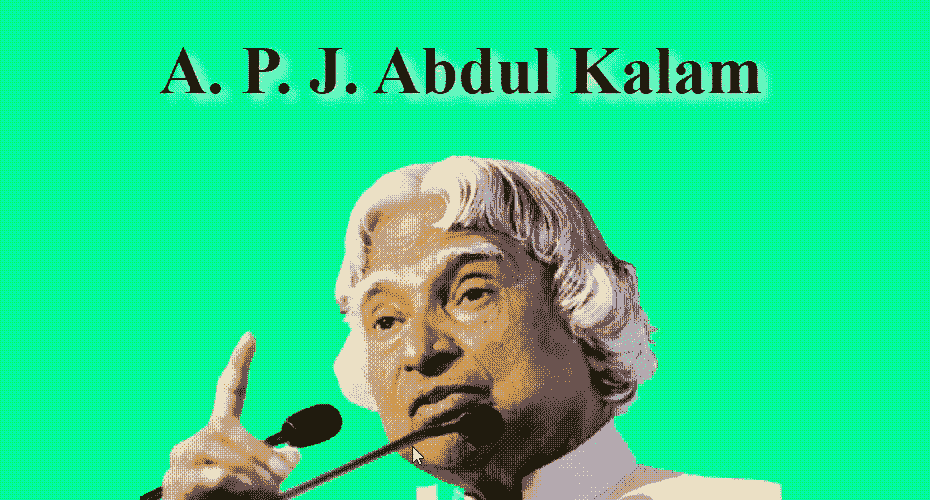

# 使用 HTML & CSS

设计一个贡品页面

> 原文:[https://www . geesforgeks . org/design-a-贡品-page-use-html-CSS/](https://www.geeksforgeeks.org/design-a-tribute-page-using-html-css/)

致敬页基本上是对我们生活中崇拜的人的概述。在本文中，我们使用 HTML 和 CSS 创建了已故阿卜杜勒·卡拉姆爵士的致敬网页。我们将在中心(标题下方)添加他的图像，并在该图像下创建一个框。在那个盒子里，我们将写下他的一些成就和细节。我们将使用 **div** 标签和 **p** 标签来写入细节和 **img** 标签来获取图像。然后使用 CSS，我们将对齐并美化设计。

**进场:**

*   在 **<主体>** 元素中，我们将使用 **h1** 标签给出页面的标题，之后我们将在 **img** 标签中添加他的图像，并添加一些标题。我们将创建另一个 **div** 标签并写入所有内容(使用 **p** 标签)。我们还为每个标签指定了标识，这样我们就可以在 CSS 文件中使用各自的标识来美化设计。
*   在 CSS 部分，我们基本上保持了一个中心设计，并使用**框阴影**围绕主要内容创建框效果。

**示例:**

## 超文本标记语言

```html
<!DOCTYPE html>
<html lang="en">

<head>
    <style>

        /* Styling the body element
        like body color and margin */

        body {
            background-color: #00FA9A;
            margin: 20%;
        }

        /* Styling the Title and giving
        shadow to the title */
        #title {
            text-align: center;
            text-shadow: 5px 5px 10px white;
            font-size: 7vh;
        }

        /* Setting width and display
        type of image */
        img {
            display: inline-block;
            width: 100%;
        }

        /* Setting font color and font
        size of the image-caption */
        #caption {
            font-size: 17px;
            font-family: Gill Sans;
            color: black;
        }

        /* Styling the content of the page like-
        padding, font-size, font color etc.*/
        div#tribute-data {
            background-color: rgb(46, 139, 87, 0.25);
            box-shadow: 20px 20px 20px #98FB98;
            font-family: Georgia;
            padding: 25px 25px;
            margin: 11px;
            margin-top: 50px;
        }

        /* Styling the title of the content */
        h1.title-APJ {
            font-size: 35px;
            color: white;
            text-align: center;
            text-shadow: 5px 5px 10px black;
        }

        /* Styling the link provided at the end */
        #tribute-link {
            text-decoration: none;
            color: black;
        }
    </style>
</head>

<body>
    <main id="main">

        <!-- Title of the page -->
        <h1 id="title">
            A. P. J. Abdul Kalam
        </h1>

        <div id="img">

            <!--Image of the Tribute Person-->
            
            <small id="caption">
                Great Indian scientist and
                politician who played a leading
                role in the development of India’s
                missile and nuclear weapons
                programs.
            </small>
        </div>

        <div id="tribute-data">

            <!--Achievements and other
                details of the person-->
            <h1 class="title-APJ">
                About the Legend
            </h1>

<p>
                ☛ A.P.J. Abdul Kalam, in full
                Avul Pakir Jainulabdeen Abdul Kalam,
                was born on October 15, 1931, in
                Rameswaram, Tamil Nadu, India.<br><br>
                ☛ He served as the 11th President
                of India from 2002 to 2007.<br><br>
                ☛ Kalam earned a degree in
                aeronautical engineering from the
                Madras Institute of Technology and in
                1958 joined the Defence Research and
                Development Organisation (DRDO).<br><br>
                ☛ In 1969, he moved to the Indian
                Space Research Organisation, where he
                was project director of the SLV-III, the
                first satellite launch vehicle that was
                both designed and produced in India.
                <br><br> ☛ Rejoining DRDO in 1982,
                Kalam planned the program that produced
                a number of successful missiles, which
                helped earn him the nickname <strong>
                “Missile Man.”</strong>
                <br><br> ☛ Among those successes
                was Agni, India’s first intermediate-range
                ballistic missile, which incorporated
                aspects of the SLV-III and was launched
                in 1989.
                <br><br> ☛ He also played a
                pivotal organisational, technical,
                and political role in India's Pokhran-II
                nuclear tests in 1998, the first since
                the original nuclear test by India in 1974.
                <br><br> ☛ From 1992 to 1997 Kalam
                was scientific adviser to the defense
                minister, and he later served as principal
                scientific adviser (1999–2001) to the
                government with the rank of cabinet minister.
                <br><br> ☛ His prominent role in
                the country’s 1998 nuclear weapons tests
                solidified India as a nuclear power and
                established Kalam as a national hero,
                although the tests caused great concern
                in the international community.
                <br><br> ☛ In 1998 Kalam put
                forward a countrywide plan called
                Technology Vision 2020, which he described
                as a road map for transforming India from
                a less-developed to a developed society
                in 20 years. The plan called for, among
                other measures, increasing agricultural
                productivity, emphasizing technology as
                a vehicle for economic growth, and
                widening access to health care and
                education.
                <br><br> ☛ Kalam received <b>7</b>
                honorary doctorates from <b>40</b>
                universities. The Government of India
                honoured him with the <b>Padma Bhushan
                in 1981</b> and the <b>Padma Vibhushan
                in 1990</b> for his work with ISRO and
                DRDO and his role as a scientific advisor
                to the Government.
                <br><br> ☛ In 1997, Kalam received
                India's highest civilian honour, the
                Bharat Ratna, for his contribution to
                the scientific research and modernisation
                of defence technology in India.
                <br><br> ☛ In 2013, he was the
                recipient of the Von Braun Award from
                the National Space Society "to recognize
                excellence in the management and leadership
                of a space-related project".
                <br><br> ☛ While delivering a
                lecture at the Indian Institute of
                Management Shillong, Kalam collapsed and
                died from an apparent cardiac arrest on
                <b>27 July 2015</b>, aged 83.
                <br><br> ☛ Wheeler Island, a
                national missile test site in Odisha, was
                renamed <b>Kalam Island</b> in September
                2015.
                <br><br> ☛ A prominent road in
                New Delhi was renamed from Aurangzeb
                Road to <b>Dr APJ Abdul Kalam Road</b>
                in August 2015.
                <br><br> ☛ In February 2018,
                scientists from the Botanical Survey
                of India named a newly found plant
                species as Drypetes kalamii, in his
                honour.
                <br><br><br>
            </p>

        </div>
        <br>
            For more information,
        check out
        <a id="tribute-link" href="#">
            <b>A.P.J. Abdul Kalam</b> on Wikipedia. [
            <small>Developed by @<a href="#">
                    Sushant Gaurav.</a></a>
        </small>]
    </main>
</body>

</html>
```

**输出:**



**支持的浏览器:**

*   谷歌 Chrome
*   微软边缘
*   火狐浏览器
*   歌剧
*   旅行队