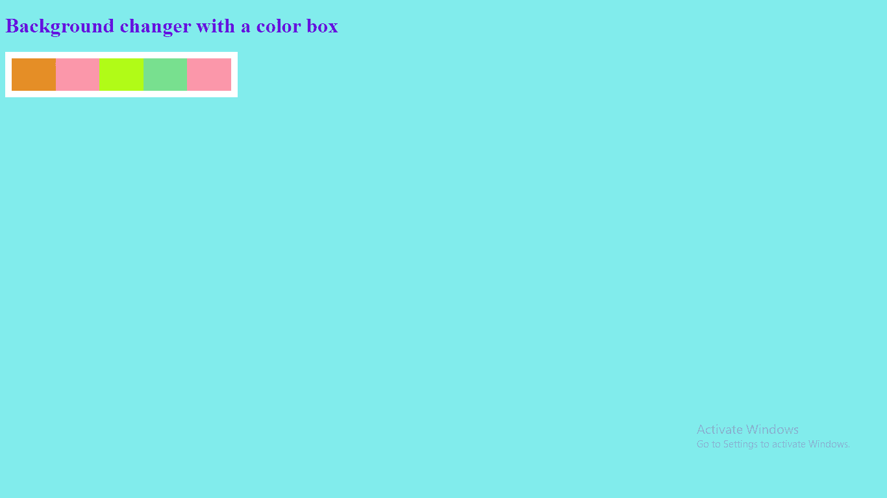
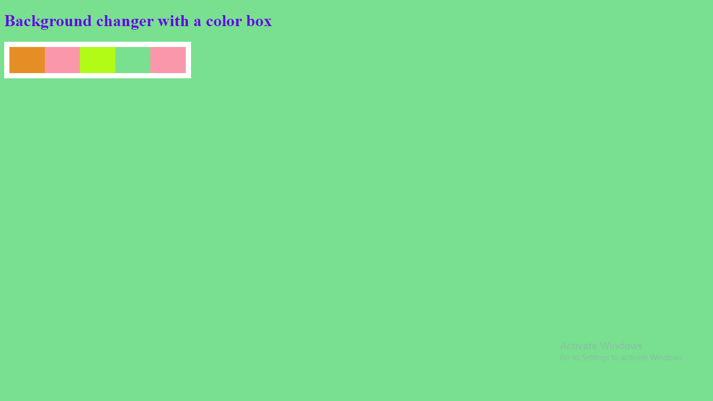

# 使用 HTML CSS 和 JavaScript 设计背景颜色转换器

> 原文:[https://www . geesforgeks . org/design-background-color-changer-use-html-CSS-and-JavaScript/](https://www.geeksforgeeks.org/design-background-color-changer-using-html-css-and-javascript/)

背景颜色改变器是一个可以轻松改变网页背景颜色的项目。网页上有颜色框，当用户点击其中任何一个时，得到的颜色就会出现在网页的背景中。它使网页看起来有吸引力。

文件结构:

*   index.html
*   style.css
*   script.js

**先决条件:**需要 HTML、CSS、JavaScript 的基础知识。该项目包含 HTML、CSS 和 JavaScript 文件。HTML 文件增加了结构，随后是使用 CSS 的样式，JavaScript 为其增加了功能。

**HTML 文件:index.html**HTML 布局是使用函数调用的 div 标签、id 属性和锚点标签创建的。它定义了网页的结构。

## 超文本标记语言

```html
<!DOCTYPE html>
<html lang="en">

<head>
    <meta charset="UTF-8">
    <meta name="viewport" content=
        "width=device-width, initial-scale=1.0">

    <title>Background changer using JavaScript</title>
    <link rel="stylesheet" href="style.css">
</head>

<body>
    <h1>Background changer with a color box</h1>
    <div>
        <a onclick="bgchange(id)" id="color1"> #e58e26</a>
        <a onclick="bgchange(id)" id="color2"> #f9b4ab</a>
        <a onclick="bgchange(id)" id="color3"> #B1FB17</a>
        <a onclick="bgchange(id)" id="color4"> #78e08f</a>
        <a onclick="bgchange(id)" id="color5"> #fd79a8</a>
    </div>

    <script src="script.js"></script>
</body>

</html>
```

**CSS 文件:style.css** 通过使用 CSS 属性，我们将对网页进行修饰，使其看起来更有吸引力。颜色、宽度、高度和位置属性根据项目要求给出。

## 半铸钢ˌ钢性铸铁(Cast Semi-Steel)

```html
body {
    background: #81ecec;
}

h1 {
    color:#6203e0;
}

div {
    width:25%;
    height: 50px;
    display: flex;
    justify-content: space-around;
    padding: 10px;
    background: white;
}

#color1 {
    flex: 1;
    background: #e58e26;
    color:#e58e26;
}

#color2 {
    flex: 1;
    background: #f9b4ab;
    color: #f9b4ab;
}

#color3 {
    flex: 1;
    background: #B1FB17;
    color: #B1FB17;
}

#color4 {
    flex: 1;
    background: #78e08f;
    color: #78e08f;
}

#color5 {
    flex: 1;
    background: #fd79a8;
    color: #fd79a8;
}
```

**JavaScript 文件:script.js** JavaScript 代码用于给网页赋予功能。这里我们使用了带有“id”参数的箭头函数。

## java 描述语言

```html
const bgchange =(id) => {
    document.body.style.background = 
        document.getElementById(id).innerHTML;
}
```

**输出:**

*   **采色前:**



带颜色盒的背景转换器

*   **拣色后:**



带颜色盒的背景转换器