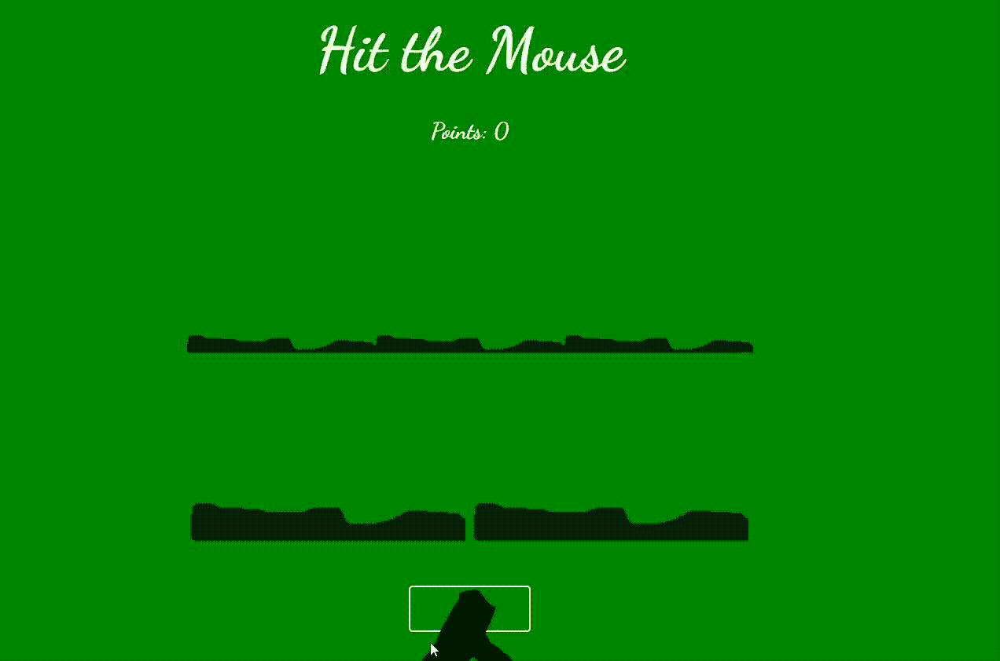

# 设计使用 HTML、CSS 和香草 Javascript 的点击鼠标游戏

> 原文:[https://www . geesforgeks . org/design-点击鼠标-游戏-使用-html-CSS-and-香草-javascript/](https://www.geeksforgeeks.org/design-hit-the-mouse-game-using-html-css-and-vanilla-javascript/)

在这篇文章中，我们将创建一个游戏，在这个游戏中，鼠标从洞里出来，我们用锤子敲击鼠标来获得分数。它是用 HTML、CSS 和香草 JavaScript 设计的。

**HTML 代码:**

*   首先，我们创建一个 HTML 文件(index.html)。
*   现在在创建完 HTML 文件后，我们将使用<title>标签给我们的网页命名。应该放在标签之间。</title>
*   然后我们将提供所有动画效果的 CSS 文件链接到我们的 html。也放在段里面。
*   **来到我们 HTML 代码的主体部分。**
    *   我们必须创建一个 div 来给出我们游戏的主标题。
    *   在第二个分区，我们给我们的游戏打分。
    *   在第三个分区，也是最有趣的一个分区，我们放置了 5 个洞，并给它们指定了特定的类别。
    *   在下一个中，我们根据用户的兴趣放置 2 个按钮来开始和停止我们的游戏。
    *   在最后一个 div 中，我们放置了一个锤子图像，稍后我们将其转换为 cursor。
*   在我们的正文部分的末尾，我们将我们的 JS 文件的链接放在

## index.html

```html
<!DOCTYPE html>
<html lang="en">

<head>
    <title>Hit-The-Mouse</title>
    <link rel="stylesheet" href="style.css">

    <!-- Adding google fonts to our project 
        to set chosen font family -->
    <link href=
"https://fonts.googleapis.com/css2?family=Dancing+Script:wght@700&display=swap"
        rel="stylesheet">
    <link rel="preconnect" 
        href="https://fonts.gstatic.com">
</head>

<body>
    <div class="heading">
        <h1>Hit the Mouse</h1>
    </div>

    <div class="score">
        <h3>Points: <span>0</span></h3>
    </div>

    <div class="holes">
        <div class="hole hole1"></div>
        <div class="hole hole2"></div>
        <div class="hole hole3"></div>
        <div class="hole hole4"></div>
        <div class="hole hole5"></div>
    </div>
    <div class="buttons">
        <button class="button start">
            START
        </button>

        <button class="button stop">
            STOP
        </button>
    </div>

    <div class="hammer">
        
    </div>

    <!-- linking our js file -->
    <script src="script.js"></script>
</body>

</html>
```

**CSS 代码:** CSS 用来给我们的 HTML 页面赋予不同类型的动画和效果，让所有用户看起来都是交互式的。在 CSS 中，我们必须提醒以下几点–

*   恢复所有浏览器效果。
*   使用类和 id 给 HTML 元素赋予效果。
*   使用@关键帧{}将动画赋予 HTML 元素。

## style.css

```html
/* Restoring all the browser effects */
* {
    margin: 0;
    padding: 0;
    box-sizing: border-box;
    font-family: 'Dancing Script', cursive;
    cursor: none;
}

/* Setting up the bg-color, text-color 
and alignment to all body elements */
body {
    background-color: green;
    color: white;
    justify-content: center;
}

.heading {
    font-size: 2em;
    margin: 1em 0;
    text-align: center;
}

.score {
    font-size: 1.3em;
    margin: 1em;
    text-align: center;
}

.holes {
    width: 600px;
    height: 400px;
    display: flex;
    flex-wrap: wrap;
    margin: 0 auto;
}

.hole {
    flex: 1 0 33.33%;
    overflow: hidden;
    position: relative;
}

/* Use of pseudo classes */
.hole:after {
    display: block;
    background: url(
'https://media.geeksforgeeks.org/wp-content/uploads/20210302112038/hole2.png')
        bottom center no-repeat;
    background-size: contain;
    content: '';
    width: 100%;
    height: 70px;
    position: absolute;
    z-index: 20;
    bottom: -30px;
}

.rat {
    position: absolute;
    z-index: 10;
    height: 10vh;
    bottom: 0;
    left: 50%;
    transform: translateX(-50%);
    animation: move 0.5s linear;
}

.buttons {
    margin: 3em 0 0 0;
    text-align: center;
}

.button {
    background-color: inherit;
    padding: 15px 45px;
    border: #fff 2px solid;
    border-radius: 4px;
    color: rgb(21, 14, 235);
    font-size: 0.8em;
    font-weight: 900;
    outline: none;
}

/* It is used because we want to 
display single button at a time
on the screen */

/* This functionally is moreover 
controlled by JS */
.stop {
    display: none;
}

.hammer img {
    position: absolute;
    height: 125px;
    z-index: 40;
    transform: translate(-20px, -50px);
    pointer-events: none;
    animation: marne_wale_effects 0.1s ease;
}

/* Giving animation to our rat */
@keyframes move {
    from {
        bottom: -60px;
    }
    to {
        bottom: 0;
    }
}

/* Giving effects to hammer when 
we hit on the rat */
@keyframes marne_wale_effects {
    from {
        transform: rotate(0deg);
    }
    to {
        transform: rotate(-40deg);
    }
}
```

到目前为止，我们已经完成了所有的用户界面部分，现在我们将编写代码来给我们的游戏赋予功能。

**JavaScript 代码:**在本节中，我们为–

1.  锤子的击打效果。
2.  将光标改为锤子。
3.  开始/停止我们的游戏。
4.  计算点击次数

## script.js

```html
// Selection of all the CSS selectors 
const score = document.querySelector('.score span')
const holes = document.querySelectorAll('.hole')
const start_btn = document.querySelector('.buttons .start')
const stop_btn = document.querySelector('.buttons .stop')
const cursor = document.querySelector('.hammer img')

// Here we changing our default cursor to hammer
// (e) refers to event handler
window.addEventListener('mousemove', (e) => {
    cursor.style.top = e.pageY + "px"
    cursor.style.left = e.pageX + "px"
})

// It is used to give the animation to
// our hammer every time we click it
// on our screen
window.addEventListener('click', () => {
    cursor.style.animation = 'none'
    setTimeout(() => {
        cursor.style.animation = ''
    }, 101)
})

// From this part our game starts when
// we click on the start button
start_btn.addEventListener('click', () => {
    start_btn.style.display = 'none'
    stop_btn.style.display = 'inline-block'

    let holee
    let points = 0

    const game = setInterval(() => {

        // Here we are taking a random hole
        // from where mouse comes out
        let ran = Math.floor(Math.random() * 5)
        holee = holes[ran]

        // This part is used for taking the 
        // mouse up to the desired hole
        let set_img = document.createElement('img')
        set_img.setAttribute('src', 
'https://media.geeksforgeeks.org/wp-content/uploads/20210303135621/rat.png')
        set_img.setAttribute('class', 'rat')
        holee.appendChild(set_img)

        // This part is used for taking
        // the mouse back to the hole
        setTimeout(() => {
            holee.removeChild(set_img)
        }, 700);
    }, 800)

    // It is used for adding our points
    // to 0 when we hit to the mouse
    window.addEventListener('click', (e) => {
        if (e.target === holee) 
            score.innerText = ++points;
    })

    // This is coded for changing the score
    // to 0 and change the stop button
    // again to the start button!
    stop_btn.addEventListener('click', () => {
        clearInterval(game)
        stop_btn.style.display = 'none'
        start_btn.style.display = 'inline-block'
        score.innerHTML = '0'
    })
})
```

**游戏步骤:**

*   点击开始按钮玩游戏。
*   点击开始按钮后，物体从孔中出来。
*   将鼠标放在对象上以获得越来越多的点数。
*   点击停止按钮暂停游戏。

**输出:**

