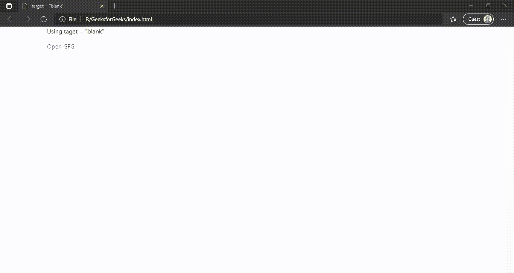
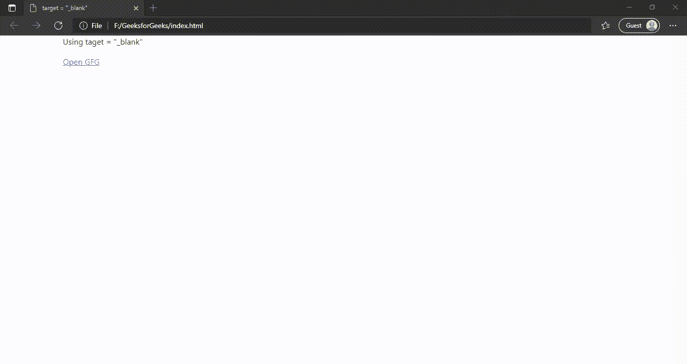

# HTML 中“空白”和“_blank”目标属性的区别

> 原文:[https://www . geeksforgeeks . org/blank-和-blank-target-attributes-in-html/](https://www.geeksforgeeks.org/difference-between-blank-and-_blank-target-attributes-in-html/)的区别

如果你曾经在网站上注意到很少有链接在新的标签页或新的窗口中打开，或者有时，在某些网站上，点击链接，第一次，它会在一个新的标签页中打开&每当我们点击链接时，那个特定的打开的标签页会更新并重新使用。这两种情况都可以通过使用 HTML 目标属性来实现。在本文中，我们将看到如何使用 target =“blank”& target =“_ blank”属性在另一个选项卡中打开超链接。如果不知道，请参考 [如何在 HTML 中打开另一个窗口或标签页的超链接？](https://www.geeksforgeeks.org/how-to-open-a-hyperlink-in-another-window-or-tab-in-html/)。我们将逐一讨论这两个属性。我们先来看看 target =“blank”。

**1。target="blank":** 如果我们将目标设置为“blank”，那么在点击链接或提交表单后，它将首次打开浏览器选项卡，并将在同一选项卡中重用。使用此属性的目的是保持用户在您的网站上的参与度，而无需花费太多精力在单独的选项卡中搜索&每次访问非现场链接。这也有助于用户的浏览器灯使用，因为过多的打开标签可能会妨碍整个浏览器的性能并影响系统&也有可能会导致浏览器挂起。

**示例:**

## 超文本标记语言

```html
<!DOCTYPE html>
<html>

<head>
    <title>target="blank"</title>
</head>

<body>

    <!-- It will open a new browser 
        tab for the first time and 
        after that it will reuse 
        that open tab -->
    <p>Using target="blank"</p>

    <a href="https://www.geeksforgeeks.org/" 
        target="blank">
        Open GFG
    </a>
</body>

</html>
```

**输出:**



使用 target=“空白”

从上面的输出中，我们可以看到，当第一次点击链接时，它将在新的选项卡中打开&每当我们点击同一个链接时，它将重定向到那个特定的打开的选项卡。

**2。target="_blank":** 如果我们将目标设置为" _blank "，那么在点击一个链接或提交一个表单后，它每次都会打开一个新的浏览器选项卡。使用这个属性的目的是让用户长期关注你的网站，这将提高你的大部分指标:跳出率、转化率、页面访问量等。

**示例:**

## 超文本标记语言

```html
<!DOCTYPE html>
<html>

<head>
    <title>target="_blank"</title>
</head>

<body>

    <!-- It will open a new browser 
        tab every time -->
    <p>Using target="_blank"</p>

    <a href="https://www.geeksforgeeks.org/"
        target="_blank">
        Open GFG 
    </a>
</body>

</html>
```

**输出:**



使用 target="_blank "

从上面的输出中，我们可以看到，每当点击链接时，每次点击都会指向新的选项卡。

#### target =“blank”和 target =“_ blank”之间的差异。

<figure class="table">

|   | 

#### **Target = "blank"**

 | 

#### **target="_blank"**

 |
| --- | --- | --- |
| 1. | 要第一次在单独的选项卡中打开非现场链接，请保持在单击链接时重复使用同一选项卡。 | 在单独的选项卡或窗口中打开非现场链接。 |
| 2. | 第一次打开一个新的浏览器选项卡&在它将被重用之后。因此，浏览器可能会高效工作。 | 每次打开一个新的浏览器选项卡。这可能会影响浏览器的整体性能，也会影响系统。 |

</figure>