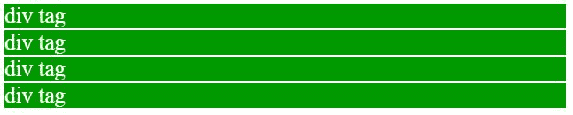
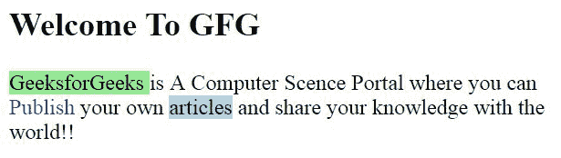

# HTML 中和标签的区别

> 原文: [https://www .极客们。org/div-and-span-HTML 中的标签/](https://www.geeksforgeeks.org/difference-between-div-and-span-tag-in-html/)

这两个标签(**[<【div】>](https://www.geeksforgeeks.org/div-tag-html/)**和**[<span>](https://www.geeksforgeeks.org/span-tag-html/)**)都用来表示 webpgage 的一部分，而< div >标签则作为块的一部分使用在 HTML 中，div 标签用于划分网页上的内容，如(文本、图像、页眉、页脚、导航栏等)。Div 标签既有开始(< div >)也有结束(< /div >)标签，必须关闭标签。我们知道 Div 标签是一个块级标签。在本例中，div 标签包含整个宽度。它将在新的一行显示 div 标签，而不是在同一行。

*   **Example:**

    ```html
    <!DOCTYPE html>
    <html>

    <head>
        <title>Div tag</title>

        <style>
            div {
                color: white;
                background-color: #009900;
                margin: 2px;
                font-size: 25px;
            }
        </style>
    </head>

    <body>
        <div> div tag </div>
        <div> div tag </div>
        <div> div tag </div>
        <div> div tag </div>
    </body>

    </html>
    ```

*   **Output:**
    

**HTML<span>标记:**HTML span 元素是内联元素和内容的通用内联容器。它用于对元素进行分组以进行样式化(通过使用类或 id 属性)。当没有其他语义元素可用时，使用它的更好方法。span 标记与 div 标记非常相似，但 div 是块级标记，span 是内联标记。

*   **例:**

    ```html
    <!DOCTYPE html>
    <html>

    <head>
        <title>span tag</title>
    </head>

    <body>
        <h2>Welcome To GFG</h2>

        <!-- Inside paragraph applying span tag 
        with different style -->
        <p><span style="background-color:lightgreen"> 
            GeeksforGeeks</span> is A Computer Science Portal 
            where you can<span style="color:blue;"> 
            Publish</span> your own <span 
            style="background-color:lightblue;">articles</span>
             and share your knowledge with the world!!
        </p>
    </body>

    </html>
    ```

*   **Output:**
    

**区别< div >和<span>tag:**

T56】T58<div>T60】T119】span>T61The tag is an inline element. It is best to attach it to a certain part of the web page. It is best to attach a CSS to a small part of a line in a webpage. Accept the align attribute. The alignment attribute is not accepted. This label should be used to wrap a part and highlight that part. This tag should be used to wrap any specific words that you want to highlight in the webpage.

HTML 是网页的基础，通过结构化网站和 web apps 用于网页开发。遵循本 [HTML 教程](https://www.geeksforgeeks.org/html-tutorials/)和 [HTML 示例](https://www.geeksforgeeks.org/html-examples/)可以从头开始学习 HTML。