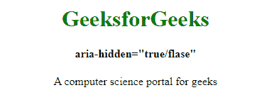

# HTML 中‘隐藏’和‘咏叹调-隐藏’属性的区别

> 原文:[https://www . geesforgeks . org/hidden-and-aria-hidden-attributes-in-html/](https://www.geeksforgeeks.org/difference-between-hidden-and-aria-hidden-attributes-in-html/)

超文本标记语言是一种结合了 CSS 和 JavaScript 的强大的网络开发工具。除此之外，HTML 还使用**可访问的丰富互联网应用程序(ARIA)** 使网页内容对残疾人友好。虽然 **ARIA** 是有益的，但是 HTML 和 ARIA 都有共同的关键词，给业余学习者造成了困惑。

**HTML“隐藏”:**当某些内容已经过时，不再需要时，使用 HTML“隐藏”属性。它对用户完全隐藏了细节。它是 HTML 代码中状态的语义指示器。如果使用此属性，浏览器将不会显示指定了隐藏属性的元素。隐藏的属性可以使用一些条件或用于查看隐藏内容的 JavaScript 来查看。

**语法:**

```html
<element hidden>
```

**示例:**

## 超文本标记语言

```html
<!DOCTYPE html>
<html>
    <head>
        <title>hidden attribute</title>
        <style>
            body {
                text-align:center;
            }
            h1 {
                color:green;
            }
        </style>
    </head>
    <body>
        <h1>GeeksforGeeks</h1>
        <h2>hidden attribute</h2>

        <!-- hidden paragraph -->
        <p hidden>A computer science portal for geeks</p>

    </body>
</html>
```

**输出:**


**aria-hidden:** 使用‘aria-hidden =“true”’从辅助功能树中移除元素及其子元素在某些浏览器中是辅助技术，但内容将显示在浏览器中。根据 **ARIA** 的第四条规则，不允许在可聚焦元素上使用隐藏特征，因为这会导致用户什么也不聚焦。不要使用**咏叹调-隐藏=“真”**内的一个 **<体>** 标记整个页面将无法被辅助技术访问。

**语法:**

```html
 <element aria-hidden="true/false">
```

**示例:**

## 超文本标记语言

```html
<!DOCTYPE html>
<html>
    <head>
        <title>aria-hidden="true/false" </title>
        <style>
            body {
                text-align:center;
            }
            h1 {
                color:green;
            }
        </style>
    </head>
    <body>
        <h1>GeeksforGeeks</h1>
        <h4>aria-hidden="true/false"</h4>

        <!-- aria-hidden="true" paragraph -->
        <p arie-hidden="true">
            A computer science portal for geeks
        </p>

    </body>
</html>                   
```



**注意:**aria-hidden 表示开发人员实现的元素及其所有子元素对任何用户都不可见。

**HTML 隐藏与 aria-hidden 的区别:**

<figure class="table">

| HTML hide | 咏叹调-隐藏 |
| --- | --- |
| HTML hides everything from users. | ARIA's aria-hidden hides the content of assistive technology. |
| With HTML hidden, you can remove the focusable content from the browser navigation. | When using ARIA hiding, we will not remove the content from the browser. |
| The CSS style displayed by **can be applied: No** is hidden in HTML. | ARIA's aria-Hidden, no such script is applicable. |

</figure>