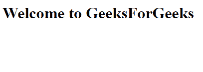

# 【HTML 和 CSS 的区别

> 原文:[https://www . geesforgeks . org/html 和-css 之间的区别/](https://www.geeksforgeeks.org/difference-between-html-and-css/)

*   **[HTML](https://www.geeksforgeeks.org/html-introduction/)**
    HTML stands for Hyper Text Markup Language and it is the language which is used to define the structure of a web page. HTML is used along with CSS and Java script to design web pages. HTML is the basic building block of a website. It has different attributes and elements with different properties.Each element has a opening and a closing tag. We can also add images by the help of HTML.

    **Example:**

    ```html
    <html>
    <body>
        <h1>Welcome to GeeksForGeeks</h1>
    </body>
    </html>
    ```

    **输出:**
    

*   **[CSS:](https://www.geeksforgeeks.org/css-introduction/)**
    CSS stands for Cascading Style Sheets and it is used to style web documents. It is used to provide the background color and is also used for styling. It can also be used to style the font and change its size. We can also style many different web pages with the same specifications by the help of CSS. CSS is also recommended by World Wide Web Consortium (W3C). It can also be used along with HTML and Java script to design web pages.
    **Example:**

    ```html
    <html>
    <head>
    <style>
    body {
      background-color:red;
    }
    </style>
    </head>
    <body>

    <h1>Welcome to GeeksForGeeks!</h1>

    <p>This page has red background color</p>

    </body>
    </html>
    ```

    **输出:**
    

【HTML 和 CSS 的区别:

| 没有 | 超文本标记语言 | 半铸钢ˌ钢性铸铁(Cast Semi-Steel) |
| --- | --- | --- |
| 1. | HTML 用于定义网页的结构。 | CSS 用于通过使用不同的样式特性来设置网页的样式。 |
| 2. | 它由包含文本的标签组成。 | 它由选择器和声明块组成。 |
| 3. | HTML 没有进一步的类型。 | CSS 可以是内部的，也可以是外部的，这取决于需求。 |
| 4. | 我们不能在 CSS 表单中使用 HTML。 | 我们可以在 HTML 文档中使用 CSS。 |
| 5. | HTML 不用于演示和可视化。 | CSS 用于表示和可视化。 |
| 6. | HTML 的备份和支持相对较少。 | CSS 有比较高的备份和支持。 |