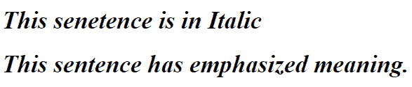

# HTML

的*和*标签的区别**

> 原文:[https://www . geesforgeks . org/I-and-em-tag-of-html/](https://www.geeksforgeeks.org/difference-between-i-and-em-tag-of-html/)

**1。 [< i >标签](https://www.geeksforgeeks.org/html-i-tag/) :**
它是 HTML 的元素之一，用于格式化 HTML 文本。它用于以专业术语、替代语气或声音、思想等来定义文本。

**语法:**

```html
<i> Content... </i>
```

**2。 [< em >标签](https://www.geeksforgeeks.org/html-em-tag/) :**
它也是 HTML 中用于格式化文本的元素之一。它用于定义强调的文本或语句。

**语法:**

```html
<em> Content... </em>
```

默认情况下，视觉结果是相同的。这两个标签的主要区别在于*标签在语义上强调重要的单词或单词的一部分，而*标签只是传统上用斜体表示的偏移文本，以显示替代的语气或声音。下面是显示两者之间差异的代码:**

**示例-1 :**

## 超文本标记语言

```html
<!DOCTYPE html>
<html>
    <head>
        <title>b Tag</title>
        <style>
            body {
                text-align:center;
            }
            h1 {
                color: green;
            }
        </style>
    </head>
    <body>
        <h1>GeeksforGeeks</h1>
        <p><i>Iron Man</i> is a hero.</p>
        <p>Gfg is the <em>best</em> educational site.</p>

    </body>
</html>                    
```

**输出:**


在这里，对“钢铁侠”这个词没有额外的强调或重要性。它只是表明这里的铁不是矿物或金属，但它指的是一个字符。但是在下一个句子中，读者将在“最好”这个词上使用口头强调。

**示例-2 :**

## 超文本标记语言

```html
<!DOCTYPE html>
<html lang="en" dir="ltr">

<head>
  <meta charset="utf-8">
  <title>Difference between <i> and <em> tag of HTML</title>
</head>

<body>
  <h1><i>This senetence is in Italic</i></h1>
    <h1>
      <em>This sentence has emphasized meaning.</em></h1>
</body>

</html>
```

**输出:**



虽然它们看起来相同，但语义不同。
支持的浏览器:< i >和< em >标签支持的浏览器如下。

*   铬
*   机器人
*   Firefox(壁虎)
*   火狐手机(壁虎)
*   互联网浏览器
*   边缘移动
*   歌剧
*   歌剧手机
*   Safari (WebKit)
*   Safari 手机