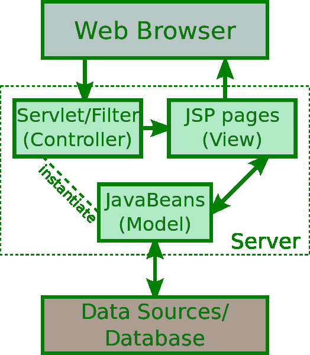
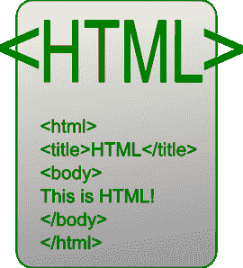

# JSP 和 HTML 的区别

> 原文:[https://www . geesforgeks . org/JSP 和-html 之间的区别/](https://www.geeksforgeeks.org/difference-between-jsp-and-html/)

**1。 [Java 服务器页面(JSP)](https://www.geeksforgeeks.org/introduction-to-jsp/) :**
JSP 代表 Java 服务器页面。这些文件有扩展名。jsp。JSP 的主要优点是程序员可以在 HTML 内部插入 Java 代码。有 JSP 标签可以插入 Java 代码。程序员可以在 Java 代码的末尾写标签。有不同的 JSP 标签可以用来完成各种任务。有在请求和页面之间共享数据的标签，以及在页面之间传递控制和从数据库获取数据的标签，等等。JSP 是建立在一种叫做 Java Servlet 的基于 Java 的技术之上的。

**Java Server Page (JSP)** 可能是 Sun Microsystems 早在 1999 年开发的技术，意在创建动态生成的站点。当一个页面是动态的，它会不断地更新知识，与此同时，在线页面会显示给客户。使用 JSP 技术，它允许在线设计人员和开发人员简单地维护和开发在线页面内容。

**2。[超文本标记语言(HTML)](https://www.geeksforgeeks.org/html-introduction/) :**
HTML 是一种超文本标记语言，为文档设计的标准标记语言，在浏览器期间在线显示和查看也有助于创建网页的结构。因为它是一种标记语言，所以它由许多标签组成。有显示文本、表格、有序列表和无序列表等的标签。在 HTML 页面中有两个主要部分:头部和主体部分。描述页面的数据(也称为元数据)位于头部，而主体部分包含表示网页可视内容所需的所有标签。

有各种各样的 HTML 版本。最新的版本是 HTML 5。它的更先进的功能，如地理位置，本地音频和视频支持，画布，网络插座等。通常，HTML 是一种易于发现和使用的语言。程序员可以使用简单的文本编辑器创建一个 HTML 文件，并使用浏览器执行它。

**JSP 和 HTML 的区别:**

| 没有。 | JSP | 超文本标记语言 |
| **1** | JSP 由太阳微系统给出。 | HTML 是蒂姆·伯纳斯·李在 1991 年创建的。 |
| **2** | JSP 为不断变化的数据提供了一个动态接口，它还动态地调用服务器动作。 | HTML 提供了一种详细描述文档中基于文本的信息结构的方法。 |
| **3** | JSP 只生成动态网页。 | 而 Html 只生成静态网页。 |
| **4** | 需要 JSP 容器来执行 Jsp 代码。 | 需要 Html 解释器来执行这些代码。 |
| **5** | JSP 允许在 JSP 页面中放置 java 代码。 | 在 HTML 中，它不允许将 java 代码放在 Html 页面中。 |
| **6** | JSP 是一种用于创建动态 web 应用程序的技术。 | HTML 是一种标准的标记语言，用于创建网页的结构。 |
| **7** | JSP 允许放置自定义标签或第三方标签。 | 它不允许放置自定义标签或第三方标签。 |
| **8** | JSP 直接在网络服务器和本地 JVM 上运行。 | 超文本标记语言在网络浏览器中运行。 |
| **9** | JSP 被称为服务器端脚本语言。 | HTML 被称为客户端脚本语言。 |
| **10** | JSP 需要一些时间来加载，因为它需要与网络服务器交互。 | 当 HTML 在本地机器上运行时，加载速度非常快。 |

