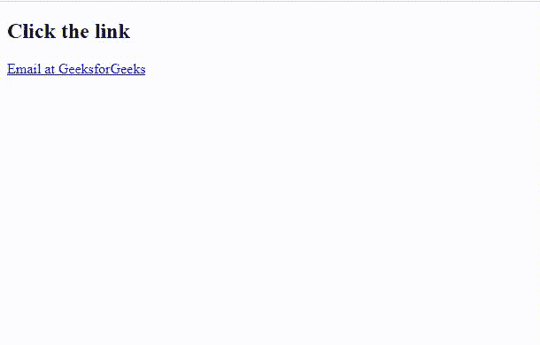

# 在 HTML 中链接图片、网站和电子邮件地址的区别

> 原文:[https://www . geeksforgeeks . org/链接图像网站和电子邮件地址之间的区别 html/](https://www.geeksforgeeks.org/difference-between-linking-an-image-website-and-email-address-in-html/)

在本文中，我们将讨论将图像、网站和电子邮件地址链接到网站。

*   HTML [img](https://www.geeksforgeeks.org/html-images/) 标签用于将图像链接到网站。
*   HTML [锚点](https://www.geeksforgeeks.org/html-a-tag/)标签用于通过在[超文本引用( *href)*](https://www.geeksforgeeks.org/html-a-href-attribute/) 属性中添加网站的路径来链接网站。
*   要链接电子邮件地址，我们在电子邮件地址的开头指定 [*【邮件到】*](https://www.geeksforgeeks.org/how-to-use-mailto-in-html/) ，并在*锚点*标签的 *href* 属性中传递该路径。

**链接图像:**“[img](https://www.geeksforgeeks.org/html-images/)”标签用于添加或链接图像。图像标签是自封闭标签，这意味着它不需要封闭标签。它需要一个属性列表，如 src 和 alt。

**语法:**

```html

```

**示例:**以下示例向网页添加图像。我们已经在[源(src)](https://www.geeksforgeeks.org/html-src-attribute/) 属性中指定了图像的路径，并在 [alt](https://www.geeksforgeeks.org/html-alt-attribute/) 属性中指定了替代文本。为了更好的理解，请参考 HTML [< img >](https://www.geeksforgeeks.org/html-img-tag/) 标签。

## 超文本标记语言

```html
<!DOCTYPE html>
<html lang="en">

<body>
    <h2 style="color:green;">GeeksforGeeks </h2>
    
</body>
</html>
```

**输出:**


**链接网站:**[主播](https://www.geeksforgeeks.org/html-a-tag/)标签是用来链接网站的，我们要在 [href](https://www.geeksforgeeks.org/html-a-href-attribute/) 属性中指定网站的路径。

**语法:**

```html
<a href = "path"> Link Name </a>
```

**示例:**以下代码演示了使用上述方法链接网站。我们已经添加了网站的路径，当我们点击 [*主播*](https://www.geeksforgeeks.org/html-a-tag/) 标签下的文字时，它会将页面重定向到指定的链接。

## 超文本标记语言

```html
<!DOCTYPE html>
<html lang="en">

<body>
    <h2>Click the link</h2>
    <a href="https://www.geeksforgeeks.org/">
      GeeksforGeeks
   </a>
</body>
</html>
```

**输出:**


**链接电子邮件地址:**要链接电子邮件地址，我们在电子邮件地址的开头指定 mailto，并在[锚点](https://www.geeksforgeeks.org/html-a-tag/)标签的 [href](https://www.geeksforgeeks.org/html-a-href-attribute/) 属性中传递该路径。

**语法:**

```html
<a href = "mailto:email__address"> Email Address </a>
```

**示例:**以下示例演示了链接电子邮件。当我们点击显示的链接时，它会将我们的页面重定向到指定的邮件地址。为了更好的理解，请参考 HTML [邮件至](https://www.geeksforgeeks.org/how-to-use-mailto-in-html/)文章。

## 超文本标记语言

```html
<!DOCTYPE html>
<html lang="en">

<body>
    <h2>Click the link</h2>
    <a href="mailto:feedback@geeksforgeeks.org">
      Email at GeeksforGeeks
    </a>
</body>
</html>
```

**输出:**



**链接到图像、网站和电子邮件地址的区别:**

<figure class="table">

| **Link image** | **Link website** | **Link email address** |
| --- | --- | --- |
| Image(img) tag is used to insert images on web pages. | The Anchor(a) tag is used to link a website to a webpage. | The Anchor(a) tag is used to specify the e-mail address of the webpage. |
| The path or address of the image is placed in the source ( *src* ) attribute of the image tag. | The path or address of the website is placed in the hyperlink reference ( *href* ) attribute of the anchor tag. | The email address is placed in the hyperlink reference ( *href* ) attribute, and there is a *mailto* attribute at the beginning of the email address. |

</figure>