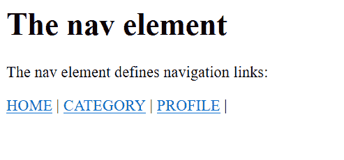

# html 5

中

<nav>和

<menu>标签的区别</menu>

</nav>

> 原文:[https://www . geesforgeks . org/nav-和-menu-tag-in-html5 之间的区别/](https://www.geeksforgeeks.org/difference-between-nav-and-menu-tag-in-html5/)

**[”<导航>”标签:](https://www.geeksforgeeks.org/html-nav-tag/)**<导航>标签用于指定同一文档或任何其他文档内的导航链接，这意味着它提供指向同一或不同页面/文档上的内容的链接。

**示例:**

```html
<!DOCTYPE html>
<html>

<body>
    <h1>The nav element</h1>
    <p>The nav element defines navigation links:</p>
    <nav>
        <a href=”/home/”>HOME</a> |
        <a href=”/category/”>CATEGORY</a> |
        <a href=”/profile/”>PROFILE</a> |
    </nav>
</body>

</html>
```

**输出:**


**示例:**

```html
<!DOCTYPE html> 
<html> 
<head> 
    <title>nav tag</title> 
    <style> 
        nav { 
            border:2px; 
            background-color:#090; 
            color:white; 
            padding:8px; 
        } 
        a {  
            color:white; 
            font-size:25px; 
        } 
        .gfg { 
            font-size:30px; 
            color:#090; 
            font-weight:bold; 
            text-align:center; 
        } 
        .nav_tag { 
            text-align:center; 

        } 
    </style> 
</head> 
<body> 
    <div class = "gfg">GFG</div> 
    <div class = "nav_tag">Nav Element Example</div> 
    <nav> 
        <a href = 
"https://www.geeksforgeeks.org/"> 
                        Home</a> |
        <a href = 
"https://www.geeksforgeeks.org/category/difference-between/"> 
          Difference Between</a> |

        <a href = 
"https://www.geeksforgeeks.org/company-interview-corner/"> 
                    Interview</a> |
                <a href = 
"https://practice.geeksforgeeks.org/courses/"> 
                      Courses</a> |

    </nav> 
</body> 
</html> 
```

**输出:**


**<菜单>标签:**HTML 中的<菜单>标签用于创建菜单列表。它定义了用户可以用来创建列表表单控件、工具栏、上下文菜单和命令的命令列表。<菜单>标签从 HTML 中移除，并在 HTML5 中重新引入。大多数平台都不支持它。

“菜单”标签的内容: