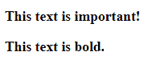
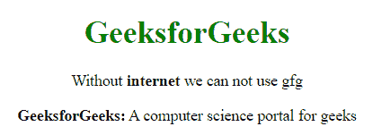

# HTML 中强标签和粗体标签的区别

> 原文:[https://www . geeksforgeeks . org/strong 和 bold-tag-in-html 的区别/](https://www.geeksforgeeks.org/difference-between-strong-and-bold-tag-in-html/)

[**HTML 强标签:**](https://www.geeksforgeeks.org/html-strong-tag/)**强**标签是用于格式化 HTML 文本的 HTML 元素之一。它用于通过加粗或在语义上突出显示文本的重要性。

**语法:**

```html
<strong> Contents... </strong>
```

[**HTML 加粗标签:**](https://www.geeksforgeeks.org/html-b-tag/)**加粗**标签或< b >也是 HTML 的格式元素之一。写在< b >标签下的文本使文本看起来醒目，以引起注意。

**语法:**

```html
<b> Contents... </b>
```

这两个标签的主要区别在于*强*标签在语义上强调的是重要的词或词段，而*粗体*标签只是在*粗体*中常规样式的偏移文本。下面是显示这种差异的代码。

**例 1:**

## 超文本标记语言

```html
<!DOCTYPE html>
<html>

<head>
    <style>
        body {
            text-align:center;
        }
        h1 {
            color: green;
        }
    </style>
</head>

<body>
    <h1>GeeksforGeeks</h1>

    <p><strong>
        This text is important!
    </strong></p>

    <p><b>This text is bold.</p>
</body>

</html>                  
```

**输出:**



虽然两个标签的显示没有区别，但是它们之间有语义上的区别。

**例 2:**

## 超文本标记语言

```html
<!DOCTYPE html>
<html>

<head>
    <title>b tag</title>

    <style>
        body {
            text-align:center;
        }
        h1 {
            color: green;
        }
    </style>
</head>

<body>
    <h1>GeeksforGeeks</h1>

    <p>
        Without <strong>internet</strong> 
        we can not use gfg
    </p>

    <p>
        <b>GeeksforGeeks:</b> A computer 
        science portal for geeks
    </p>
</body>

</html>                    
```

**输出:**



我们想展示“互联网”这个词的重要性，所以我们使用了**<>**标签，至于“极客”这个词，我们只是想用粗体格式化文本。

**支持的浏览器:**下面列出了< b >和<强>标签支持的浏览器。

*   铬
*   机器人
*   Firefox(壁虎)
*   火狐手机(壁虎)
*   互联网浏览器
*   边缘移动
*   歌剧
*   歌剧手机
*   Safari (WebKit)
*   Safari 手机